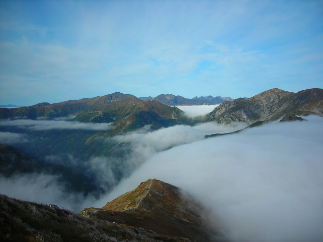
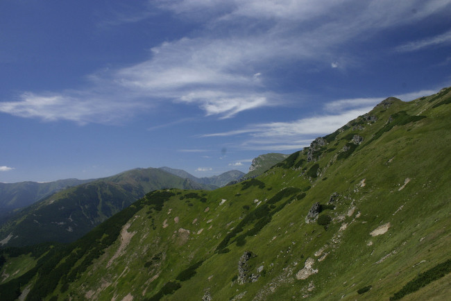
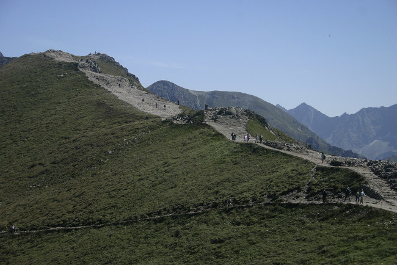
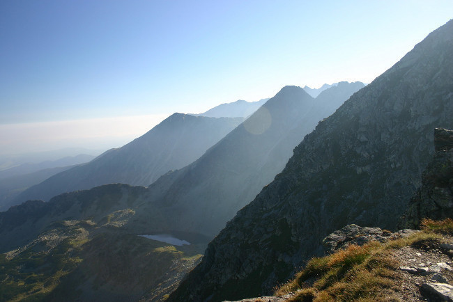

Byl jsem v Tatrách, zapomenout se nedá...
#########################################

:tags: Tchoříci, Slovensko

.. class:: intro

Živý a zdravý jsem se vrátil z Nízkých Tater a jak jsem slíbil, napíšu sem něco
o našem putování. Nízké Tatry jsou opravdu nádherné, je těžké je popsat.
Krajina se může změnit během pár kilometrů tak, že si budete myslet, že jste se
ocitli v krajině hobitů, nebo naopak, že jste se dostali do nekončícího
divokého hvozdu. No prostě nádhera.

Cesta do Tater je divoká...
***************************

Z Nýrska jsem s Johanou a jejím otcem vyrážel autem okolo čtvrté hodiny. Johana
lehce nestíhala, musela ještě nakoupit energetické zásoby.

Až jsme konečně vyrazili, směr Horažďovice, odkud jsme měli všichni společně
odjet autobusem do Prahy. Výjimečně jsme dorazili na autobusák jako první.
Dlouho jsme ale čekat nemuseli, za chvilku dorazil Jenda s Jáňou, se špatnou
zprávou, že Pavel s Markétou nepojedou, umřel jim děda. Nojo, holt život. Protože
Pavel jet nemohl, byl jsem ve výpravě, kromě našeho vedoucího, jediný kluk.

V těsném sledu dorazila i Lenka a s ní i stan, který jsem sice celou dobu
vláčel na zádech, ale ani jednou jsme ho nepoužili.

Už měl pomalu přijet autobus a s ním i Bětka, když Honzovi zazvonil
telefon a my se dozvěděli, že Bětka nechala doma něco z jídla. Ó hrůzo...

Přijela sice autobusem, ale její táta nás musel stíhat až do Strakonic, aby
nám jídlo předal. Prý vypadal pěkně nasupeně. Ani se mu moc nedivím.
Ale to už jsme seděli pěkně v teple autobusu a ujížděli do Prahy.

Největší divočina v Čechách - Praha
***********************************

A tak jsme se dostali až do největší divočiny v Čechách, do Prahy. Po příjezdu
jsme vlezli do metra ve stanici Anděl a hned jsme vykoupili krámek se sušeným
ovocem. Času jsme měli dost, protože jako obvykle bylo shánění jízdenek
problém.

Nakonec jsme ale vyrazili a užili si trasu B, A, i C. Z Anděla jsme vjeli do
stanice Karlovo náměstí, pak na Národní třídu a jako poslední stanice na
trase B na Můstek. Zde jsme přestoupili na trasu A a náležitě si při tom užili
jezdících schodů. Urazili jsme cestu do další přestupní stanice - do Muzea.
Zase jsme si užili eskalátorů a jeli do poslední stanice na naší trase metrem,
na Hlavák. Vylezli jsme a našli posledního člena naší výpravy, Marušku. Nic už
nám nebránilo sednout na noční rychlík, směr Poprad.

Přijíždíme na Slovač
********************

A tak začala dlouhá cesta až na Slovensko. Z cesty si moc nepamatuji, prospat
se sice nedala, ale prodřímat ano. Možná si nic nepamatuji z toho důvodu, že
nic k pamatování snad ani nebylo.

Hned po ránu, okolo páté hodiny ranní jsme se mohli pokochat prvním pohledem na
Tatry. Z Nízkých moc vidět nebylo, ale Vysoké, to je pastva pro oči. Kochali
jsme se asi do šesti, kdy jsme konečně dorazili do naší konečné, do Popradu.
Zde jsme vyskákali z vlaku a jali se hledat autobusové nádraží. Po zeptání jsme
ho našli rychle a po pěti minutách jsme seděli v autobusu a jeli přes horské
serpentiny do Vernáru, odkud jsme měli vyrazit konečně na pochod.

Konečně v Tatrách
*****************

A tak jsme šli. Sic nevyspalí a malátní, ale pořád se spoustou optimismu.
Cestou jsme zabočili k potoku, kde jsme se opláchli po cestě a s chutí vyrazili
zdolávat nejvyšší horu východní části Nízkých Tater - Kralovu hoľu. Pokud jste nikdy
nebyli v pořádných horách nedovede si představit co to je zdolávat převýšení
zhruba kilometru. Je to opravdu štreka, zvláště když si na zádech nesete
proviant na týden a všechno, co člověk potřebuje v horách. Cestou jsme dojídali
svačiny z domova.

Cestou přes Martalůzku jsme se do plahočili až do na Kralovu hoľu. Ve výšce
1 946 metrů máte krásný výhled na celé východní Tatry, my z toho ale nic neměli,
protože sotva jsme dorazili já a Jenda nahoru, strhla se první průtrž mračen.

Holky byly o kus vzadu a promokly na kost. A do toho začaly kroupy. Pravá
ukázka počasí na horách, před půl hodinkou svítilo sluníčko a my se potili do
kopce.

No ale co. Kralovu hoľu jsme zdolali. Už pod střechou jsme si udělali čaj na
benzínovém vařiči, a málem vyletěli do vzduchu, protože ve vařiči shořelo
těsnění a ten se změnil v časovanou bombu. Naštěstí se nám ho podařilo včas
zhasit a my si vychutnávali první horský čaj.

Byla asi jedna hodina a my jsme tu nechtěli zkejsnout, takže jsme jednotně
odhlasovali, že chceme jít dál.

Jak se jde v dešti
******************

Protože už přestalo pršet a rogalistům, kteří nestihli odletět před deštěm, se
najednou létat nějak nechtělo vyrazili jsme dál. Opět svítilo sluníčko a my se
začali zase potit. Horákovi (od hor, ne od přitroublého seriálu) je prý vždy
buď zima, nebo ukrutné horko. My si to mohli vyzkoušet na vlastní kůži.

Už jsme šli po hřebenu, po kterém jsme měli jít až do konce. Bez problémů jsme
se dostali na Strednou hoľu. S chutí vyrazili dál, šlo se chvíli opravdu
pěkně. Problémy začaly těsně před horou Orlová. Ještě předtím jsme se ale
dlouho mohli kochat pohledem; na vysokém nezalesněném hřebenu jsme viděli
daleko a ta krása se nedá popsat.

Těsně před Orlovou začala znovu průtrž mračen, tentokrát jsme se ale nemohli
nikam schovat a navíc se do toho začalo nebe bouřit - blesky šlehaly jedna
dvě. Teď došlo na naše pracně připravované pláštěnky a igelity, pod které jsme
se schovali. Moc nám to ale nepomohlo a všichni, ještě v triku a kraťasech,
začali klepat kosu. Bouřka přestala, a tak jsme se odvážili jít dál. Pršelo
sice pořád, ale jít bylo lepší, než stát a čekat. O tom jsme se mohli přesvědčit,
protože pršelo až do rána. A my šli a šli.

Cestu mám mlhavou, pamatuji si akorát, že pořád pršelo, takže musím sáhnout po
mapě a podívat se kudy jsme to vlastně šli.

Z Orlové jsme se dostali na menší horu Bartková (1 790 m.n.m.) a pak začali
scházet do Ždiarského sedla. Zde byla první útulňa, která však vypadala tak, že
dole byla hlína a spousta odpadků a nahoře obsazená půda.

Nám nezbylo nic, než jít dál. Museli jsme vystoupat na horu Andrejcová. Pořád v
dešti, ale už o hodně menším, jsme se dostali k další útulně. A dobře jsme
udělali, protože tady byla i kamínka a my si mohli usušit svoje mokré věci.

První noc
*********

A tak jsme zakončili první den v Tatrách pořádnou večeří. Protože zde byla
kamna, uvařili jsme si královsky. Jako první hod byly ovesné vločky, a o chvíli
později spousta pudinku. Všechno jsme to zapili spoustou čaje s ještě větší
spoustou cukru.

Tady jsme vlastně potkali další turisty. Byli to ale nějací měkkotové, protože
tu byli již druhou noc. Sice se snažili odejít, ale chytli je stejné deště jako
nás a tak se vrátili.

Po večeři jsme si vylezli nahoru na půdičku a vyspali se do dalšího dne.

Odpočíváme...
*************

Protože Jenda usoudil, že jsme zvládli na první den moc velkou vzdálenost,
nedošli jsme druhý den výpravy moc daleko. Když jsme se ráno probudili, sousedé
pod námi se už balili a během pár minut jsme měli útulňu pro sebe. Jenda s
Maruškou už byli chvíli vzhůru, takže jsme se ze spacáčků dobatolili rovnou k
snídani.

Po snídani jsme u pramenů načepovali vodu na další etapu našeho pochodu a po
sbalení vyrazili. Nejsem si jistý, ale myslím že Bětka už měla puchýř. Slunce
krásně svítilo, takže jsme se brzo zapotili. Lezli jsme na horu s názvem Velká
Vápenica. Když se tak dívám na mapu a porovnávám, co jsme ušli první den a co
dny potom, docela se divím, i když vím, že Honza říkal, jak jsme ušli málo.
Na některé úseky cesty si vzpomínám hodně těžko, ale myslím že na Heľpianském
vrchu se zrodila naše hymna "Jeníkovi tchoříci".

Na témže vrchu jsme potkali dva Čechy, dva muže okolo 60 let, kteří nám
tvrdili, že na další úsek nezapomeneme do konce života. No v jejich věku je
pochopitelné, že si to mysleli, nicméně my jsme sestup do sedla Priehybka
zvládli v pohodě. Následný výstup na Veľkou Vápanici také, i když někteří na to
určitě nezapomenou. V hustých polomech se dokonce jeden člověk málem ztratil.

Sestup a výstup nás ale asi zdolal víc, než si myslím, protože i tvrďák jako
Jenda nás nenutil jít dál, ale usídlili jsme se na lovecké chatce pod
Kolesárovou. O její existenci nám řekli ti dva Češi, kteří nás tak
strašili.

Sami bychom ji ale asi nenašli, musel nám poradit strážce národního parku. Pro
některé dozorce. Asi hlídal dál protože v chatce, kde se šlo dostat jenom na
půdičku, se nakonec ubytovalo čtrnáct lidí.

Naše skupina, já, Lenka a Bětka si mohla konečně uvařit sama na svém "skvělém"
benzínovém vařiči. Těsnění bylo vyměněno, benzín dolit a my se mohli najíst. Už
ani nevím co jsme jedli, ale určitě to bylo dobré.

Kam dojdeme?
************

Šli jsme spát brzo, protože Jenda chtěl zase jednou ujít větší kus. Vyspali
jsme se celkem dobře. A ráno bylo památeční. Vařič sice ne a ne pořádně hořet,
ale všechno toto jsme dohnali naším kuchařským uměním. Náš bujón se stal
památným. A všechno to začalo docela nevině.

Příběh jednoho bujónu
---------------------

Jenda s Maruškou jsou prostě ranní ptáčata, proto když se probudila naše
vařičparta, jim se voda skoro už vařila a my jenom sondovali, co si dneska dají k
snídani.

A vysondovali jsme. Vařili něco na způsob rýže s ovesnými vločkami a
spoustou kakaa. No a teď co my. Voda než se začne vařit, to bude trvat dlouho,
soudili jsme, a pak se rýže musí vařit nejméně dvacet minut.

Nastal čas pro improvizaci, a dodržení zásadních postupů. Naše heslo by mohlo
znít asi: "Neriskuj zbytečně".

A tak jsme si udělali polívku z masoxu a spoustu nudliček do toho. Nevím, proč
se to stalo památným, ale nejspíše proto, že v tom byl dostatek soli. Pravda, ze
začátku to bylo dost silné, ta sůl vyžrala z krku úplně všechno, ale pak už
jsme to lačně polykali.

A tak nakonec je z toho jasné, alespoň jedno, improvizace s dodržením zásadních
postupů je hlavní, pak vzniká něco, co může být téměř nesmrtelné.

On the road again
-----------------

Ale teď už zpátky k naší cestě. Někdy okolo osmé jsme vyrazili zpět nahoru na
Kolesárovou a pak dál po hřebeni. Po severní straně je krásný výhled na Velký
bok. Nastal další pochod, ze kterého si pamatuji jen málo a znovu musím koukat
do mapy.

Pomalu jsme vystoupali na Homoľku a pak začala dlouhá cesta lesem po
vrstevnici. Byla tam spousta polomů a šlo se opravdu těžko.

Šli jsme a šli až jsme se dostali do pozemského ráje. Celou dobu jsme šli
pomalu možná proto, že všude bylo spousta borůvek, malin a brusinek a my se
tímto dosycovali. Co na tom že se to v NP nesmí.

Teď ale teprve začal ten pravý ráj.

Šlo se úzkou pěšinkou a na každé straně nebylo nic jiného než maliny. Šli jsme
rychlostí asi dva metry za minutu. Pomalu jsme se dopracovali až k další útulně, kde
jsme spát neměli, ale Honza toho prý z mapy vyčetl víc než my, proto jsme tam
raději zakotvili.

Jak se pudí introverti
**********************

A tak jsme přišli do útulni Ramža. Rozložený tam byl na jedné z paland nějaký
Čech. My, samí mladí, jsme asi dělali dost velký kravál, takže sotva jsme
přišli, začal se ten muž tvářit zkroušeně a když jsme naházeli bágly do chatky
vzal do ruky mapu, chvíli se do ní díval a pak si sbalil saky paky a odešel.
Introvert na dovolené jak vyšitý.

Chatka vypadala vevnitř trochu jako chlívek, a taky to tam tak bylo cítit,
proto jsme tam trochu poklidili a pak se začala pomalu chystat večeře.

Holky šly na maliny a borůvky, my pro dřevo. Nakonec vznikly bramboráky s
malino-borůvkovou omáčkou a oheň v kamnech. Prostě idylka.

Nějak jsme začali debatovat o tom, kdo ještě do chatky přijde, nebo zda nikdo
nepřijde. Nakonec sázku vyhrála Lenka s Johanou, které byly s tipem (3 Slováci)
nejblíže pravdě (4 Slováci, jedna Slovenka).

Přišli zrovna, když jsme hráli myšlený slovní fotbal a ohromně jsme se u toho
bavili. Oni si mezitím vybalili a sedli si k nám, ale naše myšlenkové pochody
nestíhali. Neměli šanci, protože jsme chvílemi nevěděli ani my o čem
debatujeme.

A my se prostě nemyjem!
-----------------------

Večer jsme strávili společně se Slováky, kteří si museli pomáhat nějakým
místním patokem v zelené lahvi, aby s námi udrželi krok. Postupně jsme zalehli,
ale Slováci byli teď tak nabuzení svým pitím, že by s námi pořád debatovali.
Johana je ale všechny rychle odradila další památnou větou: "My se nemyjem".
Prý si o nás pak mysleli, že jsou to jenom čudné baby, jak to označil Jenda.

Kapustová polévka, aneb trable holek se slovenštinou
****************************************************

Ráno jsme se ještě se Slováky vyfotili a najedli se další až moc výživné
potravy. Holt jsme jí nevařili my, ale Jenda na kamnech. A pak znovu a zas na
cestu. Batohy se nám již zdály lehčí, byli jsme ale nevyspalí, protože jsme
spali na maličké půdičce, kam jsme se stěží vešli, a navíc každé pohnutí bylo
doprovázeno hlasitým vrzání prken. Ke všemu tam bylo hrozné horko, protože Slováci
se báli medvědů a nechtěli nechat dveře otevřené.

Museli jsme dnes dojít až na Štefáničku, aneb chatu generála Milana
Rastislava Štefánika. Nejdřív jsme museli projít civilizací, v sedle
Čertovica je pár horských chat a hotelů. Odtud bylo posláno pár pohledů.

Na oběd jsme šli do jedné restaurace, kde jsme měli na výběr mezi kapustovou a
držkovou polévkou. Nakonec bylo odhlasováno pro kapustovou, v poměru asi 4:3.

Jenže ale těm, kteří hlasovali pro kapustovou polévku, nedošlo, že jsme na
Slovensku a kapusta není nic jiného než prachobyčejné zelí. A tak jsem nakonec
s Honzou polévky za ostatní dojídal.

Pak už jsme byli narvaní k prasknutí a obsadili místní záchodky. Postupně jsme
se vyprázdnili a mohli vyrazit dále.

Kakao a karamel
---------------

Sotva jsme ušli pár kroků z Čertovice, začala další z průtrží mračen. Museli
jsme vyndat velký Maruščin igelit a všichni se pod něj na půl hodinky schovat
než přešly nejhorší deště. Pak jsme opět stoupali dále a výše, stejně jako v
Narnii.

Na konci únavného stoupání jsme byli tak žízniví a touha po kakau byla tak
silná, že jsme byli ochotní vypít potok rozbahněné vody po dešti, stékající z
kopce. Už se těším až si dnes večer konečně vychutnám půl litru poctivého
kakaa.

Pak už se šlo celkem dobře a my mohli povídat o všem možném. A tak jsme se přes
moje bratrance, pak spolužáky, balení na tábor dostali až k nejuniverzálnějšímu
tématu na světě, k jídlu. Téma jídlo, je dokonalé. Můžete o něm mluvit jak
dlouho chcete a pořád to má šmrnc.

O tomto tématu jsme se bavili až do té doby, než se nám naskytl krásný
pohled na nejvyšší horu Nízkých Tater Ďumbier (2 043 m.n.m.). Ještě
dvě stě metrů z kopečka a už jsme byli u Štefáničky. Začali jsme vášnivě
diskutovat o tom zda je lepší postavit stan, nebo se dostat na mizinu
ubytováním za 270 slovenských kaček. Jenda se v nás prý nemohl vyznat,
nevěděl jestli jsme tvrďáci, co chtějí stan, nebo teplou vodu v chatě,
každý chtěl obojí.

Nakonec to musel rozhodnout za nás a šoupnul nás do chaty. Myslím, že
nikdo pak nelitoval. Sušička na boty se hodila a dokonce i já si poprvé
vyčistil zuby.

Vlajka vlaje dál
----------------

Večeři jsme si uvařili dole v chatě dohromady, vlastně neuvařili,
nakrájeli a nařezali. Byly zbytky, salám se sýrem a chlebem. A
samozřejmě dobře oslazený čaj. A protože jsme cukru měli opravdu moc,
dali jsme si ho nasucho do hrnečků a jedli lžícemi. Opravdu dobrá
vzpruha.

Protože jsme byli tak nabytí energií, začali jsme vtipkovat. Pro potrápení hlav
Tchoříků jsem vytáhl tento hlavolam:

.. image:: images/2007-08-14-byl-jsem-v-tatrach/100je510.png
   :alt: Hádanka.

Co musím uznat, je vytrvalost, se kterou to někteří řešili do dalšího
dne.

Večeři jsme snědli a odebrali se vykonat hygienu. Teda, jenom
někteří. Vyprali jsme si prádlo a Jendovi nezbylo nic jiného než
vyvěsit naší vlajku. Trenky na ramínku vlály vesele v okně a
rozveselovaly bratry Slováky.

Nejvýše
*******

Dnes nás čekal památný den. Dostaneme se na Ďumbier. U většiny z nás to
byla největší hora na jakou kdy vylezli.

Pak hurá z Ďumbíku na Chopek, kde jsme si v kamenné chatě dali svačinu.
Pak nastala zase dlouhá cesta, tentokrát navíc ještě v mlze. Jen občas
se rozjasnilo. V sedle Poľany jsme viděli dost z blízka kamzíky a další
stádo o kus dál. Pak jsme zase šli v mracích na Chabenec. Pak už to bylo
krátké, měli jsme spát v chatě za 70 korun.

Ale to bychom nebyli my, kdyby šlo všechno rychle.
Na svazích dolů k chatě byly borůvkové lány. Žádné
stromy, nic, jenom spousta borůvek na zemi. Ihned jsme zalehli a hnuli
se dál až po dlouhém naléhání.

A tak jsme se dostali do nejzvláštnější stanice na naší cestě. Spali
jsme v alupokoji, půda, se stěnami z alobalu byla opravdu "skvělá",
moderní umění v horách.

Chatu vedl starý notorik, proto se z chaty pro nás stala Chata u
Notora. Co ale bylo fajn, že tam byly šachy. Po dlouhých dnech
nedostatku přemýšlení jsem konečně uspokojil své mozkové závity. Šachy
nás uchvátily, proto jsme si vyrobili i cestovní, které jsme později
ještě zdokonalili.

"Až to se mnou definitivně sekne"
---------------------------------

Večer byl i s muzikou v podání slovenského lidového zpěváka zpívajícího
české písničky od českých populárních autorů např. od Nohavici.
Slovenskou píseň si nepamatuji ani jednu.

Noc byla prý ještě veselá. Na chatě zrovna vybírali v tu dobu latrínu,
takže tam byli i makači, kteří byli prostě lidoví.

Ráno ale zase pršelo. Pršelo vlastně celou noc, ale jak bych to mohl
vědět, když jsem spal. Dali jsme si vločky v kakau a znovu energetickou
bombu v podobě smíchaného cukru, kakaa a šumáku s vitamínem C. Vše jsme
nasypali do hrnečku a jedli lžícemi. Fakt dobrý...

Postupně pršelo čím dál tím méně a my zase vyrazili v mlze. Teď už jsme
měli vlastně to nejtěžší za sebou, už jsme skoro jenom klesali.
Překvapivě bylo nejtěžší stoupání na Malou Chochuli, protože se mezitím
stačilo sejít o hodně níž, takže stoupání bylo dost velké.

Pak jsme slezli do Hľadelského sedla, kde se opět spustil pořádný
liják, ale naštěstí už jsme měli dobře nacvičenou taktiku, proto jsme
zůstali relativně v suchu.

Až do Donovan
*************

Nevím jestli jsem se úplně těšil, byl to takový zvláštní dobrý pocit -
vědět, že už za chvíli budeš v civilizaci. Museli jsme ale ještě
vystoupat na Kozí chrbát, na který se opravdu lezlo jak na kozu. Pak už
přes malé kopečky dolů až do Donovan.

Těsně před Donovany mne chytla zvláštní nálada, a myslím že jsem v ní
nebyl sám, že domů ještě nechci a že všechno co jsem předtím měl
rozdělané je méně důležité než se pořádně vychodit. Bylo to jako
kdybyste jedli něco hodně dusivého, ale na konci zjistili, že to bylo
hrozně dobré a že to za tu dusivost stálo.

Civilizace byla na dohled, ale na dohled byla i Malá Fatra a s tímto
pohledem i touha vylézt nahoru a dřít to. Bohužel nikdo nemůže mít
všechno, Jenda musel vydělávat a rodiče by byli asi trochu vyjukaní,
kdybychom na Slovensku zůstali ještě týden.

Donovany mají krásnou autobusovou zastávku, v Čechách byste takovou
našli asi jen těžko, ale autobusy u ní nestavějí.

Čekali jsme od sedmi, zkoušeli jsme i stopovat, ale kdo by chtěl
zastavit čtyřem lidem s batohy. Měli jet ještě dva autobusy do
Ružomberoka, ale ani jeden z nich nezastavil.

Co nám zbývalo, vlezli jsme do restaurace a pořádně se zasytili. Byli
jsme tam až do zavíračky. Pršelo, jen se lilo a my museli někde přespat.
Donovany asi prosperují, staveb k vybrání byla spousta a my ulehli do
jedné z nich a prospali se.

Back home
*********

Ráno nám už autobus zastavil a svezl nás až do Ružomberoka. Vlak do
Prahy sice jel až v 22:10, ale my měli chuť improvizovat.

Na tržišti jsme si každý koupil snídaní a svačinu na cestu. Naše
skupina také dva melouny. Prostě to bylo fajn. Pak jsme jeli nejdříve
do Púchova, kde jsme vytáhli a zdokonalili naše šachy. Čekat na vlak do
Prahy jsme museli asi dvě hodinky.

Pak jsme nasedli a jeli, jeli, a jeli zase zpátky domů.Většina pocitů
se popisuje těžko a ani tyto pocity nebyly výjimka. Cestu jsme si ale
náležitě užili (hlavně s kakaem :).

V Praze začalo loučení. Bez Marušky jsme pak pokračovali opět metrem na
autobus. Do Horažďovic už žádný nejel, jel jen do Strakonic a ten jel
až za dlouho, takže jsme udělali naší oblíbenou činnost, skejsli v
hospodě. Johana se potkala s sestřenicí a my si mohli v klidu dát
zmrzlinu. Zmrzlina byla tedy bída.

Pak zase cestovat. Nasednout do autobusu a nechat se vézt. Až do
Strakonic. Tam nastalo další loučení, Lenka s námi už dál nejela.
Poslední mohykáni si to pak valili autem až do Týnce, kde na nás už
čekali naši odvozci.

Každý příběh má svůj konec a my nemůžeme být jenom výjimeční. Možná jsem
pouštěl své pocity moc volně, nicméně dost jsem zatajil, takže si o nás
nedělejte obrázek. Píšu to další den a zdi mě při tom svírají a
já se těším opět do divočiny. Co bude příště? Kdo ví, možná zase Tatry,
nebo jiné Karpaty, nebo třeba Kanada či Island. Není to jen jít a jít.
Není důležité, jak daleko dojdeme. Je důležité přijít s ně(č)(k)ím.
