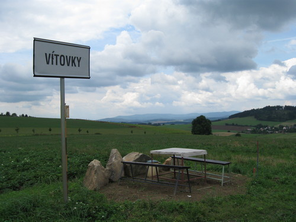

Po Domažlicku
#############

:tags: Šumava

.. image:: images/2008-07-31-po-domazlicku/IMG_1013.jpg

Den první
*********

Nakonec jsme přece jen vyrazili, sic s jednodenním požděním, ale přece a tak
po šťastném návratu můžu zas něco napsat - aneb průběh naší túry po Domažlicku.

Jak už jsem psal, vyrazili jsme s bratrancem Markem až o den déle, ve středu.
V úterý bylo hnusně, pršelo a my byli rádi, že jsme nikam nešli. Zato ve středu
se trochu počasí umoudřilo a my někdy kolem desáté hodiny dopoledne vyrazili
směr Hadrava a Orlovice.

Ze začátku všechno probíhalo hladce, šli jsme po rovince, pak
trochu do kopce, vzadu za námi Nýrsko. Všude okolo to vypadalo všelijak, ale mi
to krásně procházeli v trhlině mezi mraky. Cestou do Orlovic jsme potkali asi
pět skupinek mlaďochů, asi nějaký tábor, reakce na nás byly rozporuplné, jasné
však bylo to, že jsme jim jednoznačně zlepšovali náladu.

Asi tu napíšu pouze kudy jsme šli, protože nic extra se nestalo, nikdo si nic
nezlomil, a tak, však to znáte. Radši si prohlédněte pořádně fotky.

Cesta směřovala nejdříve přes Orlovice, Chodskou Lhotu, k Vítovkám a až
do Nové Vsi. Tam si pamatuji, že nás do vystrašil pes, který měl v cestě asi
jen půlmetrový plůtek (to by přeskočil, jen kdyby chtěl).

Dále po červené - vede přes Hájek do Brůdku, což je zacházka jak sviňa, řekli
někteří z nás. Trochu nás to tam zmátlo, už už jsme si mysleli, že si nezajdeme
a že si to o hodně zkrátíme. To se nám tak úplně nepovedlo a šli jsme dál podle
plánu. To už zmizela půlka čokolády. Dál cesta vedla pře Mlýneček a do Filipovy
Hory. Tam jsme povečeřeli (nejdřív jsme si museli říct o vodu v jedné z
místních chalup, přičemž nás domorodci pozvali do hospody) - dali jsme si
polívku s masovými knedlíčky a těstovinami. Docela se nám povedla, to se musí
nechat.

Pak jsme došli kousek do Pelechů, kde jsme chtěli někde na kraji lesa přespat.
To se nám podařilo a zakotvili jsme na pomezí lesa a jetelového pole, bylo sice
trochu brzo, ale ve spacáčku nám bylo fajne. A tak skončil náš
první den, zhruba po třiceti kilometrech tvrdé chůze (během osmi hodin, to jsou
asi čtyři kilometry za hodinu, nic moc). Vyspali až do zítřejšího, trochu
podmračeného rána.

Den druhý
*********

Vyspali jsme se poměrně dobře, večer byly krásné červánky, které ovšem nevěštily
nic moc dobrého, na Šumavě bývá většinou den po nich počasí pod psa, což také
bylo. Ráno byla obloha slušně zamračená, ale zatím to nevypadalo, že by se
mohlo rozpršet.

Rána sama o sobě bývají drsná, tohle bylo ještě o trochu horší než obvykle,
protože jsme neměli nic k jídlu ani k pití a snídani jsme si chystali dát až v
příští vesnici.

Marek ráno vyspával a já mezitím trochu změnil dnešní trasu,
i když jsem tušil, že Marek by tím nadšen nebude. Původně jsem
totiž mysleli, že si uvaříme snídani v Pelechách (asi tři sta metrů od našeho
ležení), přičemž si tam někde řekneme o vodu - mě se ale už zpátky vracet moc
nechtělo a taky jsem si nebyl jistý, jestli takhle dopoledne bude vůbec doma
někdo, kdo by nám vodu dal. A tak jsme šli hned po ránu dál, do další vesnice.

Když se na to teď zpět podívám, bylo to docela moudré rozhodnutí, protože
snídaně v Tlumačově stála za to. Nezačali jsme sice plně správně (při vzpomínce
na heslo "za zeptání nic nedáš a huba ti neupadne" jsem se zeptal prvního
domorodce, kde je tu nějaký obchod a on se na mne podíval jak na vola a řekl, že
tamhle - pár metrů za mnou.), ale po nákupu ideální snídaně (čerstvé rohlíčky,
paštička, sušenky a kdo ví co ještě) jsme si začali vesele pobrukovat, jak je
život trampa krásný.

.. image:: images/2008-07-31-po-domazlicku/IMG_1070.jpg

Po pár minutách jsme vyrazili dál, příští zastávka Domažlice. Na žádnou
zajímavou příhodu si nevzpomínám, jen že tam byly pěkné výhledy.

V Domažlicích jsme dokoupili zásoby (pití, papírové kapesníčky - ty se hodí na
hodně věcí a spolehlivě nahradí toaleťák) a pak se vydali dál. Byli jsme rádi,
když jsme měli rušnou silnici ve směru na Kdyni za sebou a šli dál po silnicích
vedoucích do malých vesniček. To byla jedna z nejpříjemnějších části našeho
putování - šlo se krásně až jsem si začal pískat a dokonce i Marek řekl, že
nohy už má rozchozený. Idylka však nikdy netrvá věčně - to jsme poznali, když za
vsí s jménem Zahořeny začalo poprvé v dnešním dni pršet.

Byl to vůbec první vážnější déšť za naše putování, zatím spadlo vždy maximálně
pár kapek. Nebyl to sice kdovíjak ukrutný slejvák, nám se ale moc promoknout
nechtělo a tak jsme zkusili taktiku "Batoh pod igelit! My pod igelit!", která
se osvědčila na výbornou (nebylo to poprvé, v Tatrách to fungovalo ještě lépe,
ale tam jsme to měli už ke konci natrénované).

Skoro škoda, že nepršelo déle - sedělo se nám tam celkem fajn až na to, že
komáři kousali o sto šest.

.. image:: images/2008-07-31-po-domazlicku/IMG_1091.jpg

Pak už to taková idylka jako předtím nebyla. Nějak nám zatuhly nohy, navíc
začalo zaset kapat. Tady jsem poprvé odhalil svůj odvážný plán, který ve mně
doutnal od rána - ukončíme puťák už dnes, ale tvrdě, dojdeme až do Nýrska.

Marek ještě nebyl unaven tak, jako o pár hodin později a tak překvapivě souhlasil. A
tak jsme práskli do bot a trochu přidali do kroku.

Teď už jsem měnil trasu za běhu, střihl jsem to dolů z kopce do Nového Dvora,
pak přes Kout na Šumavě až do Kdyně. Tady se Markovi už plán přestal líbit
(zrychlili jsme příliš) a tak naplánoval návrat zpátky domů vlakem.

Kdo mne zná, jistě ví, že se mi to vůbec nelíbilo - už z principu, co jsem si
navařil, to si i sním, kam jsem došel, odtud se musím dokázat i vrátit. A navíc
se mne zmocnila ta stará touha jít, stejná, na jakou můžou vzpomínat čtyři
pamětníci z Tater. Tam to bylo stejné, jen cíle byli jiné. Velká Fatra se
proměnila v Nýrsko, kopce se proměnili v rovinu.

.. image:: images/2008-07-31-po-domazlicku/IMG_1135.jpg

Tím jsem ale Marka raději neděsil a radši jsem mu vlak nenápadně rozmlouval. Do
karet mi hrálo to, že bylo z náměstí v Kdyni celkem daleko a Markovi už se
opravdu nechtělo udělat ani krok. Nakonec to skončilo tak, že pro nás měl
přijet Zdeněk z Nýrska autem. My se mu vydali naproti, za chvíli tu byl a
naštěstí se nechal přesvědčit a odjel s Markem beze mne.

Zpočátku se šlo krásně - čtyři puchýře na každé noze, co to je - a dokonce to
ani nevypadalo na déšť. Kdo mne potkal, musel si říkat co to tu jde za blázna s
krosnou - vzpomínal jsem si na staré táborové popěvky, staré siónské písně,
spirituály, ale jasně to vyhrály divné věci v našem údolí. A tak jsem vyřvával
z plných plic a celkem svižným krokem byl na cestě k domovu.

Za Pocínovicemi opět idylka vyprchala. Nohy už byly opravdu cítit a nastal typ chůze,
o které by se dalo mluvit jako o dření. Ono dření je na každé výpravě jedna z
nejdůležitějších věcí, právě na to se pak krásně vzpomíná s pocitem: A tohle
jsem dokázal.

.. image:: images/2008-07-31-po-domazlicku/IMG_1144.jpg

Při této chůzi jsem koukal pouze na krajnici silnice dva metry před sebou,
občasné zastavení na vyfocení nějaké zajímavosti bylo utrpením, protože mé nohy
vždy nejhlasitěji protestovali právě při rozcházení.

Tak jsem se doplahočil až do Nýrska. Živý a zdráv. Ještě před panelákem jsem
potkal sousedy (samé obvyklé reakce), chudák pan soused musel jít po schodech,
protože jsem zabral místo ve výtahu. Doma už jen hodně mléka a teplá koupel -
hurá, tohle na Ukrajině nebude.
