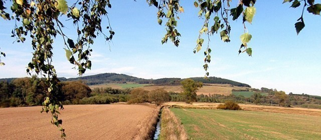

Zase příště
###########

:tags: povídky

Na cestě stál vůz. Nebyl schopen jet dál, to co bývalo kolem, už kolem rozhodně
nebylo. Tlouštík právě slezl z kozlíku a začal lamentovat nad svým neštěstím.
Jen zázrakem vůz ještě stál, málo chybělo k tomu, aby se skutálel dolů k
potoku.

„Zdravím vás, příteli,“ vynořil jsem se z křovin a pozdravil nešťastníka. Ten
nadskočil a zbledl.

Nedivil jsem se mu, věděl stejně dobře jako já, v jaké je kraji. Nezřídka se
stávalo, že ten, kdo se tudy vydal, nedojel tam kam chtěl, ale zůstal ležet
vedle cesty s podřezaným hrdlem a o kousek dál stál jeho vůz dříve plný
vzácného zboží.

„Také vás zdravím a doufám, že víte co znamená slovo přítel – nevím, zda mi tak
můžete říkat.“

„Nebojte se, nejsem ten, koho se bojíte. Vidím, že jste v nesnázích. Můžu nějak
pomoci?“

„Kolo u vozu mám na kusy. Tady mi asi moc nepomůžete, pokud tedy náhodou nemáte
doma malou dílnu.“ poznamenal s dávkou sarkasmu.

„Nevím, jestli vám to pomůže, ale asi o míli dál stojí podobný vůz, bojím, se
že vlastníkovi už bude jedno, jestli mu jedno kolo ubude.“

„Myslíte, že by šlo kolo nahradit?“

„Myslím, že to nebude problém, pomůžu vám.“

„Opravdu? A mohl byste mi to kolo přinést? Víte, mám tu drahé věci a nechat je
tu jen tak stát, to si nemohu dovolit.“

Trochu jsem se usmál: „Tady v těch končinách je úplně jedno, jestli tu necháte
vůz stát nebo u něj budete. V druhém případě vás to může bolet o trochu více.
Než bych se vrátil, to je půl hodiny a vy můžete být už nahoře u pánbíčka.“

Tlouštíkovi vidina brzké smrti na zdravé barvě nepřidala a začal se tvářit
trochu sklesle.

„Pučte mi jednoho svého koně, na tom budu u vozu za chvíli a vy máte dobrou
naději, že to nebude vaše poslední cesta.“

„Víte, kůň – to je celé jmění. Já bych vám rád věřil, ale přece jenom se
neznáme.“

„Já vás chápu. Nemůžete půjčovat své věci každému koho potkáte. A já už stejně
musím jít, ale rád jsem vás poznal,“ zamával jsem mu a vydal se vlastní cestou.

„Ne, počkejte, přece mne tu nenecháte. Hrozně nerad to dělám, ale pučte si toho
koně.“

Nechtěl jsem si koně nechat. Proč bych to ostatně dělal. Vůz opravdu o kousek
dále stál a nebylo těžké vzít kolo a nasadit na vůz ho neznámému.

„Mockrát vám děkuji za pomoc,“ loučil se obchodník, „Musím už jet, hodně jsem
se tu zdržel, tak abych byl do večera ve městě.“

„Počkejte ještě,“ zavolal jsem na něj, když odjížděl, „dejte mi ten váš kabát,
co si vezete vzadu. Jen tak z přátelství. Prosím vás.“

„Můj kabát? Proč bych to dělal,“ zasmál se a jel dál.

„Třeba proto, aby vám měl příště kdo pomoci,“ promluvil jsem tiše za
odjíždějícím vozem.
