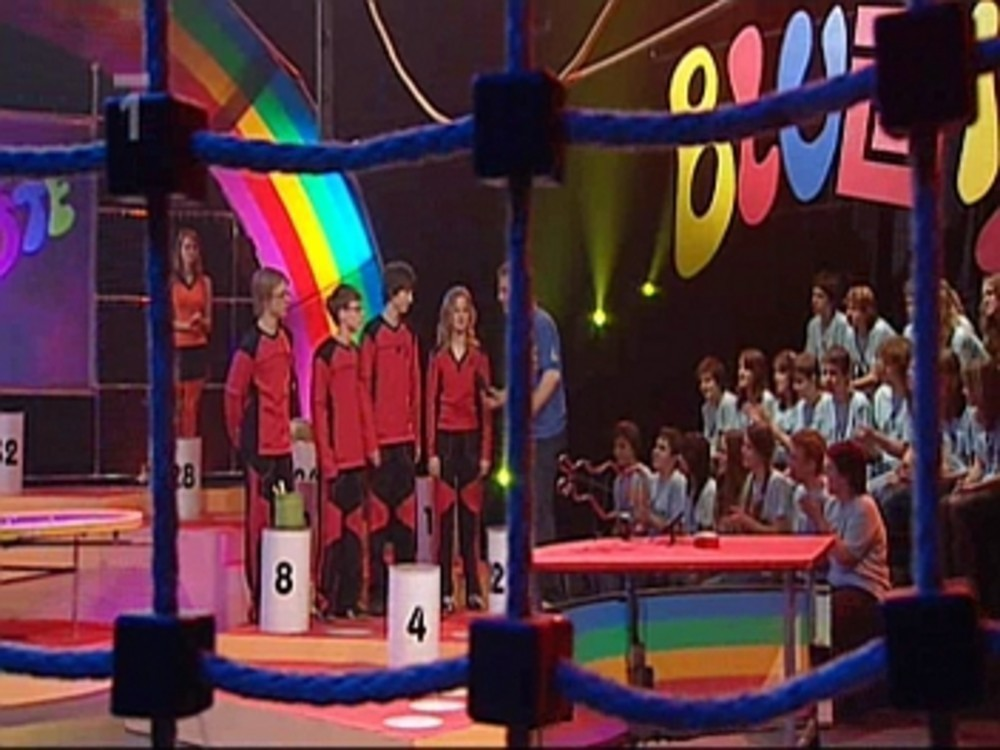
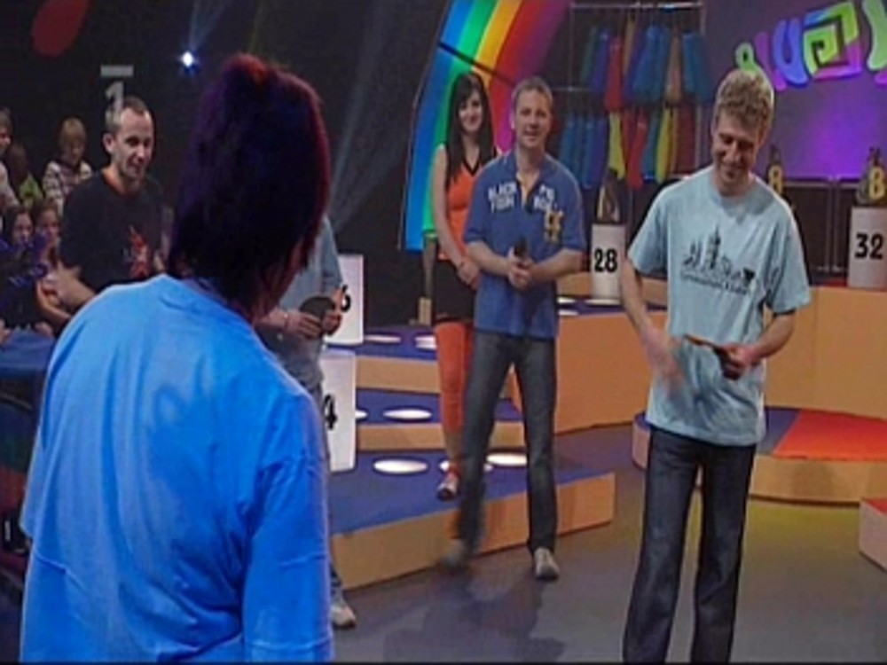
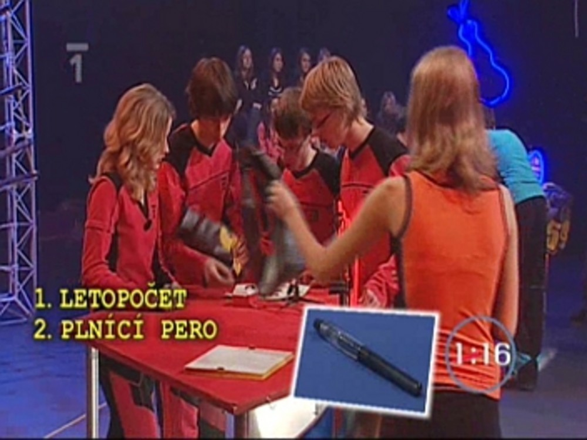

Jaké bylo Bludiště I. - stručně a jasně
#######################################

:tags: Bludiště, gympl
:category: Škola

.. class:: intro

V některých třídách si žáci dávají před Vánocemi dárky. Občas dají dárek i
učitelé. A my jsme dostali k Vánocům dárek pořádný.

Naše třídní profesorka,
Jana Soukupová, nás totiž přihlásila do televizní soutěže „Bludiště“. A jak se
říká, darovanému koni na zuby nekoukej, ani my jsme se tohoto dárku moc
nezděsili a v celku ochotně jsme se pustili do tréninku a příprav.

Jeden z nejtěžších úkolů bylo sestavit čtyřčlenné družstvo, které by mohlo
soutěžit a obstát. V této soutěži totiž nejenom musíte mít něco v hlavě, ale
musíte i dokázat lézt po lanech a vydržet veškerý stres, který je se soutěží
spojen. V naší třídě, kvartě B, se osvědčily hry „Česko“ a „Evropa“.

Uspořádáním pár soutěžních kol ve třídě jsme si mohli snadno určit naše
favority, jejichž znalosti by byly dostatečné. Pak už si každý jenom vybral
čtyři kandidáty, kteří se mu zdáli být dobrými jak po stránce fyzické, tak i té
mozkové. Proběhlo hlasování a bylo rozhodnuto, že „černý Petr“, toto nelehké
poslání, zůstane v rukou Martina Hezoučkého, Judy Kalety, Karla Pučelíka a
Jitky Fűrbacherové.

Tento tým pak mohl směle nacvičovat obratnost v prostorách tělocvičny školy,
kde si za pomoci pár učitelů zřídil vlastní lanové centrum a nacvičoval doslova
„ostošest“. A aby si celá třída mohla být jistá, že je tým nezklame, vypravili
se ještě tito čtyři spolu s paní učitelkou Soukupovou do skutečného lanového
centra v Sušici.

Dalším těžkým úkolem, do kterého se dlouho nikomu nechtělo, bylo vybrat název
týmu.

Hned po jarních prázdninách, přesněji v neděli 22. února, celá třída nasedla do
autobusu a společně s panem učitelem Tomášem Rynešem a paní učitelkou Janou
Soukupovou se vydali na cestu do Ostravy. Natáčelo se až v pondělí ráno, od
osmi hodin se tým i s celou třídou rozkoukával ve studiu a nechal se popohánět
různými uličkami – převléct, napudrovat, ať se nám nelesknete a rychle, jedem,
natáčíme.

Pak nám rychle vysvětlili co a jak, jak se tvářit, jak tleskat, kam si stoupat,
kudy běhat a tak všelijak. I když Bludiště je malá věc, televize je tu cítit –
občas nám dělalo potíže smát se pořád stejně radostně, když už jsme výhru
nahrávali po třetí, nebo jsme začali cítit bolest v dolních končetinách, po
tom, co jsme po šesté přibíhali.

Velmi dobře jsme se také přesvědčili, že celá soutěž je vlastně o náhodě. Pan
učitel Ryneš dokonce zopakoval tento výrok v každém díle. Poprvé se nám
podařilo zvítězit díky tomu, že jsme rychleji přišli na hlavní tajenku a
obrátili tak skóre – celou dobu předtím nás soupeř válcoval. Podruhé jsme
vyhráli jen díky našim učitelům, kteří dokázali lépe házet frisbee. Díky nim
jsme získali takový náskok, že jsme si mohli dovolit prohrát tajenku (a taky že
jsme ji prohráli). Po třetí zase rozhodli učitelé, když dokázali postavit vyšší
věž než jejich kolegové ze Stříteže. Jediný rozdíl byl v tom, že se nám
podařilo i dřív uhádnout hádanku. Jediné s čím jsme měli v soutěži problém a
upřímně řečeno byl to problém velký, byl balancovník. Pro ty, kdo soutěž ještě
neviděli, je to finální úkol, ve kterém dostane družstvo do rukou velkou
kruhovou desku a musí koule umístit podle barev do správných děr. Člověk by si
řekl, že je to snadné. Možná že to i snadné je, každopádně nám se to podařilo
až naposledy.

Účastnit se televizní soutěže, ať už Bludiště, nebo jakékoliv jiné, je určitě
velká a dobrá zkušenost. Poznáte kameramany, režiséra, podáte si ruku s lidmi,
které znáte jenom z televize. Zažijete spoustu stresu, ať už jako soutěžící
nebo i jen jako divák. A hlavně – až se za pár let znovu uvidíte, jak jste tam
seděli a usmívali se do kamery, určitě vás to pobaví.

A kdy nás vlastně můžete v televizi shlédnout? První díl poběží v pátek 27.
března a další díl vždy po týdnu. Na jedničce – od 16:30.
