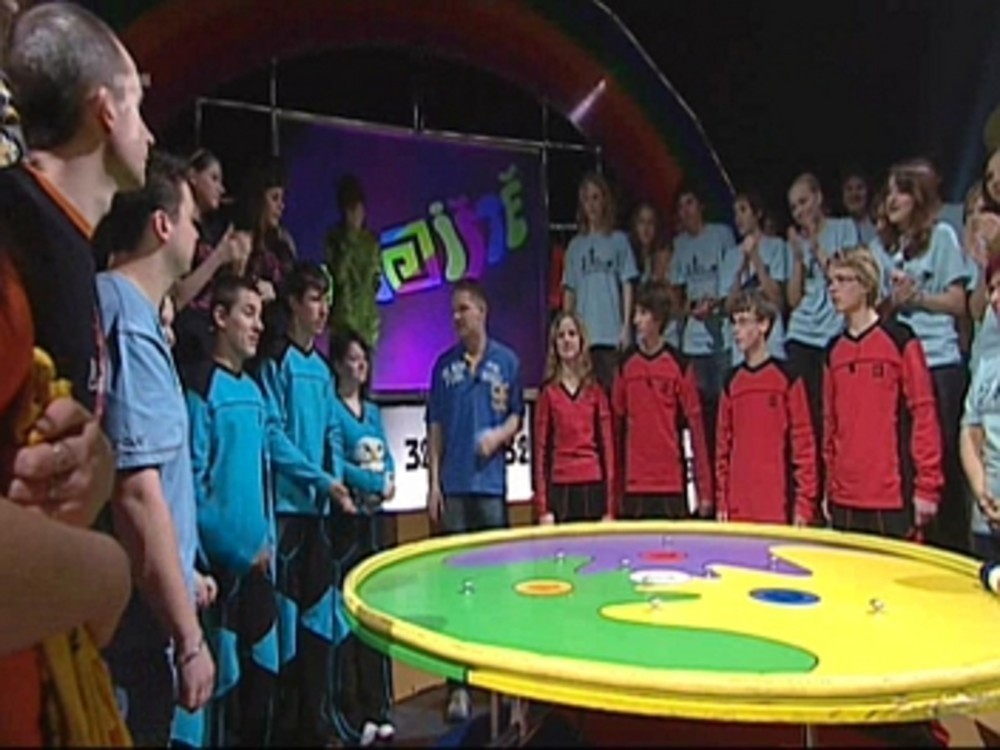
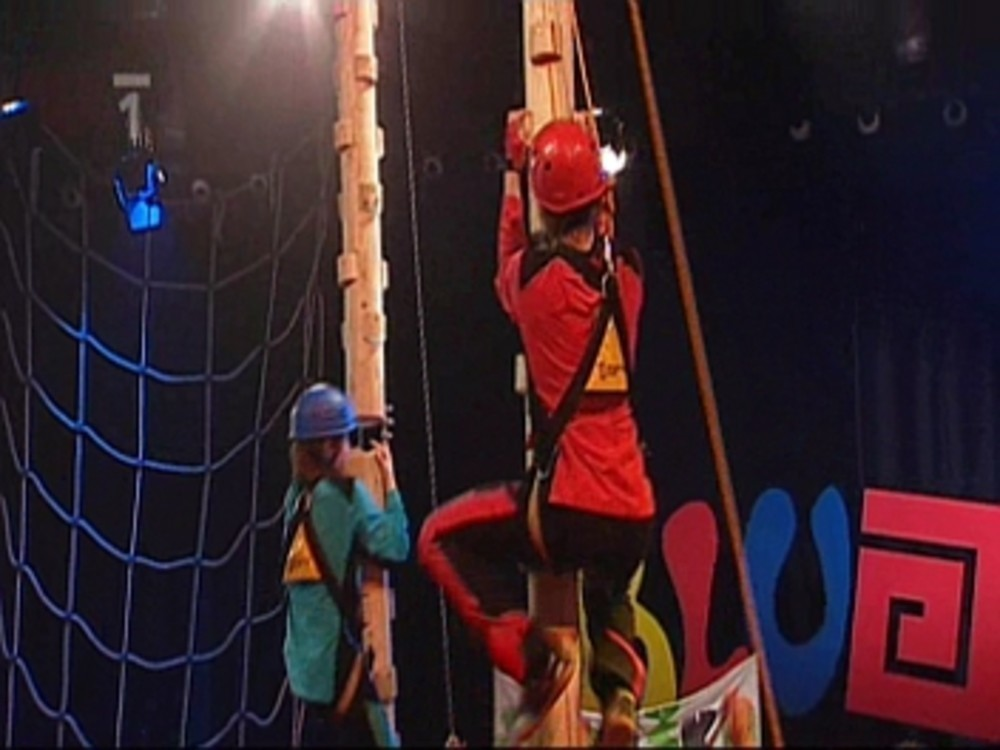
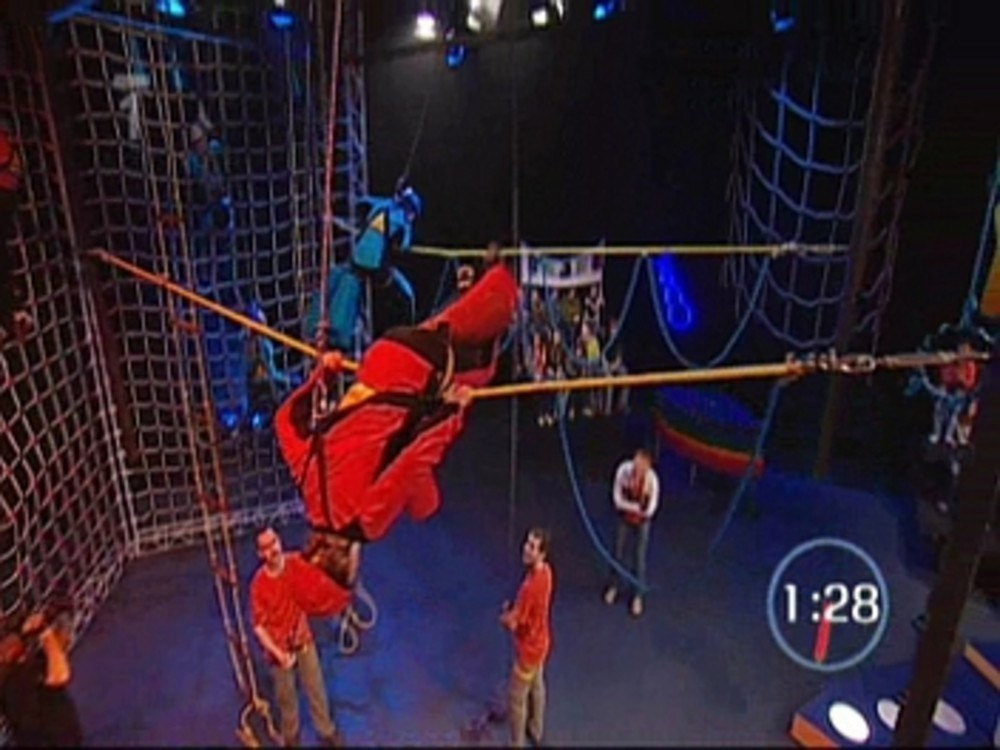
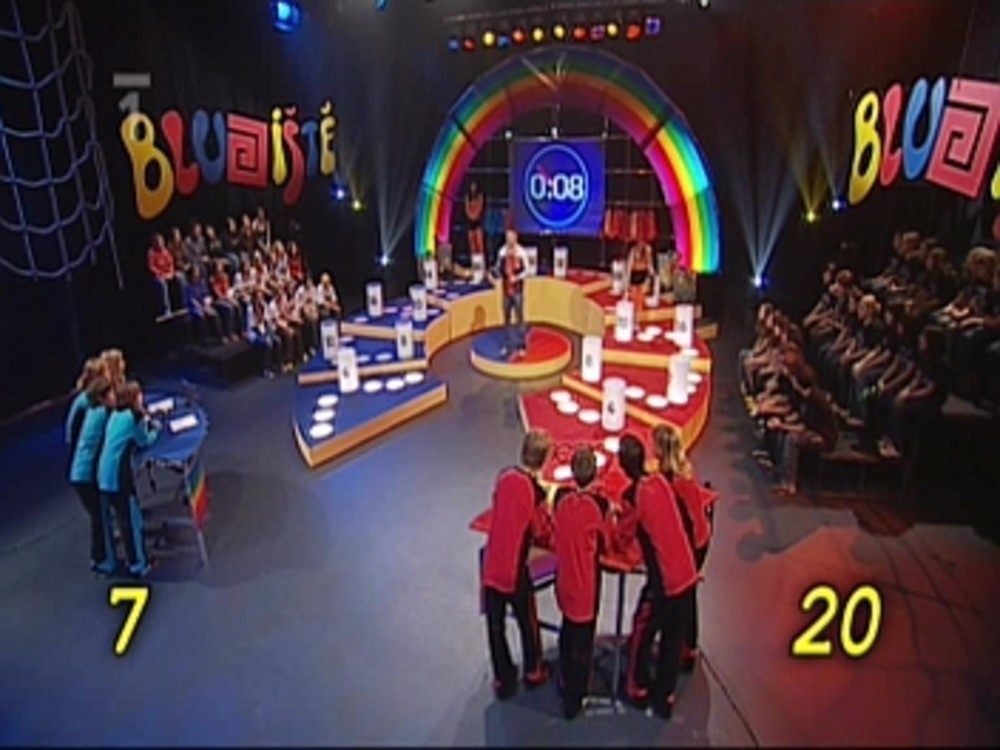

Jaké bylo Bludiště II. - rozhovor s týmem
#########################################

:tags: Bludiště, gympl

.. role:: sc

.. class:: intro

A další informace o Bludišti vyplouvají na hladinu. Tentokrát rozhovor s nešťastníky,
kteří okusili stres ze soutěžení na vlastní kůži. Ponechalo to
na nich následky? Přesvědčte se sami...

.. class:: question

Jaké pocity jsi měl(a) z toho, když jsi se dozvěděl(a), že budeš soutěžit v Bludišti?

:sc:`Karel`: Nejdříve jsem se lekl, ale potom jsem si řekl, že to může být zajímavé.

:sc:`Martin`: Žádné zvláštní. Nijak mě to nevzrušovalo.

:sc:`Jitka`: Ze začátku jsem byla ráda a těšila jsem se, ale jak se to blížilo...

:sc:`Juda`: Rozhodně mne to nepotěšilo, ale byla to věc, se kterou jsem se musel smířit. Asi stejně jako s návštěvou u zubaře.

.. class:: question

Čekal(a) jsi, že tě třída vybere? Kdo byli tví favorité?

:sc:`Karel`: Sebe jsem mezi čtyřmi vybranými rozhodně nečekal. Na svůj papír jsem napsal Martina Hezoučkého, Judu Kaletu, Markétu Votavovou a Marii Zieglerovou.

:sc:`Martin`: Jo, čekal jsem to.

:sc:`Jitka`: Spíš ne, říkala jsem si že by to teoreticky mohlo bát možný ale, že spíš ne. Mými favority byli Juda Kaleta, Martin Hezoučký, Kája Pučelík pak třeba Markéta Votavová či Abeba Jánská

:sc:`Juda`: To že mně ve třídě vyberou, jsem tak trochu čekal. Jinak jsem hlasoval pro všechny z družstva, místo sebe bych nasadil Martina Wirtha.

.. class:: question

Kdy jsi pocítil(a) nejvíc stresu? Proč?

:sc:`Karel`: V prvním díle před tajenkou. Prohrávali jsme o dost bodů a věděl jsem, že když tajenku neuhodneme prohrajeme.

:sc:`Martin`: Asi před otázkami, když už se to točilo potřetí.

:sc:`Jitka`: Nejhorší bylo když jsme jeli ráno na první natáčení tak v autobusu. Nevěděla jsem jak to bude probíhat, ale když jsem dorazili tak to ze mě opadlo.

:sc:`Juda`: Možná by si někdo řekl, že nejhorší je zavěšovat v posledních sekundách bludišťáky, tak jako se to povedlo mně, ale tam na to člověk nemá čas myslet. Takže asi v prvním díle před tajenkou.

.. class:: question

Proč ses do Bludiště (ne)těšil(a)?

:sc:`Karel`: Bylo to pro mě něco úplně nového a zajímalo mě, jak to zvládnu, takže jsem se docela těšil.

:sc:`Martin`: Moc jsem se netěšil, hlavně na tu dlouhou cestu autobusem.

:sc:`Jitka`: Těšila - něco nového a snad i super zážitek. A netěšila protože jsem se bála, že to všem zkazím.

:sc:`Juda`: Protože mi od začátku celá soutěž připadala hodně o náhodě. Je to o tom, jaké máte štěstí na otázky a jaké štěstí mají učitelé.

.. class:: question

Jak moc by sis na svůj tým před Bludištěm vsadil(a)?

:sc:`Karel`: Určitě moc ne.

:sc:`Martin`: Radši nic.

:sc:`Jitka`: Středně. Doufala jsem že bychom mohli párkrát vyhrát, ale obávala se, že se tak nestane.

:sc:`Juda`: Osobně jsem čekal, že po prvním díle pojedeme domů.

.. class:: question

Překvapilo tě ve studio něco? Dělalo se něco jinak, než jsi čekal(a)?

:sc:`Karel`: Překvapilo mě natáčení jednoho momentu několikrát.

:sc:`Martin`: Ne. Ne.

:sc:`Jitka`: Překvapila mě velikost studia, bylo strašně vysoké, ale jinak docela malé. Síť po které jsme lezli se tím pádem zdála opticky nižší. Také jsem byla mile překvapena štábem a moderátor byl taky super.

:sc:`Juda`: Docela mně zarazilo, když jsem viděl, že ani zkušený moderátor není bez nervů a že se často zapotí, když něco opakuje třeba po páté.

.. class:: question

Jaké byly tvé pocity po první výhře?

:sc:`Karel`: Měl jsem radost a byl jsem překvapený.

:sc:`Martin`: Tak byl jsem rád. Asi protože jsme nemuseli jet hned domů.

:sc:`Jitka`: Jelikož byl náš první soupeř dost namyšlený a neodpustil si pár narážek, tak jsem byla ráda že jsme jim to natřeli . A taky už bylo jasné, že neodjedeme domů se stoprocentní ostudou.

:sc:`Juda`: Asi největší radost mi dělalo to, že se díky nám ostatní „ulejou“ o pár dalších hodin ve škole.

.. class:: question

Jaký díl byl pro tebe nejnáročnější?

:sc:`Karel`: Rozhodně první. Soupeř byl velice dobrý.

:sc:`Martin`: První, tak bylo tam hodně stresu.

:sc:`Jitka`: První díl byl takový plný překvapení, ale nejnáročnější byl asi druhý, protože se natáčel chvilku po prvním, ve studiu bylo horko a byli jsme unavení.

:sc:`Juda`: Tak tady už je odpověď jasná – i když na nervy čas nebyl, náročné to bylo: překážka a zavěšování v druhém díle.

.. class:: question

Jaký díl sis nejvíce užíval(a) a proč?

:sc:`Karel`: Třetí, protože už jsem věděl co nás čeká.

:sc:`Martin`: Třetí. Asi díky soupeřům.

:sc:`Jitka`: První díl mne vyloženě bavil, v posledním díle už zase o tolik nešlo, protože jsme se zúčastnili už všech natáčení a nebylo již kam postoupit.

:sc:`Juda`: Asi jako všichni ostatní ten třetí, hlavně proto, že nebylo co ztratit, domů bychom jeli tak jako tak.

.. class:: question

Zopakoval(a) by sis bludiště? Proč?

:sc:`Karel`: Asi ano, protože jsem si kromě nervů užil i spoustu legrace.

:sc:`Martin`: Jo, protože jsme neměli školu.

:sc:`Jitka`: Myslím že ano, protože jsme si užili i spoustu srandy. Vyfotila jsem se taky s Romanem, zalezla po síti, což bylo úplně super. Zhoupla jsem se na houpačce.

:sc:`Juda`: Jednou a dost. Rozhodně mi to stačilo, i když zkušenost to byla zajímavá.
