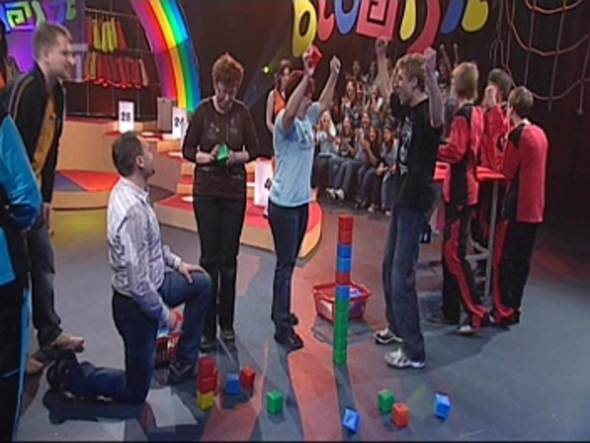

Jaké bylo Bludiště III. - rozhovor s Tomášem Rynešem
####################################################

:tags: Bludiště, gympl
:category: Škola

.. class:: intro

Další zajímavý článek, tentokrát s učitelem, který nás do Bludiště doprovázel. Hlavní rozhovor s naší třídní se ještě chystá...

.. image:: images/2009-02-24-jake-bylo-bludiste-i/11.jpg

.. class:: question

Znal jste soutěž Bludiště před tím, než jste do Ostravy měl jet?

Slyšel jsem o ní, pravidelně jsem ji však nesledoval.

.. class:: question

Kolik byste vsadil na tým Chemiků před Bludištěm? Věřil jste mu?

Při trénincích v hodinách TV jsem tak trošku tušil, že by to mohlo vyjít.

.. class:: question

Která z učitelských soutěží pro vás byla nejnáročnější a která naopak úplná „brnkačka“?

Nejnáročnější byl ping pong v prvním díle, jelikož nervozita cvičila asi s každým z nás. „Brnkačkou“ lze tedy nazvat zbylé dvě soutěže.

.. class:: question

Kdy jste zažíval největší nervy?

Největší nervy jsem zažíval asi v prvním díle, kdy nebylo do poslední chvíle rozhodnuto.

.. class:: question

Jaké byly vaše pocity, když tým zvítězil?

Myslím, že z obrazovky to bude cítit. Radoval jsem se jako malý Jarda a prožíval tak soutěž se vším všudy.

.. class:: question

Víte, že ve druhém i ve třetím díle zvítězili Chemici hlavně díky svým učitelům? Vnímal jste to už při soutěži?

Jelikož jsme v prvním díle svým výkonem družstvo příliš nepodrželi, rozhodli jsme se tomuto učinit přítrž a v dalších kolech jsme naši část soutěže již zvládli. Důvodem byla jistě zmiňovaná větší odhodlanost ale také menší míra nervů a přibývající zkušenosti.

.. class:: question

Jaký názor máte na soutěž Bludiště? Máte nápad, jak by se dala tato soutěž vylepšit?

Myslím, že se jedná o povedenou soutěž na odpovídající úrovni. Líbí se mi, že podporuje staré antické hodnoty, a sice rozvoj těla i ducha. Mimo to takový výlet za společným cílem probudí ve studentech nejen soutěživého ducha, ale především může pomoci ke stmelení daného kolektivu. Nic bych na soutěži neměnil, možná bych zavedl jednodušší úkol při získání cen v samém závěru.
