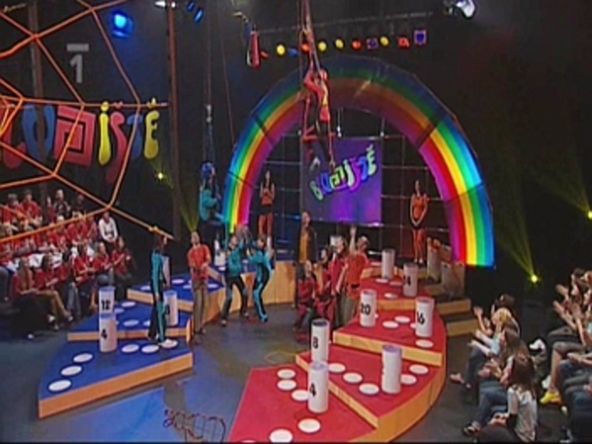
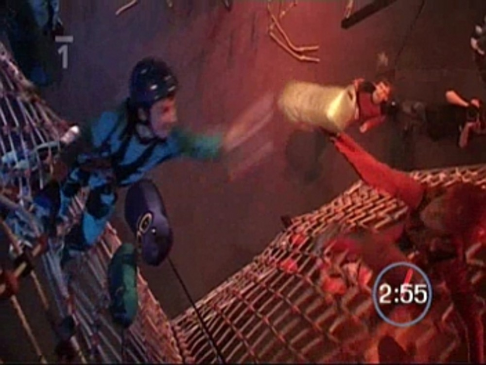
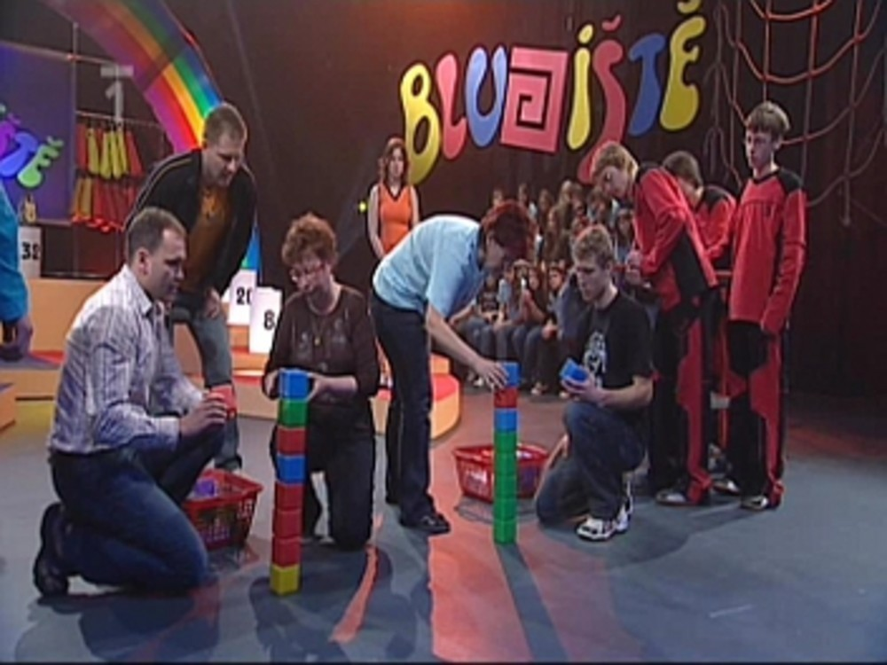
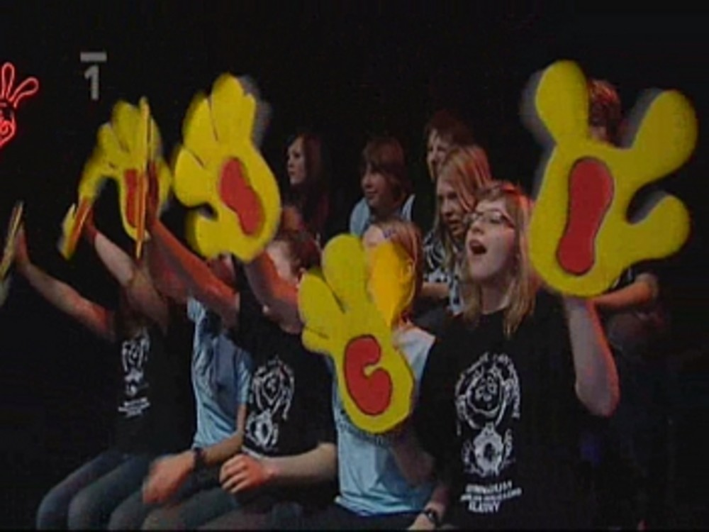
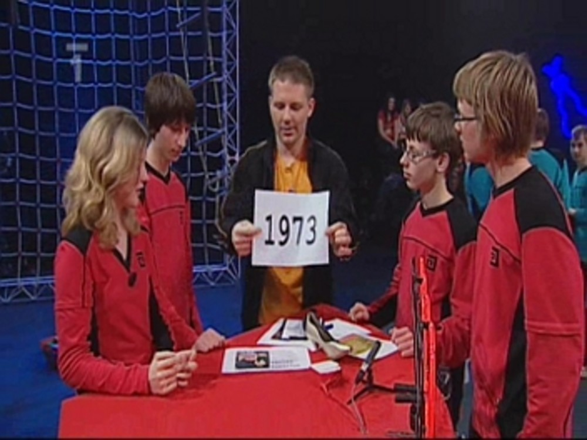
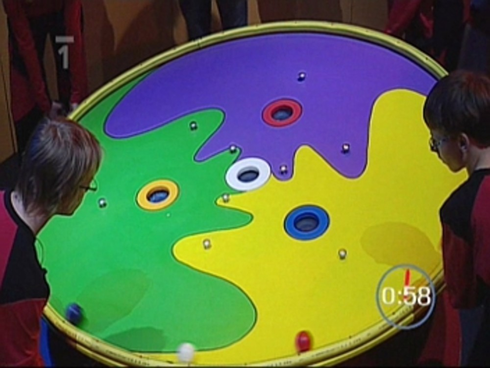
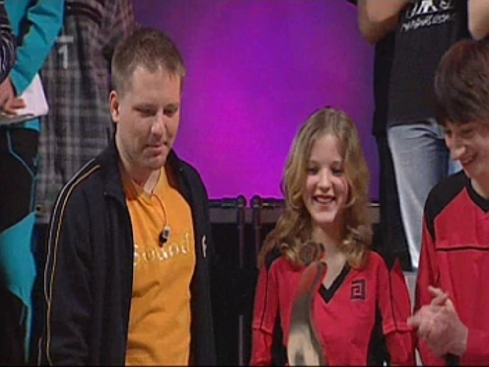

Jaké bylo Bludiště IV. - jak to bylo doopravdy
##############################################

:tags: Bludiště, gympl

.. class:: intro

Možná se vám také zdály poslední články takové jakési suché. Patrně máte
pravdu, nebylo to, co jsem na blog zvyklý psát. A ani si zvykat nehodlám.

Prostě to na blog nebylo - bylo to novin (Klatovského deníku, to jsem zvědavý,
jestli se tam něco objeví) a do školního časopisu (do Magyku - magazín gymnázia
Klatovy). Prostě a jednoduše - tam jsem si nemohl dovolit napsat vše a tímto
článkem to chci trochu napravit. Píšu ho už také proto, že chci mít za sebou
všechno to bludišťování. Poslední týden je pořád na jedno brko. Tento maratón
zakončím článkem o Jizerkách - to nejlepší nakonec, takže se máte ještě na co
těšit.

Nebudu to protahovat a začnu psát, jaké to vlastně v Ostravě bylo. To jak jsme
se tam dostali už zhruba víte, protahovat to nechci, psát to znovu nebudu.
Samotný odjezd byl docela fofr. Přijel jsem z Jizerek, někdy večer kolem osmé a
zítra v půl deváté vyrážel zas do Klatov a odtud do Ostravy. Co se toho člověk
za pár dní najezdí.

Nějak se to však zvládlo a nikdo, opravdu nikdo, se nezranil, takže třídní
mohla být v klidu a užívat si klasického seřvávání (jémine, co je to za slovo?)
svých svěřenců. Do autobusu pana Štáhlicha jsme se naskládali a vyjeli. Nevím
jestli má cenu nějak zvlášť se tu rozepisovat o cestě. Bylo to stejné jako
jízda při jakémkoliv jiném výletě. Kravál, mobily a zastávky na čurání.

V Ostravě jsme se měli usídlit v ubytovně "Pod mostem". Žádný vtip, no joke,
opravdu. Takhle se jmenovala. Hned vedle byla hospoda a night club. Pan
profesor Šmíd později prohlásil, že je to neslýchané. Ubytovna zezadu byla
velmi podobná domům, které si Tchoříci mohou pamatovat z Ukrajiny. Holé cihly,
tu a tam nějaká vypadlá, okna, která vypadají, že už dlouho nevydrží - no
prostě hrůza. Snad sem dostanu nějakou fotku, abyste se mohli pokochat.

Vevnitř to zas tak hrozné nebylo, snad až na ty okna, se kterými nešlo hnout a
na plíseň na zdech - dnes už je známá snad jen jako Amátka. Pak tam byli
zajímaví spolubydlící. Vedle našeho pokoje bydlela Samantra (ani nevím, kde se
tohle vzalo) - stará nerudná ženská, která chtěla mít trochu svého klidu a
párkrát nás přišla seřvat. Docela jsem ji chápal. Pak nějací ukrajinští dělníci
(a hale, zase vazba k Ukrajině), kteří prý byli všechno, jen ne slušní.

Noc jsme na ubytovně nějak přečkali, někdo spal, někdo ne. Klasika.

Ráno jsme zase naskákali do autobusu. Kompletně zabalení, pro případ, že se
nezadaří a my hned pojedeme domů. S drobným zpozděním jsme dorazili do studia,
nikterak to nevadilo, protože štáb se zpozdil také - tři centimetry sněhu,
kalamita, co se dá dělat.

Pak už to šlo ale rychle. Seznámili nás s tím, co se bude dít, nás čtyři
zvolené si odvedli nejdřív do kostymérny pro ty skvělé hábity - dostali jsme
červené. Pak do maskérny, přepudrovat, nastříkat vlasy nějakým sajrajtem a kdo
ví co ještě.

Soukupová prý prohlásila něco ve smyslu: "Juda nalíčenej, já padnu."
Ve skutečnosti toho na nás zas tolik nedali, poznat to skoro nebylo. Nato si
nás odvedli do studia, kde nás seznámili s režisérem (Jindřich) a s tím jak to
bude probíhat. Televize je televize, i v téhle soutěži se scény několikrát
opakují. Třeba jen nabíhání zpoza sítě se točilo pěkně dlouho. Před prvním
dílem jsme byli všichni dost vyklepaní, takže s námi potíže neměli, všichni se
snažili co to šlo.

Když už byl natočen náš náběh mohli se tribuny zaplnit diváky a začít se
pořádně. Diváci mají důležitou úlohu. Tleskat a fandit. Prý to bylo dost
únavné, ruce bolely, krky bolely. Nám soutěžícím se zas klepaly ruce a hrdlo
bylo jak přiškrcené. Na někom to bylo vidět víc, na někom méně, každopádně
zlaté zkoušení z fyziky - to je úplná pohodička.

Ze začátku se nám moc nedařilo. Vlastně dařilo, ale jen tak na půl. Úvodní
otázky jsme dali obě dvě za tři bludišťáky. Bohužel soupeř stejně tak. Byl to
soupeř zkušený, dvakrát už vyhrál a brousil si zuby i na nás.

Ještě jsem tu neobjasnil, proč se náš tým jmenoval Chemici. Chtěl jsem to
napsat už do článku do novin, ale zůstalo to jen nakousnuté (úplně jsem to
zapomněl dopsat). V televizi uslyšíte, že je to podle skupiny My Chemical
Romance, která je v naší třídě oblíbená. Ve skutečnosti to bylo na památku
našeho spolužáka, ale to by, jak řekl rejža, znělo hrozně smutně. Holt televize.

Pak přišlo na řadu lezení. Na síti lezla ještě nesehraná dvojice Hezoun a
Jitka, Karel to dole vázal a na mě zbyla překážka. Soupeř nás v tomhle docela
převálcoval. Ty zkušenosti byly znát. Zlatého bludišťáka nám sebrali ani jsme
nemrkli. Zato nám jeden bludišťák spadl hned ze začátku. Komplikace při
zavěšovaní naštěstí nenastaly.

Když přišly otázky byli jsme všichni ještě pořádně vyklepaní. Snad nám
nezabírali ruce nad tlačítkem, protože ty se klepaly snad každému. I přes tu
nervozitu jsme si nevedli špatně. Tuším, že jsme zodpověděli o otázku víc než
soupeř. U tak ale soupeř vedl asi o šest bodů.

Učitelé si měli pinkat co nejdéle s ping-pongovým míčkem. Učitelé z Bohumína to
váleli, naši také nebyli špatní, ale ti druzí byli prostě lepší. My jsme
rozumně vsadili pouze jeden bod, ten nám také odečetli. Soupeř udělal fatální
chybu a vsadil pouhé tři body. Kdyby to trochu déle rozmýšlel, vsadil všech
pět.

Naši učitelé, jak už jsem řekl, prohráli - my tak ztratili jeden bod a soupeř
získal osm. Rozdíl byl tuším 13 bodů. Rozhodnout tedy měla až poslední
disciplína - tajenka. Tady byly naše nervy opravdu našponované, teď šlo o
všechno.

Měli jsme přijít na známou osobnost. První nápověda - rok 1936. Pak tam bylo
pero. Ve třetí pouta. Nikdo pořád netušil. Rozlouskla to až čtvrtá nápověda,
nápis: Charta 77. A jediné jméno, které se nám v tu chvíli vybavilo, bylo jméno
Václava Havla. A kupodivu to tak doopravdy bylo. Za tajenku jsme získali 15
bodů, o pouhé dva body jsme tedy zvítězili.

Stačilo by málo a mohlo to by úplně jinak. Pokud bychom měli například o pouhou
jednu zodpovězenou otázku méně a soupeř vsadil na učitele všech pět bodů, bylo
by rozhodnuto. To se naštěstí nestalo a my byli rádi, že nejedeme hned domů.
Jak jsme si vedli u balancovníku snad ani psát nebudu. Po všech těch nervech
nám to jaksi všechno vypnulo a my tam jen tak stáli, drželi balancovník a
koukali jak se kuličky kutálejí. Nedostali jsme tam snad ani jednu kouli.
Následovala přestávka a pak se točil druhý díl. Zase to samé. Jen trochu
únavnější, protože ve studiu bylo už pořádné horko a taky už se všechno
nedařilo tak jako ráno, scény se opakovali a únava vzrůstala.

Naštěstí jsme dostali relativně slabého soupeře, jeho nevýhodou byl asi věk -
všichni byli o dva roky mladší než my. Co musím uznat je to, že měli pěkný,
rytmický a melodický pokřik. Znělo jim to opravdu pěkně. "Bejci, do toho,
vyhrajem to, hotovo." Zkuste si to zakřičet. Úžasné, škoda že jsme něco tak
pěkného nevymysleli i my. I když naše "Chemici, Chemici, to jsou prostě
profíci. Vždycky vědí co a jak, všem vám tady daj na frak." taky není úplně
špatné.

Druhý díl už si tak dobře jako první nepamatuji, nějak se mi to tam v makovici
pomotalo. V úvodních otázkách to moc slavné nebylo, ale soupeř s námi držel
krok. Rozhodující bylo lezení. Překážka byla o něco těžší než v prvním díle,
když na ní neděláte kraviny, dala se zvládnout.

Začátek byl opravdu pěkný. Dvojka na síti už se sehrála a tak byl zlatý
bludišťák náš, ani nikdo nemrkl. Problém nastal až u mně. Trochu jsem to
zdramatizoval a čistě neúmyslně jsem začal dělat nahoře kraviny. Prý to
vypadalo pěkně, až se na sebe budu dívat, asi si řeknu něco nepěkného. Jednak
mi Karel nabalil spoustu bludišťáků a mně se to v lanech nahoře šmodrchalo.
Dokonce tak hodně, že jsem jednoho z karabiny urval. Asi v půlce překážky jsem
přesunul těžiště výš, než bylo zdrávo a otočil jsem se hlavou dolů. Úplně
úžasné je, jak si z toho pamatuji každou setinu. V jednu chvíli jsem byl výš
než jsem chtěl, pak se začínám otáčet a diváci na tribunách tichnou. Pak visím
hlavou dolů a snažím se zhoupnout zpátky. To se mi naštěstí podařilo, dokonce
až tak, že jsem se málem přetočil na druhou stranu. Diváci jásají. Tady mně to
docela začalo bavit.

První nálož jsem zavěsil a dole už pro mě byla přichystána další. S Karlem jsme
měli domluvené, že mi řekne, kolik mám ještě času. On ale nějak na časomíru
zrovna neviděl a tak mi řekl, že mám asi o patnáct vteřin víc času. Za tu dobu
jsem to měl dát úplně v pohodě. Jsem kousek za půlkou překážky a ouha,
posledních deset sekund a Roman (moderátor) začíná odpočítávat. Nebudu vám
popisovat to drama, mě to tak napínavé zas nepřišlo, zase jsem vnímal každý
detail - poslední sekunda, hala tichá, já mám kruh na zavěšování na dosah, dole
vidím kameramana a moderátora, který odpočítává poslední sekunda. Pak cvak a je
to tam. Prý včas. Budu jim věřit. A tak až na jednoho urvaného bludišťáka
viseli nahoře všichni.

Soupeř tak úspěšný nebyl a mi začínali doufat, že domů ještě dnes nepojedeme a
že se ulijeme z fyziky. V otázkách to bylo vyrovnané, rozhodla soutěž učitelů.
Ti měli totiž házet frisbee do košíčku. Možná už jste to viděli, v Bludišti to
nebylo poprvé. Pan učitel Ryneš sice tvrdil, že je to o náhodě, každopádně se
mu jako jedinému podařilo trefit a to dokonce dvakrát.

My už to měli všechno propočítané a vsadili jsme přesně tolik, abychom si mohli
být jistí, že to máme v kapse. To se povedlo a my si tak mohli dovolit prohrát
poslední úkol, tajenku. Docela mne zklamalo, že v tajence nevyšel můj tip Marca
Pola. Tam jsme se možná trochu unáhlili a měli jsme déle přemýšlet, protože
soupeř měl pouze dvě nápovědy, ze kterých vycházeli jako možné dvě osoby, již
zmiňovaný Polo a pak Kryštof Kolumbus. No a ten druhý byl správný.

Pak zase přišel balancovník. No comment, možná jsme lemplové, ale zase jsme se
nechytili. Něco už se nám tam dostat podařilo, dva tisíce korun nám ale zase
utekly.

Zase jsme naskákali do autobusu a odjeli zpět na krásnou ubytovnu. Cestou jsme
se stavili v Kauflandu a dokoupili zásoby, nikdo se neztratil, nikdo snad ani
nic neukradl.

Co se dělo v noci nevím, protože mně se chtělo spát a když se mi chce spát tak
spím. Jednoduché.

Ráno bylo stejné jako to včerejší, nasnídat, zabalit a do autobusu. Teď už bylo
jasné, že pojedeme po natáčení domů, takže si už z výsledku natáčení nikdo
hlavu nedělal. Na place to byl samý vtípek a legrácka. Po úvodních otázkách
jsme zase lehce vedli, to už jsme ale věděli, že to nic neznamená. Lezení se
zdařilo na výbornou, Jitka těsně ukořistila zlatou potvoru a překážka tentokrát
byla hodně jednoduchá, takže jsem šel na jistotu, nijak zvlášť nechvátal a
docela si to zase užíval. Když tak nad tím přemýšlím, nahoře jsem si to pokaždé
užíval nejvíc. Žádný stres, nemusí se u toho moc přemýšlet, skvělé.

V otázkách jsme soupeře převálcovali. No, my... Spíš Karel. Ten si taky
poslední díl užíval, i ruka nad tlačítkem se mu klepala skoro jako normálně a
dával si tam jednu otázku za druhou. Učitelé tentokrát stavěli kostky na sebe a
opět se prokázalo, že na gymplu jsou nejenom talentovaní žáci (ironie), ale i
učitelé (no jo, stavění kostiček, to jim de). Zase bylo rozhodnuto a my si
chtěli ten pocit co nejvíc vychutnat - nikde jinde než v televizi takovou šanci
nemáte, každé radování jsme mohli opakovat klidně i třikrát, stačilo aby se
režisérovi něco nelíbilo. Uhádli jsme i tajenku, kde jsme neudělali chybu, jako
v předchozím díle, dostatečně dlouhou dobu jsme si počkali a jasně určili, že
požadované dílo je Popelka (resp. Tři Oříšky pro Popelku).

A tak pěkný den jsme si nemohli zkazit tím, že bychom nedali tu mrchu s názvem
balancovník. Taktika už byla vymyšlená a my opravdu odcházeli s poukázkami do
Tesca v hodnotě 2.000,-. Navíc protože jsme vyhráli třikrát za sebou, dostali
jsme poukázku do lanového centra.

A závěr? Hurá už to máme za sebou, ale už by se o tom mohlo přestat mluvit. Ať
máme po svých deseti minutách slávy pár měsíců klid.
