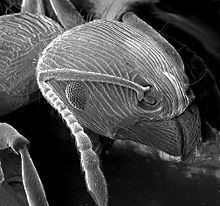
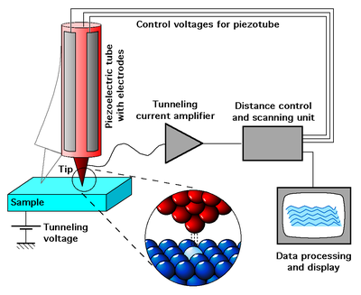
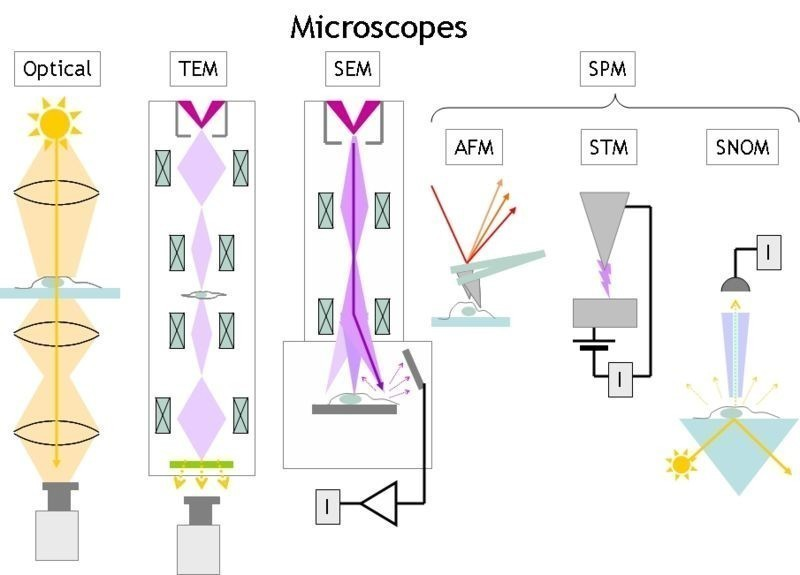
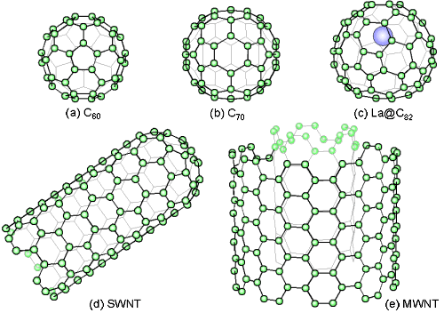
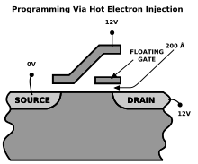

Reportáž z MatFyzu
##################

:tags: gympl

.. class:: intro

Jak známo "matfyzáka" od obyčejného člověka poznáte snadno a pokud se budete
řídit intuicí, nemáte šanci k omylu. Splésti si ho můžete snad jenom s
chemikem. A výlet na matematicko-fyzikální fakultu je proto zážitkem podobné
intenzity třeba jako návštěva zoo.

Narozdíl od zoologické zahrady není tato instituce den co den otevřena
veřejnosti, nebo lépe řečeno je, ale těžko se shánějí průvodci. Dne 3. února
léta páně 2011 to bylo trochu jinak. V akci zvané "Jeden den s fyzikou" se tato
škola snažila nastavit svou lidskou tvář a nalákat potencionální oběti do svých
tenat. Podařilo se?

Díl I: Ohýbáme fotony - na malé věci bez mikroskopu
===================================================

Zájem o jeden den v této proslavené budově byl převeliký. Hlavní zahajovací
přednáškou byla "Velká fyzikální podívaná...", ale té jsem se účastnil již
loňský rok a protentokrát jsem se rozhodl vyzkoušet něco jiného. Usadil jsem se
v posluchárně F2 a čekal.

Protože se nám podařilo dorazit nečekaně s dostatečným předstihem, mohl jsem
sledovat jak se sál plní, jaké osoby přicházejí a o čem si povídají a s potěšením
jsem konstatoval, že toho dne se nedostavili jenom ti, co už téměř jinou
možnost studia nemají, ale i obyčejní lidé, kteří usoudili, že horší než
den ve škole den na Matfyzu být nemůže.

Přednáška začala s mírným zpožděním, protože ani zde nefunguje všechno neomylně
(kupodivu) a technika celkem dlouho odolávala pokusům profesorů o zprovoznění.
Když se konečně umoudřila, jeden z nich se ujal slova, chvíli pronášel takové
ty klasické fráze, jako že nás vítají a doufají v krásné prožití tohoto dne.

Pak předal slovo druhému profesorovi, s hlavou hodnou učence - sluneční paprsky
se od jeho hlavy odrážely krásně všemi směry. Povídal o tom, k čemu se hodí
vidět věci pěkně podrobně a začal tím, co každý z nás zná, mikroskopem:

Optický mikroskop
-----------------

Zdlouhavě objasňovat principy tohoto zařízení by bylo urážkou váženého čtenáře.
Jedná se o věc již delší čas známou, prý už od roku 1590, kdy byl v Holandsku
sestaven panem Jansenem. S postupem času se mikroskopy zdokonalovaly a na
omezení začali narážet lidé až docela nedávno. Jeho maximální teoretické zvětšení je totiž
asi 2000× a to kvůli délce vln viditelného světla. V praxi se lze dostat zhruba
na polovinu.

    Mravenec pod SEM mikroskopem

A protože lidé by rádi pořád víc a víc, v roce 1931 byl panem Ernstem Ruska
objeven mikroskop, který pracuje na trochu odlišném principu.

Elektronový mikroskop (TEM a SEM)
---------------------------------

TEM mikroskop, plným názvem "transmisní elektronový mikroskop" zobrazuje
pozorovaný objekt tak, že jím prozáří patřičně zrychlené elektrony, které jsou
na druhé straně zachyceny a převedeny na obraz.

To na jednu stranu přináší mnohem více podrobností ale také i nevýhod. Zkoumaný
objekt musí být velice tenký (tzn. 10 až 500 nm - pro srovnání lidský vlas je
tlustý okolo 50 mikrometrů neboli 100× více, než mikroskop zvládne).

Dalším problémem je to, že elektrony jsou záporně nabité částice (snad vám to
ve škole nezatajili) a tak se vám snadno může stát, že se v pozorovaném objektu
najde nějaká kladně nabitá částice, se kterou se váš elektron skamarádí a
výsledný obrázek tak nebude vypadat úplně správně.

Na podobném principu pracuje i SEM mikroskop - "rastrový elektronový
mikroskop". Ten se na rozdíl od TEMu nesnaží protlačit elektrony skrz látku,
ale odchytá ty, co se od ní odrazí. Pozorovaný prvek "skenuje" řádek po řádku a
podle toho, jak se elektrony odrazí se získá výsledný obraz.

Z toho plyne oproti TEM mikroskopu výhoda toho, že pozorovaný objekt nemusí být
tenký. Nicméně nevýhody zůstávají. A komu by se líbilo tolik nevýhod?

Mikroskop STM
-------------

Tento mikroskop už pracuje zcela na jiném principu, než klasické mikroskopy i
než elektronové mikroskopy. Nenechte se ale zastrašit, není o nic složitější,
ba naopak.  Namísto toho, aby objekt pozoroval si ho totiž pěkně ohmatá.
Jehlou, která má na špičce právě jeden atom, přejíždí po povrchu látky a podle
toho, jak vysoko jehla je zaznamenává obraz. Asi tak, jako když přejíždíte
prstem po Braillově písmu nebo když jehla v gramofonu jede po desce.

    Princip STM

Tím se nám naskytne rozlišení o přesnosti na jeden atom a to už je hodně pěkné.
Téměř dokonalé. Jen jednu mouchu to má - objekt vidíme pouze ze shora. Nešlo by
se na něj podívat prostorově, získat obraz v 3D? Šlo.

Zbytek přednášky se věnoval tomuto tématu. Zde už se častokrát přednášející
neudržel a komplexních číslech, převodech amplitudy a frekvence na výsledný
obraz o obráceně se nejeden člověk ztrácel. Já se budu snažit nezabíhat do
přílišných podrobností a vysvětlím to polopatě. Pro více informací se obraťte
na své učitele fyziky. Případně na nějakého profesora z Matfyzu, pokud ani
učitelé nebudou vědět...

Získávání prostorového obrazu
-----------------------------

Nyní se dostáváme až na samotné jádro - samotné atomy. Máme-li třeba
krystalickou mřížku, která není úplně jednoduchá a chceme zjistit, jak jsou
atomy v ní poskládané, běžné metody nám na to stačit nebudou.

Na objekt se musíme podívat doslova ze všech stran. Získané obrazy pak spojíme
a získáme výslednou podobu. Zatím to zní jednoduše, ne?

K "podívání se" na objekt se používá nějakého záření krátké vlnové délky, často
třeba rentgenového záření. Problém je v tom, že pokud něco takto prosvítíte,
nezískáte opravdový obraz, ale pouze vzdálenosti částic. Ty je pak potřeba
správně převést. A to už je celá věda, kde se pracuje dokonce i s náhodou.

Na závěr srovnání jednotlivých typů mikroskopů:

Díl II: Nanotechnológie a ich súčasné využitie
==============================================

Druhá přednáška byla něčím speciálním a výjimečným hned ze dvou
důvodů. Byla totiž ve slovenštině a navíc od mladé přednášející, která se
stereotypu "matfyzáka" úspěšně vyhýbala. Ani v této přednášce jsme se nedostali
do velkých rozměrů - moderní téma nanotechnologií ale dokázalo nalákat a sál byl i tentokrát
plný.

Ale jak prohlásil jeden z přednášejících profesorů: "Abyste na nějaký výzkum dnes dostali grant, musíte mít
v názvu bio nebo nano".

Od základních pojmů, kterými bylo vysvětleno, co to vlastně nanotechnologie jsou, čím jsou zajímavé a přínosné
jsme se dostali až k možné budoucnosti, která často hraničila se sci-fi.

Nanotechnologie jsou celkem stará záležitost - už staří Egypťané si barvili vlasy s pomocí
mikročásteček. Ve středověku se zase přidávaly přísady do skel, jak kvůli barvě, tak kvůli průhlednosti.

Vědci se tímto světem ale začali zabírat poměrně nedávno. V roce 1959 přednesl na jednom sjezdu fyziků pan Feynman slavnou větu:

    There's Plenty of Room at the Bottom

což znamená ve volném překladu "tam dole je spousta místa". Fyzici ho pochopili a přestali mít hlavu v oblacích a ve hvězdách a vůbec ve velkých věcech a začali se věnovat čím dál tím věcem menším.

Asi nejvýznamnějším objevem v této oblasti byly takzvané fullereny. To jsou speciálně poskládané atomy uhlíku, které jsou mimořádně pevné - tvrdší než diamant. Pánové, kteří to všechno vymysleli, se jmenovali Curl, Smalley a Kroot a v roce 1996 za to získali Nobelovu cenu za chemii. Kromě toho, že se jedná o částečky nesmírně pevné, jsou i supravodivé.

    Různé typy fullerenů

    Uložení do FLASH paměti

Poskládáním více těchto prvků k sobě mohou vzniknout třeba nanovlákna, která se dále používají hlavně v textilním průmyslu
Hodně toho vydrží, působí antibakteriálně a vůbec jsou dneska in.

Ovšem přes spoustu výhod v sobě tyto technologie přinášejí i spoustu nebezpečí. Nanočástice mohou snadno proniknout do lidského těla, jakpak by taky ne při jejich velikosti, kde mohou dlouho přetrvávat a hromadit se. Americký výzkum dokonce prokázal,
že nanočástice stříbra o velikostech desítek nanometrů mohou v embryích ryb způsobit otoky a krevní výrony, které vedou ke
smrti.

Poslední část přednášky se věnovala využití nanotechnologií v informatice, především v oblasti hardwaru sloužícímu
k ukládání dat. Laicky řečeno takovým věcem jako jsou CD, DVD, harddisky, Blu-ray apod. Dostalo se i na FLASH paměti, kde
byl objasněn rozdíl mezi jimi a obyčejnou RAM pamětí (tou co máte v počítači).

Ta totiž slouží pouze jako dočasná paměť - pokud přerušíte přívod elektrického proudu všechna data se vymažou. Ve FLASH
pamětích se speciálním zábleskem (odtud název flash = blesk) změní hodnota buňky a zůstane zde uložena.
