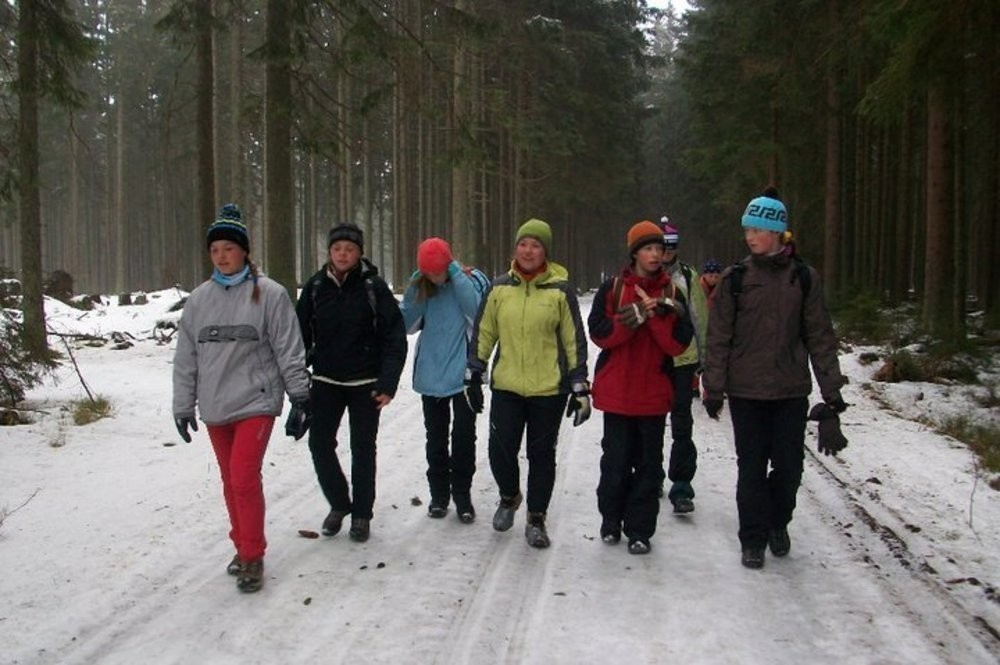
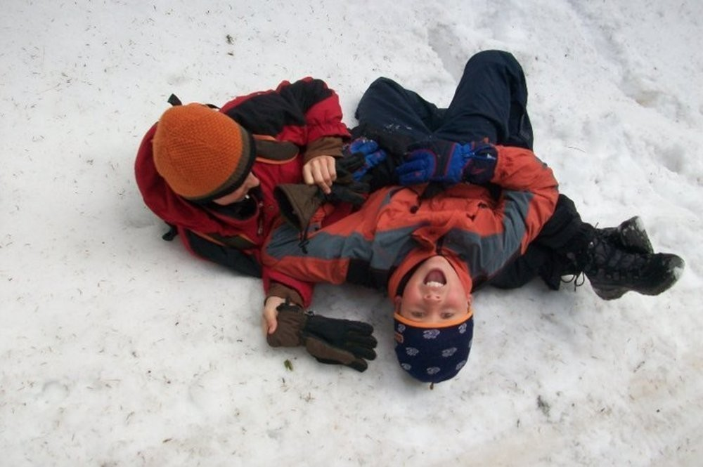
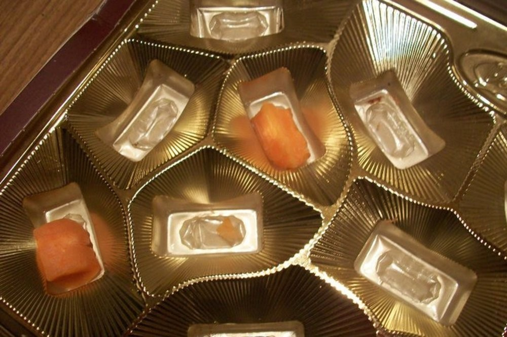
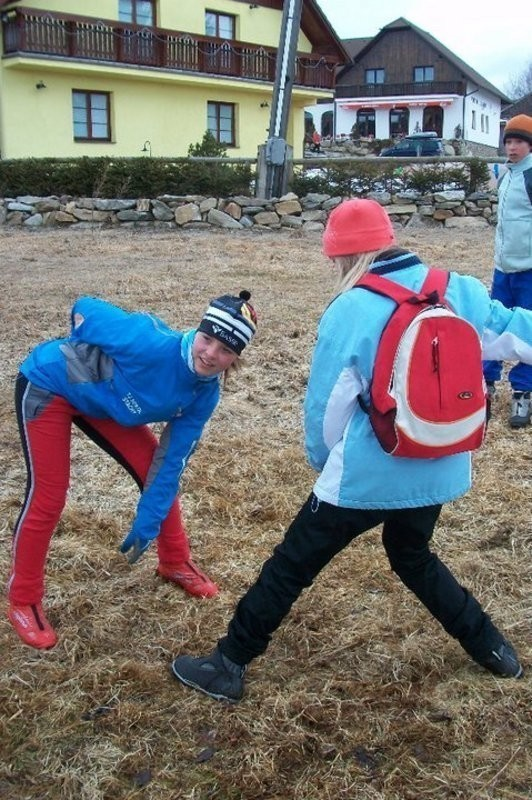
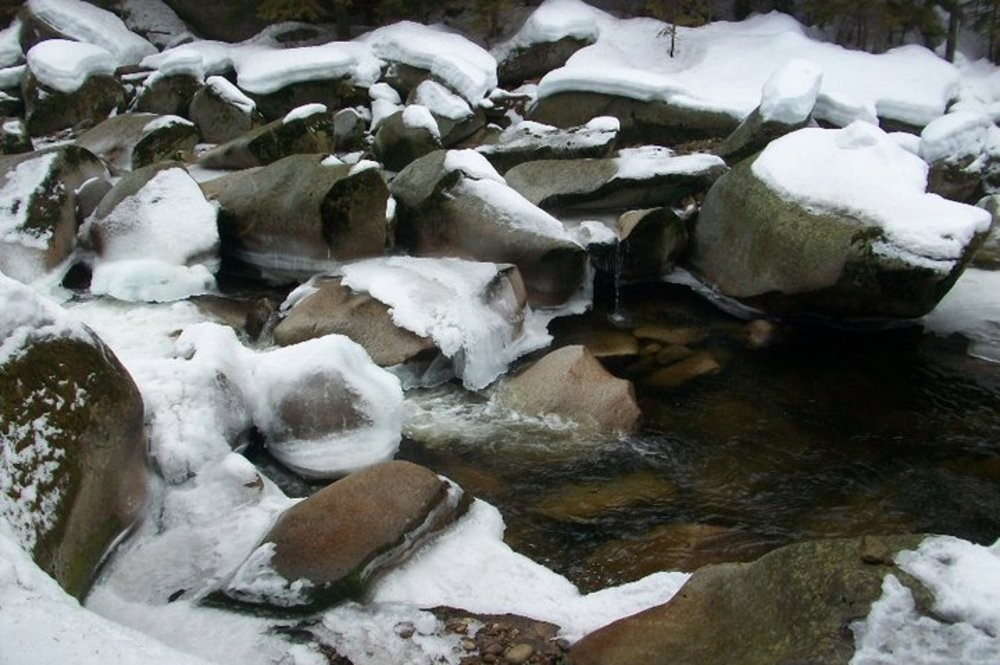
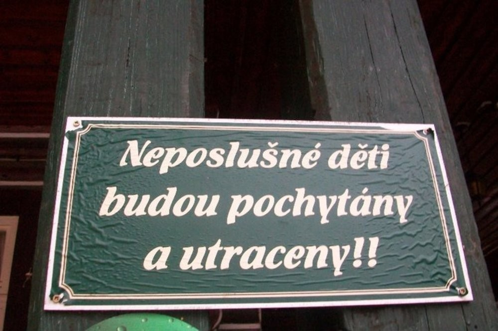
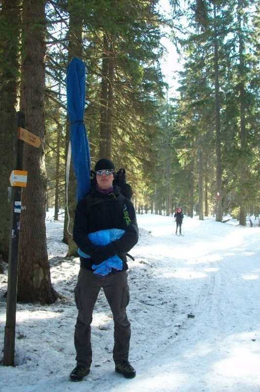

Goldbrunn 2011 - po stopách pašeráka
####################################

:tags: Tchoříci, Šumava

.. class:: intro

Opravdu se omlouvám za to, že je to takové obsáhlé, zdlouhavé a nudné. Prostě jsem
psal a psal a psal. A těch věcí se opravdu stalo strašlivě moc. Dost jich muselo
být vynecháno.

S nepříliš vychladlou hlavou plnou emocí, dojmů a pohnutek, jak to tak
po týdnu s Tchoříky bývá, začínám sepisovat další část té naší kroniky.
Hned večer po skončení této akce. Ještě stále cítím vnitřní strany stehen,
bolavý sval pod ramenem, pálení slunce v očích a smrad našeho pokoje. Nejsem
si jist, jestli stihnu dnes či krátce po půlnoci článek dopsat, je toho opět
dost. Nuže popořadě.

S plnou chatou malých dětí?
***************************

Už loni, když jsme o jarňácích byli na Zaječím skoku v Jeseníkách, Jenda
vyhrožoval, že příští rok by nás rád zapřáhnul do řehole vedoucích. Mělo to být
na již známých místech Zlaté Studny, v posledním zachovalém domu této vesnice
v bývalé hájovně. Zlatá Studna se nachází zhruba tři kilometry od Horské Kvildy
směrem na Zadov (Churáňov).

Určitě si dovedete představit, jak některé z nás (nechci mluvit za všechny,
ale rozhodně jsem nebyl jediný) znepokojila myšlenka chaty plné malých (ukřičených)
dětí, které budeme mít na povel. Trochu jsme z toho znervózněli.

Sraz měl být v sobotu ráno na parkovišti nad hotelem Olympia u areálu Zadov. Na
místo jsme se dostávali všelijak (asi tak jako podivné bytosti v knížce
Střetnutí). Já vyrazil už den předtím, v pátek, na Špičák k Novotným, abych
se mohl dobře vyspat a nemusel vstávat ráno moc brzo. Ráno jsme se cestou ještě
stavili na jedné křižovatce a nabrali Kryštofa.

Bez jakýchkoliv problémů jsme dorazili na dané parkoviště. Vylezli jsme z aut a
postávali na sluníčku. Libovali jsme si, že jsme na parkovišti dokonce na čas
přesně (ano, to není pravidlem). Kluci (Ondra a Vojta Novotných spolu s Vítkem)
se váleli ve sněhu, my je pozorovali pohledem starých a moudrých[ref]Ani
jedno není úplná pravda, ale tvářili jsme se tak.[/ref]] a čekali.

Čekali jsme nezvykle dlouho. Dokonce jsme si začali říkat, jestli jsme tu vůbec
dobře. Jenda nikde, nikdo jiný taky ne. Ujo to totiž bral s mezi-zastávkou a nabral menší zpoždění.
Když dorazil a s ním i Jáňa, začali jsme se chystat na konečný přesun k Zlaté
Studni. Moc se nás tedy na parkovišti nesešlo - Jenda, Kryštof, Jáňa, Klára, Ondra,
Vojta, Vítek a já. Od Horské Kvildy ale měly přijet další holky - Bětka s
Markétou. Áňa a Sváťa byly na závodech - to byla ona Jendova zastávka a k
podrobnostem jejich přesunu na ZS[ref]Zlatá Studna, jak jinak. Jsem
líný to psát celé, tak si to budu takhle zkracovat.[/ref] se ještě dostaneme.
Odpoledne ještě přibyla Zuzka a tím se celkový počet ustálil na krásných třinácti
osobách. Mělo nás být o něco málo víc, ale řádily chřipky a virózy.

Trochu problém nastal s dopravou jídla. Protože jak bylo řečeno na parkovišti nás
bylo pár a jídla bylo jak pro regiment, do batohů se nám nemohlo přirozeně vejít. Plán byl
proto následující: vezmeme v batohu jen jídlo na oběd - to znamená pár pytlíků rýže,
kečup a cukr. Jestli si říkáte, že je to dost divná kombinace, pak vězte, že byla.
Chtěli jsme vzít k cukru i čaj, ale na ten se zapomnělo. K rýži mělo být také něco
jiného než kečup, ale nic jiného nebylo zrovna v kufru auta k nalezení.

Po dopravení se až na chatu měly holky začít vařit oběd, kluci mezitím vyložit batohy
a vrátit se s prázdnými zpět na parkoviště. A jak se řeklo, tak se také učinilo.
Vrátili jsme se k parkovišti a začali nakládat, vše od mléka v prášku, přes kaši v
prášku až k salámu, naštěstí ne v prášku. Trochu problém byl s vajíčky, která
překvapivě v prášku také nebyla. V batohu by se riskovalo rozbití a tak se využilo
toho, že Vojta neměl sebou batoh (kdoví proč) a celá krabice se mu přivázala na
záda. Po dojezdu z toho byl sice skoro na umření a ruce měl zmodralé a nemohl s nimi
hýbat (přeháním), ale jinak to zvládl. Stejně jako všichni ostatní. Dokonce i
ti, co vezli salám ho dokázali přivést v celku.

Po obědě jsme si udělali první kratší výlet - ze Studny k Matesovi a pak ke Třem Jedlím.
Na rozcestí kousek od Jedlí jsme se rozdělili - holky jely na Horskou Kvildu pro Zuzku
a kluci zpět na ZS. Myslím, že to nebylo za účelem odpočinku, ale bylo potřeba nanosit
dřevo, pootevírat dosud zavřené okenice a udělat spoustu dalších věcí.

V té době už chatu pomalu opouštěli nájemníci, kteří zde trávili čas před námi. Nechali
nám tu kečup, dali instruktáž k otevírání dveří a zmizeli. Chata byla od té chvíle jen
naše.

Na letošním lyžáku bylo mnoho věcí revolučních. První z nich bylo to, že o mytí nádobí
po večeři se vždy hrála nějaká mezi-službová hra. Ten kdo prohrál měl smůlu a večer
strávil u talířů. Tou druhou věcí bylo to, že Jenda přestal omezovat dlouhé večery.
Sice to platilo jen pro starší, tuším, šestnácti let, ale to většině z nás stačilo.
Chcete vědět, jak se toto zvolnění režimu projevilo? Trochu předběhnu.

První večer jsme vydrželi zhruba do jedné, druhou noc polovina z nás do půl druhé (ta druhá polovina ještě
mnohem víc, myslím, že říkali něco o třech hodinách. Nebo o svítání? Teď nevím...).
Protože se ale každý den vstávalo v půl osmé (služba v sedm), začal se spánkový
deficit projevovat celkem brzo. To se dalo řešit všelijak, ale stejně to dopadlo tak,
že se prostě třetí den šlo spát po večerníčku.

První večerní hra o nádobí byla zároveň i hrou rozřazovací. Rozdělila nás do tří
družstev, jednalo se vlastně hlavně o vařicí party - Pašeráků, Převaďečů a Hraničářů.
Večer se četlo o králi Šumavy - Kiliánovi Nowotném, pašerákovi a převaděčovi z dob
minulého režimu. Protože se jedná o zajímavou historii, nebudu vás ochuzovat vlastním
převyprávěním, ale odkáži vás přímo na
`originální článek <http://www.moskyt.net/view.php?cisloclanku=2006100001>`_.
V dalším vyprávění budu často odkazovat na nějaká místa související s tímto tématem,
pokud vám tedy bude nějaký pojem nebo místo neznámé, je možné, že ho naleznete tam.

Hledáme Kateřinu a obchod
*************************

Další den jsme měli velmi přesně naplánovaný. Potřebovali jsme na běžkách dojet opět
na parkoviště, pak se poskládat do auta a dojet na závody. První úkol ještě splnit
šel. Na parkoviště se nás všech jedenáct dostalo. Trochu problém byl naskládat se do
auta. Bylo totiž pro sedm lidí. Naštěstí jsme kluci (a děvčata) hubení a sedět se dá
pohodlně i ve více vrstvách. Auto protestovalo jen malinko.

Cestou jsme zpomalili u místa, kde začínal kanál 54, dnes nezajímavé místo kousek
od kasáren.

Závody, na které jsme jeli, nebyly nic nepatrného. Kousek od Vimperku se totiž hledala
nová Kateřina Neumannová. Tchoříci tam jeli podpořit Áňu a Sváťu a taky je nabrat do
auta a odvézt k Zlaté Studni. Někteří (přesné obsazení raději nechť zůstane
veřejným tajemstvím) si při těchto závodech stačili odskočit do Vimperka
a dokoupit zásoby a čerstvé pečivo (mlask!).

Po skončení závodů jsme se opět naskládali do auta a ano, počítáte dobře, tentokrát
se nás vezlo třináct. Tlumiče auta protestovaly opět o něco více, ale ještě se to
dalo vydržet.

Další zastávkou byla vesnice Nový Svět. Ta se totiž nachází kousek od Chalupské slati,
největšího mokřadu, který Kilián Nowotny musel překonávat. Prostředkem bažiny
podle našich zdrojů měl vést široký násep, po kterém se dá bez problému přejít.
Ten se nám podařilo nalézt snadno, ale bažina samotná by se dala určitě přejít
ještě někde jinde. Jenda to mezitím objel s autem a počkal na nás u Svinné
Lady.

Popojeli jsme do Borové Lady a zašli si na polévku a Kofolu. Tu si dali asi všichni, krom Sváti, která
vykalkulovala, že je lepší dát si vodu, protože je jí víc za méně peněz. Ale někde
se stala chybička a tak dostala stejné množství vody jako my Kofoly. Úplně nadšená
z toho nebyla.

Zase jsme se nasáčkovali do auta a popojeli kousek proti proudu Teplé Vltavy. Asi
tři kilometry od Borové Lady se totiž nachází most u kterého Kiliána Nowotného
postřelili. Je u něho i pomník všem převaděčům a pašerákům, kteří pro tuto činnost
často obětovali i život.

Tam jsme vyndali běžky z auta, vzali je do ruky a vydali se směrem k Zlaté Studni.
Stal se z toho trochu pěší výlet s běžkama v rukou, protože jsme většinu cesty
šli po silnici, která byla z velké části pokryta souvislou vrstvou ledu, z trochu menší
části suchými místy a minimem sněhu.

Lepší to začalo být až když jsme přešli silnici (kousek od rozcestí, které na mapě vidím
označené jako Pod Hůrkou). Tam jsme nasadili lyže a vydali se zakázanými místy 1. zóny
národního parku přes mokřiny a kleč. Kousek od cíle naší cesty po nás začal střílet jakýsi
strážce, ale pak raději vzal do zaječích. Byl to Jenda, který auto převezl na Horskou
Kvildu a pak se nám vydal naproti.

Od toho večera jsme tedy na chatě byli již všichni. Nevím, proč, ale nemůžu si dost
dobře vzpomenout na jednotlivé večery a tak doufám, že to moc nepomotám. Mám za to,
že druhý večer četl Jenda pokračování příběhu o králi Šumavy. Opět raději odkáži na
`originální článek, tentokrát o trochu smutnější události <http://www.moskyt.net/view.php?cisloclanku=2008100003>`_.

V pondělí jsme se vydali hledat trosky Pöslova domu. Měly být kdesi v místech, přes
které jsme den před tím projeli, když jsme se vraceli zpět domů. Takže nás opět čekala
cesta do neprostupné kleče. Ale většina z nás (možná všichni) si takovéhle prodírání
terénem užívala více, než kdyby musela jet dlouhé kilometry nudnou stopou. Ani nevíte,
jak krásně se mezi klečí bruslilo a kličkovalo.

Ruiny domu jsme našli až překvapivě rychle. A protože jsme měli ještě spoustu času,
zahráli jsme si kousek odtud pár her. Ukazovalo se na sever (nepoměrně přesněji, než
loni na Zaječím Skoku) a házelo se oštěpem. A také se běžel závod o večerní nádobí.

Byla asi hodina před polednem a my byli na oběd pozváni k malým dětičkám na Horskou
Kvildu. A tak nás Jenda poslal po týmech samotné, ať si zkusíme
HK[ref]Další zkratka - HK pro Horskou Kvildu.[/ref] najít sami.

Jak se dalo očekávat, všem se to podařilo zvládnout bez problému, však to byl kousek
a v známých krajích, známým směrem. A tak jsme se na chatě u Musila dočkali polévky
i těstovin s flákem masa a omáčkou - rajskou?

Po obědě na nás vytáhl Martin Satorie bonboniéru, kterou nám slíbil darovat za to,
když se alespoň jeden z nás vykoupe v potoce za chatou a vydrží ve vodě alespoň
deset vteřin. A my, protože nejsme žádné máčky, žádné béčka, jsme řekli, že tam vlezeme
všichni.

Tak jsme se svlékli do trenek, a vyběhli za chatu. Tam jsme se opravdu všichni ponořili
do ledové vody Hamerského potoka. Všechno se fotilo a natáčelo, takže až jednou narazíte
na nahrávku, asi se dobře zasmějete. Nejvíce se proslavily Jendovy tanečky, které prováděl
poté, co vylezl z vody.

Když jsme se všichni umyli, vrátili jsme se zahřát k topení do chaty. Chvíli jsme ještě
popíjeli teplý čaj a pak vyrazili zpět na ZS. Zde se asi poprvé začal projevovat krásný
trend letošní zimy - kopce a kopečky (a podle názoru Áni i lehce nakloněné rovinky) se vycházeli
zásadně pěšky, s běžkami v rukách. Samozřejmě se našli i tací, kteří byli líní se sehnout
k vázání, ale těch bylo málo...

Memoriál Michala Nováka
***********************

A protože bylo ještě odpoledne, slunce krásně svítilo a my přece nemohli jen tak zůstat sedět
v chatě, vyběhli jsme před ní a začali dupat přes lyžařské stopy a hrát nejrůznější hry. První
byla inspirována vyprávěnými příběhy - tým PPS[ref]Pomocné pohraniční
stráže - jednotky, které za komunistů pomáhali dobrovolně, z nadšení, hlídat státní hranice
před vnějšími vlivy.[/ref] měl za úkol ohlídat jisté území a druhý tým pašeráků a převaděčů
se jednak musel dostat přes toto území a hlavně přenést americkou vysílačku.

Hráli jsme dvakrát a pak se vrhli na trochu akčnější hru - žhavou uličku, běh smrti,
jatka. Jak chcete. Od chaty dolů z kopce vede krásná cesta prostředkem lesíka, do
lesa je krásně zasazená, země se na obou stranách zvedá. Na těchto vyvýšených místech
stáli střelci se zásobou šišek. Po zapískání se odshora odvalilo druhé družstvo
a kdo nebyl zasažen, ten přežil a vyhrál. Pro velký úspěch se hrálo snad šestkrát
za sebou.

A pak konečně přišla hra, na kterou jsme se všichni těšili. Pravé tchoří ragby. Takové,
jaké se hrálo loni na Zaječím Skoku s Michalem. Takové, při kterém jsem si podruhé
už radši sundal brýle. I když minule vydržely skoro až do konce. Skoro. A mač začal.
Podle chybějícího člena z loňské výpravy byl pojmenován jako "Memoriál Michala Nováka".
A byl to mač opravdu drsný. Po pár hrách měl kde kdo už bolavá místa, naražené kosti, otlučenou hlavu.

Největší zábavu vždy poskytoval Kryštof. Pamětníci vypráví, že dokázal chytit tři lidi a
přejít s nimi přes značný kus hřiště. Ale ani my, druhý tým, jsme se nevzdávali a bojovali
z plných sil. Asi po hodině už jsme sotva šoupali nohama. A pak jsme ještě dost dlouho hrát
vydrželi. Od našich bojů nás odvolal až Ujo, který mezitím připravil večeři.

K večeři jsme se nějak doploužili, dali si čaj a dokázali se trochu oklepat, takže večer
mohl začít.

Z Horské Kvildy jsme si přivezli draze zaplacenou bonboniéru a těšili se, jak si ji večer rozbalíme.
Ta chvíle nastala, i když jsme na to málem zapomněli. Vůbec letos se na sušenky k večernímu
posezení dost často zapomínalo a tak jich většina zbyla na poslední den. Rozbalili jsme tedy
nejdříve fólii, která bonboniéru kryla (jak to tak bývá). Pak nadzvedli víko. Následoval
příval nejrůznějších drsných slov, třeba: "No to teda!", "Cože?!?", "Jak mohli?". V bonboniéře
byly totiž místo slaďoučkých bonbonů položeny nakrájené plátky mrkve. Začali jsme plánovat
odplatu...

Poté jsme si také zahráli osvědčenou klasiku - "Vraha". Hra, která vznikla kdysi ještě na Jizeře,
kde jsme ji hráli pořád dokola, každý večer několikrát. Až z toho byly noční můry a špatné
spaní. Tím se nám trochu ohrála a tak jsme ji tenhle večer hráli až po hodně dlouhé době.
Pokud znáte městečko Palermo, tak takhle hra je hodně podobná, ale poskytuje trochu více adrenalinu,
dedukce a krutosti - poprava bývá klasicky sněhem za krk... Pár her nám stačilo,
jinak bychom z toho zase začali bláznit. Poté jsme si ještě zahráli Jendovu hru, taky "Vraha", jen
trochu jiného. Ten byl ještě akčnější. Skončil tak, že většina lidí ležela na podlaze
v místnosti a vzájemně se škrtili a křičeli. Prostě krása!

Poté byli mladší posláni na kutě. My starší ještě pár hodin vydrželi u svíček a postupně
jsme odpadávali. Někteří toho i tak nestihli moc naspat.

Až za prameny
*************

Další den si pamatuji o něco lépe, hlavně co se týče jídla. Naše žrádlparta totiž měla službu.
Takže nám den začal o půlhodinky dříve, připravili jsme stejnou snídani jako už dvě služby
před námi - nakrájeli chleba a uvařili čaj. Rozcvičku, snídani a takové věci snad už
zmiňovat nemusím.

V tento den nás čekal asi nejdelší výlet, který jsme za celý pobyt podnikli. Přes Kvildu
jsme měli dojet až k pramenům Vltavy a pak ještě dál k německému jezeru Reschbach Klause.
Na tomto místě se totiž setkával Kilián s agenty CIC (předchůdce CIA).

Ze včerejších událostí jsme se mohli sotva hýbat, svaly bolely a celkové vyčerpání bylo znát.
Navíc počasí nebylo pro běžkování úplně ideální - namazat se nám nepovedlo, snad to
ani na té směsi starého sněhu a ledu nešlo, jen jsme si klistrem zapatlali lyže. Většinu
času jsme proto probuslili nebo šli pěšky. Já s Kyšem prakticky celou druhou půlku cesty
z Kvildy k pramenům. Po sněhu se totiž pohybovalo podstatně lépe s běžkami na rameni
než pod nohama.

Za prameny jsme se vnořili do zakázané zóny NP a překročili hranici k jezeru. Mezi mrtvými
stromy to nebyl problém a přes jezero jsme si to přebruslili až k hrázi. Tam jsme si dali
svačinu a trochu delší chvilku poseděli - zkoušeli jsme pevnost ledu, házeli po sobě koule
a Jenda předváděl rozzlobeného německého dědečka (k podivu dvou starších Němců, kteří stáli opodál).

Pak následovala cesta zpátky, tentokrát běžnou cestu - přes Bučinu směrem zpět na Kvildu.
Opět střídáním pěší chůze a běžek jsme se dopravili až na Kvildu, pak známou trasou
na HK a ještě známější cestou až domů na ZS.

V této době padl první z členů výpravy, udolán nějakou virózou a kombinací nevyspání,
ragby a ledové vody v potoce - Kryštof.

K večeři byla čočka s vajíčky a cibulkou. Až na to že se nám čočka lehce připálila (to stejně
nikdo, kdo nebyl v kuchyni nepostřehl) to byla strava celkem dobrá a vydatná. Večer
jsme byli všichni natolik vyčerpaní, že jsme odložili společné posezení na příště a
šli spát.

Ráno se Kryštof odstěhoval z klukovského pokoje do svého vlastního, na marodku.
Ne že by se úplně bránil. Celkem si v tom liboval. Pravdou totiž je, že postupem
času se stal náš pokoj neobyvatelným kvůli přílišným výparům ze smradlavých ponožek.

Puding!
*******

Byla středa. Na odpoledne byli pozvaní prckové z HK spolu s vedoucími. Proto jsme se
nemohli vydat nikam daleko.

Pro malé jsme měli přichystaný "skvělý" zlatostudniční puding. V původním plánu bylo,
že pro děti uděláme normální puding, slaďoučký jak med. Takový aby děti slintaly
blahem, až ho budou jíst. A pro vedoucí ten pravý puding. S dostatkem soli, jak se
na Zlatou studnu patří[ref]To se vztahuje k tříleté historii,
kdy jsme byli na ZS poprvé. Tenkrát jsme se zrovna vrátili z šíleně dlouhého výletu.
K večeři měl být puding, ale jakýmsi nedopatřením se namísto cukru dostala do pudingu
sůl. Nedovedete si představit, co kilo soli s pudingem udělá. A to měl každý jeden
hrníček povinně...[/ref].

Aby puding neměli jen tak zadarmo, po snídani jsme začali kreslit poukázky na puding,
které se později poschovávali v lese. Pár z nich bylo opravdu uměleckými díly,
třeba Jánina "Vstupenka do cirkusu".

Jenže udělat dobrý puding se jaksi nepovedlo. Dost za to mohl špatný hrnec. V něm se prostě všechno připalovalo,
ať to byla čočka nebo puding, ať se to míchalo tak nebo onak. A puding tak získal příchuť
po spáleném mléku. Nic strašného, dalo se to jíst, i když my jsme zvyklí na mnoho.
Vedoucím jsme navíc, jako poděkování za skvělou bonboniéru, přimíchali do pudingu
vrstvu kyselého zelí. Ať si to užijou!

Dětičky měly ze své chaty na HK vyrazit někdy kolem půldruhé. To znamená, že ti rychlejší
by mohli být na ZS kolem druhé, ti pomalejší s odstupem půlhodinky. My jsme s dostatečným
předstihem vynesli ven na louku stůl a židle a čekali. Bylo pěkně, sluníčko svítilo
a nám ani nevadilo, že se čekání trochu protáhlo.

Když konečně přijeli, nejdříve se je Ujo rozhodl zničit hrou na tažné psy (a my mu
byli velmi vděční, že to dopadlo takhle. Čekali jsme to horší, třeba že tažní psi
budeme my). Pak je konečně vyslal do lesa hledat poukázky a nás pro puding.

Nastala osudová chvíle. Jako jeden z prvních přiběhl Vojta Spěváček. Dostal puding,
naházel ho do sebe a liboval si, jak je dobrý. Docela jsme koukali. Další, co ho
dostali, se na něj už tak nadšeně netvářili. Postupně začali prskat a běhat do
křoví puding zase vyplivovat. Měkoty!

Celkem s nedočkavostí jsme očekávali prvního vedoucího, který si přijde pro puding
(vedoucí také hledali poukázky, jen trochu jiné a trochu výše na stromech). Postupně
přišli. A když viděli děti, moc se jim do jejich pudingu nechtělo. Martin Satorie se
do něj s odvahou pustil a dokud nenarazil na vrstvu se zelím, dělal, jak si pochutnává.
Pak už myslím ne...

Výsledek byl takový, že nám dost pudingu zůstalo v napůl snědených hrnečcích. Ani
jsme se tomu moc nedivili.

Ještě jsme si s prckama zahráli ragby. My, Tchoři, se nejdříve snažili hrát naší pěknou
hru, ale postupem času se to změnilo na valnou hromadu s míčem někde dole. Přece jen
když na vás naskáče dvacet děcek, moc šancí nemáte. Memoriál Kryštofa Mejstříka jsme
tak neslavně prohráli tři ku jedné. Ale ani nás to moc nemrzelo, protože prohrát v
nerovném souboji není ostuda, že[ref]No tak dobře, chvilku jsme
možná trochu naštvaní byli, ale opravdu jen chvilku :)[/ref]?

Večer se nesl v duchu více či méně praštěných her. Já jim říkal "stresové" a ze začátku
se mi do nich moc nechtělo. Zvlášť když jsem viděl ostatní, jak sedí dokola na židlích a
ukazují podivná gesta (třeba naznačovali sloní chobot nebo jelení paroží), ale nechal
jsem se přemluvit. Hra byla jednoduchá. Jestli znáte takové ty strašlivé seznamovací
hry typu "Marek, Marek, Tonda, Tonda. Tonda, Tonda, Jirka, Jirka", tak tohle bylo něco
na podobný způsob. Jen ne se jmény. Každý si zvolil ze začátku jeden znak - jedno gesto
nějakého zvířete a to pak ukazoval. Následně musel ukázat znak někoho jiného. A musel
to udělat dostatečně rychle (nebo fikaně), protože uprostřed stál člověk s novinami,
který se snažil praštit, přetáhnout a majznout toho, kdo zrovna ukazoval.

Člověk by ani nevěřil, jak taková hra dokáže chytnout. Chvílemi jsme se víc smáli,
než hráli. Pak jsme ale vypnuli generátor elektriky a protože takhle hra vyžadovala,
abychom na sebe viděli, museli jsme ji trochu upravit. Celkem logickou obměnou byla
výměna gest za zvuky. A pak to teprve začalo. Vzniklo totiž pár zvuků, které byste
si asi nebyli schopni domyslet. Třeba - jak dělá pštros? A co byste si představili
pod zvukem "lezilezi"?

Pěšky jako blešky
*****************

Dalším, kdo nevydržel a padl, byl starý náčelník. Chytil něco podobného jako Kryštof,
navíc si prý už něco přivezl z domova. A tak nás vyslal na výlet. A protože bylo
počasí na draka a běžkovat se pořád moc nedalo, šli jsme pěšky. Navíc jsme šli do
míst, kde jsme předpokládali, že moc sněhu nebude (a taky že nebylo). Naše cesta
vedla ze ZS na Zhůří, pak dolů z kopce na Turnerovu chatu. Tam jsme si dali všichni
hranolky a obdivovali vydru, kterou zde měli zavřenou v kleci. Měli tu také asi tři
papoušky a čtyři kočky. Zajímavý pajzl.

Tento náš výlet se stal zdrojem nepočitatelného množství zábavy. Pokud někdy uslyšíte
o vydrodlacích, tak se to zrodilo pravděpodobně právě tady.

Cesta z Turnerovky nahoru na Antýgl byla vcelku zajímavá. Silnice byla totiž pokryta
souvislou vrstvou ledu a tak občas někdo klouzl a chvíli sebou mrskal na zemi.
Mezi pády jsme obdivovali vedle tekoucí Vydru (a koukali po vydrách).

Někdy v téhle době začal odpadávat Vojta a jak se později ukázalo, byl další
obětí záludné nemoci. Pomalu jsme se tedy došourali na Horskou Kvildu, chvilku
poseděli na chatě a popili čaje. V plánu jsme počítali s tím, že dětičky budou
někde na běžkách a že bude na chatě klid, ale oni zůstali doma a tak jsme se tam
nezdržovali déle, než bylo nutné a s nabytými silami jsme doběhli až domů na Studnu.

Můj rodný dům
*************

Další den už vstal Kryštof z postele a vyrazil s námi hledat rodný dům
Kiliána Nowotného. Měl se nacházet kdesi u Starých Hutí. Měli jsme obrázek,
respektive popis tohoto domu. A zbytek už byl na nás. Ujo, který nás vyslal,
chtěl, abychom toho zjistili co nejvíc - poptali se po dětech, drbech a takových
věcech.

Do Nových Hutí jsme dorazili bez větších problémů. Dokonce i sjezd k Pláním
jsme všichni přežili. Tam jsme si sundali běžky a vydali se po těchto pláních.
Ve vesnici jsme lyže odložili a vytvořili pátrací čety. Já zůstal hlídat
u lyží. (Ale nezahálel jsem. Hned jsem vyzpovídal dva kolemjdoucí). Asi za
hodinku jsme se sešli zpátky - zjistili jsme, že hřbitov je plný Nowotných i
Novotných, cosi o nemanželských dětech, pak o lidech, kteří se dlouhá
léta schovávali ve stodole, než je komunisté dopátrali. Bylo toho prostě dost.
I dům jsme našli (i když nám nějaký další starousedlík tvrdil, že už je dávno
zbouraný). Takže kdoví, jak to ve skutečnosti je a jestli jsme našli ten
správný.

Další cesta vedla přes Nové Hutě, nahoru přes sjezdovky až ke kraji lesa.
Tam jsme si chtěli dát svačinu, ale Ondra, který nesl batoh (ve kterém byla), zjistil,
že zůstal na druhé straně údolí. A protože je mladý a zdatný, nechali jsme ho
sjet dolů z kopce, vyběhnout pro batoh a vrátit se nahoru. Naštěstí ho do
kopce vyvezli vlekem. Pána, který tam byl, prý dost pobavil.

Po žluté jsme pak došli na Kvildu a zbytek už si jistě dokážete domyslet.
Mezi Kvildou a Horskou Kvildu jsme potkali Martinovu družinu, která tam
zrovna závodila.

Posledním, kdo stihl onemocnět ještě v průběhu lyžáku, byl Ondra. Možná
se na tom podílel i běh pro batoh. Výměnou za to vstal z postele jeho
brácha.

Večeři si pamatuji, opět jsme měli totiž službu. A protože se vařily
jenom těstoviny, nechali jsme holky odpočívat a stala se z toho čistě
chlapská záležitost. Vítek s Vojtou nastrouhali sýr, já uvařil těstoviny
a večeře byla na stole.

Nevím jak ostatní, ale mne celkem překvapilo, když mi večer došlo,
že už je vlastně pátek a že se zítra vracíme do svým domovů. Z toho
plynulo to, že bylo potřeba dojíst spoustu sušenek a sedět večer
pospolu, co to jen unavené tělo a Jenda dovolí.

Balíme, mizíme
**************

Ráno už totiž nenásledovalo nic jiného, než obvyklý program posledních
táborových dnů. Balení, hledání ztracených ponožek, uklízení pokoje
i všech ostatních společných, vytírání, zametaní, nošení dřeva. Však to
také znáte.

Někdy kolem deváté jsme opouštěli chatu a se slzou v oku a batohem
na zádech jsme se vydali na Horskou Kvildu, kde již čekali rodičové,
odvozci a další známí.

Ještě jedna veselá historka se na samém konci udála. Nedojelo nás totiž
všech třináct, ale o jednoho méně. Zuzka nebyla stále nikde v dohledu
a její táta už na parkovišti netrpělivě podupával. Po delším čekání
vyslal Jenda dva rychlé zvědy - Sváťu a Áňu, aby se šly podívat.
My ostatní u toho ještě vtipkovali, kde že jsme ji viděli naposledy.
Na rozcestí? Ne. Před chatou, když jsme odcházeli? Také ne. Jestli
ona nezůstala zamčená na chatě...

Otec už to nevydržel a šel se také podívat naproti - cestou, kterou jsme
přijeli. Zrovna zmizel za horizontem, když se Zuzka objevila na trochu
jiné straně, než jsme čekali. Rázovala si to po silnici.

O rychlé zvědy nejevil Jenda starost ("Ty ať si klidně doběhnou na
Zlatou Studnu a zpátky"), ale byl jsem poslán, abych odchytil jejího
tátu. To se mi podařilo celkem brzy a tak jsem se pln nadějí rozeběhl
i za rychlými zvědy.

Během pár dalších metrů mi došlo, že s rozdílem jejich a mého tréninku
je potkám, až když se budou vracet s nepořízenou ze Studny. To se také
stalo, naštěstí pro ně ale o něco dříve, protože Áňa sebou měla mobil,
sic s posledními zbytky baterie, ale živý.

A tak to skončilo. Zase moc rychle a moc brzo. Možná ještě dříve, než
obvykle. Protože čím lepší věci se dějí, tím čas rychleji utíká. Tak
už to prostě je. Ale za měsíc jsou Velikonoce, není nač zoufat.

