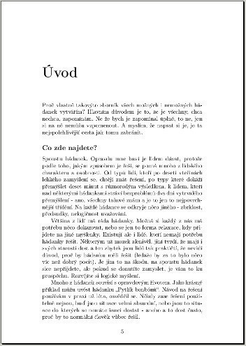

Hádanky na entou
################

:tags: hádanky

.. class:: intro

Už dlouhý čas skladuji ve své hlavě i na disku svého počítače spoustu hádanek.
Je to takový výběr toho, na co jsem kdy natrefil, co mi kdo kdy dal a tak
všelijak podobně. A už před hodně dlouhou dobou jsem si napsal skript, který mi
to převede do LaTeXu a uloží jako PDFko. A zrovna teď máte exkluzivní šanci
zavařit si mozkové závity.

**Stahuj:** `Sborník hádanek (PDF) <https://github.com/yetty/Hadanky/raw/master/hadanky_(PC).pdf>`_

K dispozici je i `online verze <https://docs.google.com/viewer?a=v&pid=explorer&chrome=true&srcid=0BwlwCxlM5bwJMzM1NTEwZTAtOGIyZS00NDdlLTlhNzgtMWE3NjExYjA0MDBm&hl=cs>`_,
která je uložena v dokumentech Google, a snadno ji tak zobrazíte v obyčejném prohlížeci.

Git
***

Abych se nemusel bát, že mi jednoho dne odejde harddisk a všechno bude v tahu,
rád používám Git. Kdo nevíte, co to je, nemusíte se tím trápit. Kdo ví, toho
možná bude zajímat, že i zdrojáky hádanek jsou dostupné. A to `na Githubu <https://github.com/yetty/Hadanky>`_.

Ukázka: Podivný závod
*********************

Umřel velmi bohatý šejk, měl dva syny a v závěti stálo, že dědictví dostane ten, který vyhraje závod na velbloudech. Jenže onen
závod vyhraje ten, jehož velbloud dojede do cílového města poslední. A tak synové vyrazí, velmi pomalu, oba hrozně touží po
bohatství. Po měsíci pomalého putování potkají starce, který se
diví, proč jedou tak pomalu. Oni mu vypráví svůj příběh, on se
zamyslí a něco jim poradí. Synové se zaradují, vyskočí na velbloudy a uhánějí do města. Co jim stařec poradil?

*Řešení naleznete ve sborníku...*
