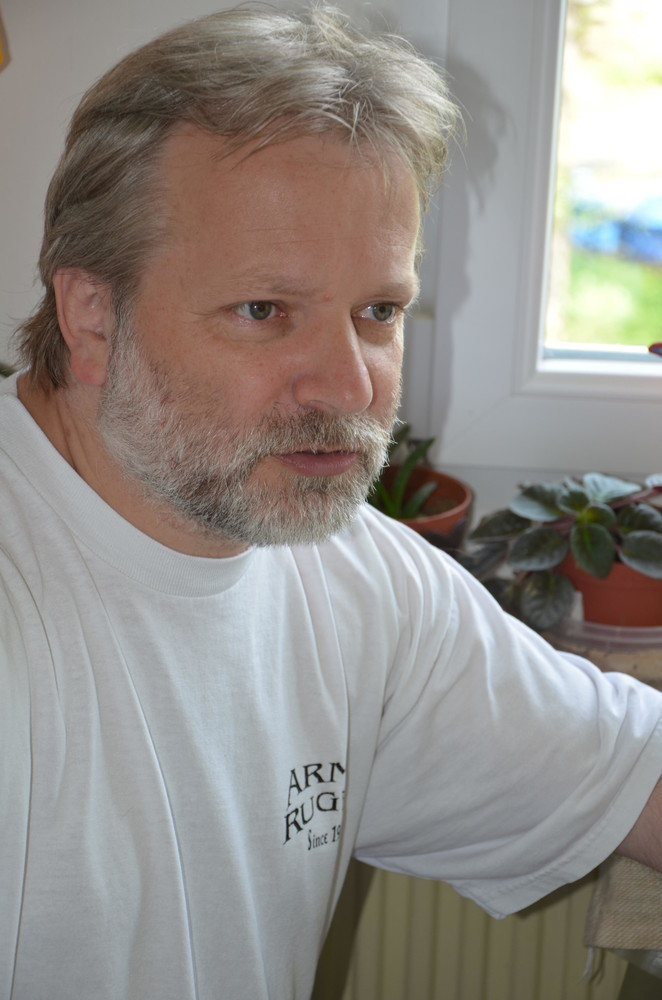
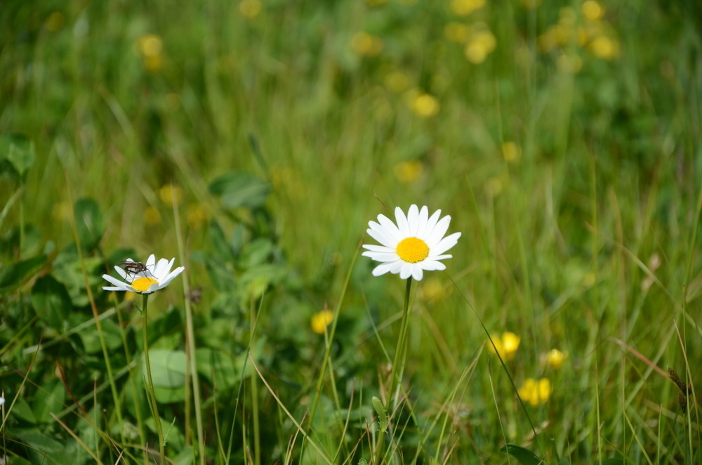
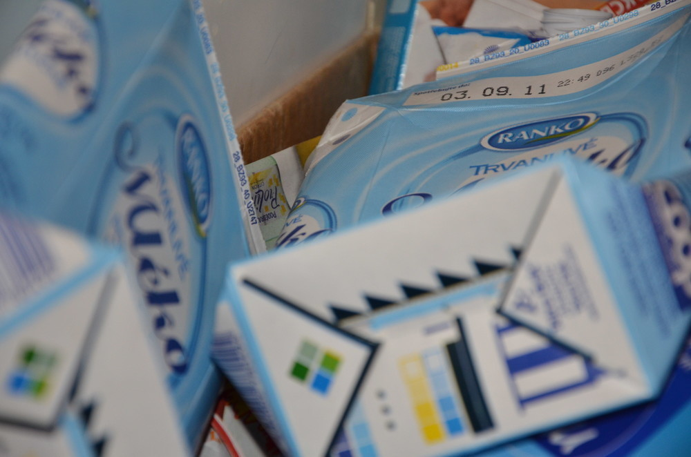
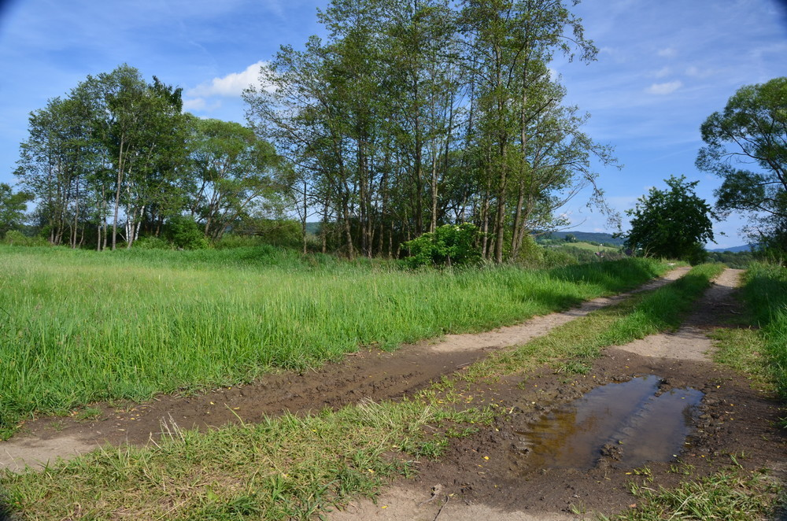
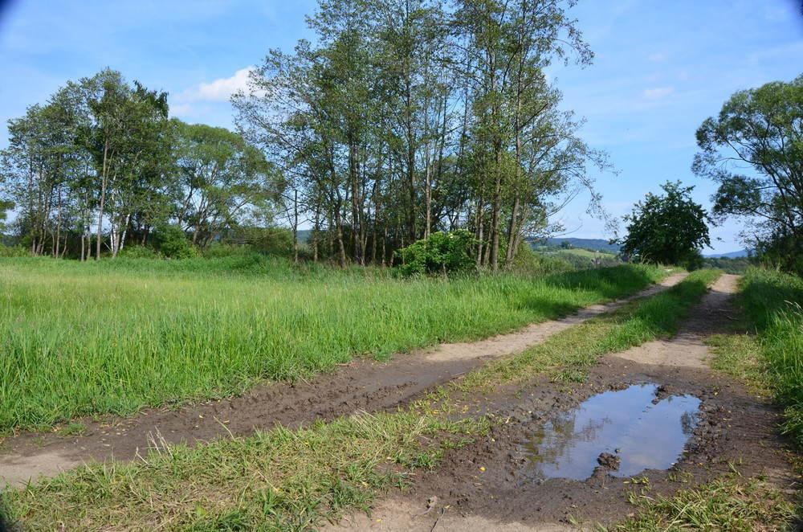
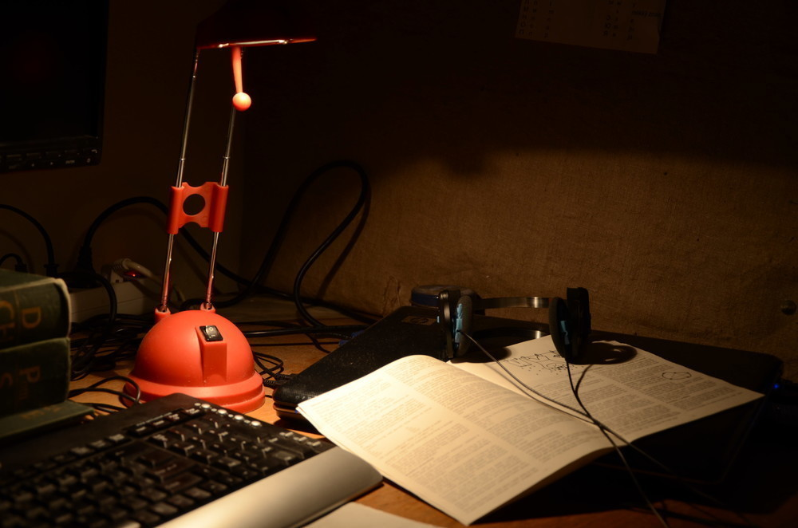
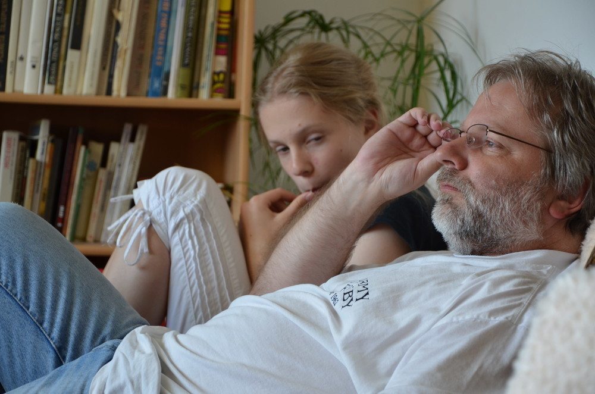
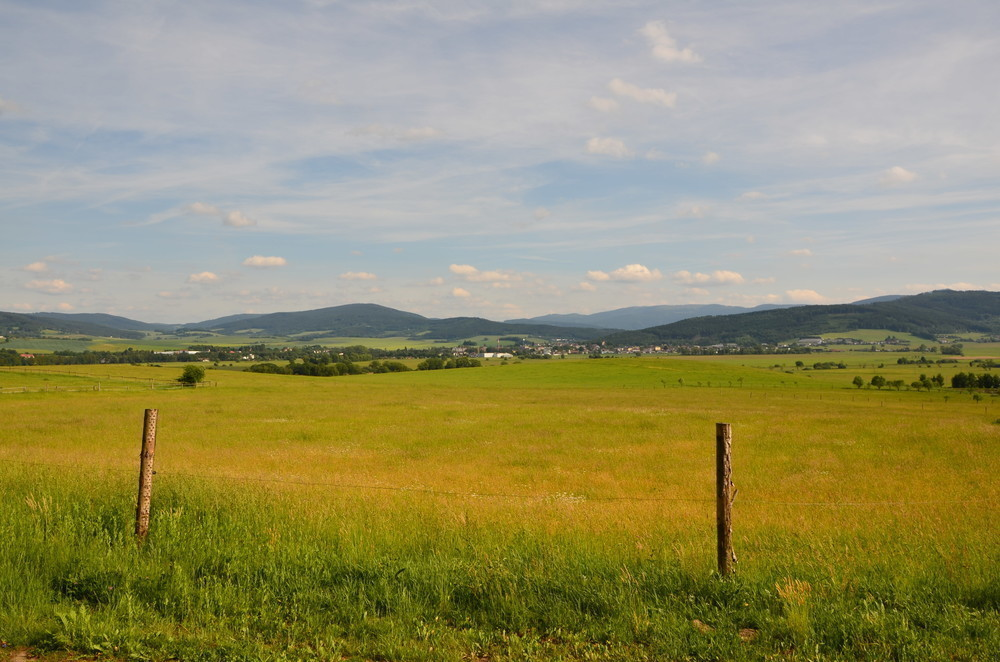
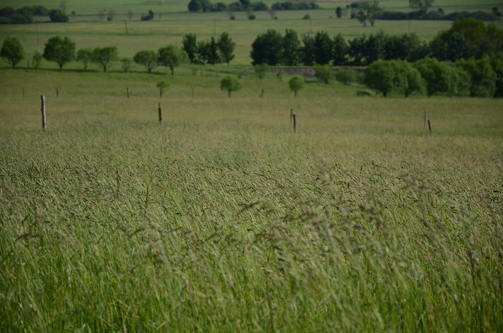

Nikon D7000
###########

:tags: fotky, vybavení

.. class:: intro

Tak jsem vstoupil do velkého světa fotografování. Přestal jsem to šudlat s
malým kompaktem a pořídil si pořádné dělo - Nikon D7000. A jak se s něčím
takovým fotí člověku na těžký fotoaparát neuvyklý? Minirecenze, zkušenosti,
fotky...

    **Poznámka:** všechny fotky v článku lze rozkliknout na nezmenšený jpeg, který
    vylezl z foťáku. Můžete si zkoumat EXIF jak je libo. Mám i RAW a chtěl jsem ho
    i nahrát na web, ale spadlo mi to na sto procentech, tak jsem toho nechal.

Původně jsem měl v plánu pořídit si něco levnějšího, ale pak jsem si řekl, ať
to stojí za to a začal jsem pokukovat po střední třídě. Nakonec mi sítem prošly
pouze dva přístroje - `Canon 60D <http://usa.canon.com/cusa/consumer/products/cameras/slr_cameras/eos_60d>`_
a `Nikon D7000 <http://imaging.nikon.com/lineup/dslr/d7000/>`_.

Po (ne)dlouhém váhání jsem se rozhodl pro Nikon. A to přesto, že jsem do té
doby byl vyznáním canonista. Co mě k tomu vedlo? Po přečtení pár recenzí a
srovnání (`Mišákův blog <http://blog.michaltrs.net/2011/03/jaky-vybrat-canon-60d-nebo-nikon-d7000.html>`_,
`Digineff <http://www.digineff.cz/art/jakejeto/nikon_d7000_rec.html>`_) došel jsem
k těmto pro a proti.

1) Podle toho, co jsem si přečetl, je Nikon o něco lehčí a tělo působí odolněji. Výhoda pro Nikon.
2) Rychlejší reakce Nikonu, další bod.
3) Canon je nepatrně levnější.

Ostatní výhody a nevýhody mi v tu chvíli přišly nepodstatné, praktické
zkušenosti s tím, na co se dívat chyběly, recenze byly tak půl na půl. Rozhodlo
asi to, že v Alfacompu.cz dávali zrovna v tu dobu k Nikonu externí disk Samsung
250GB a kdo by to nebral s takovým dárkem, že?

Pořídil jsem si set s objektivem Nikkor 18-105 nad kterým pan Neff zrovna
nejásal, ale já si říkal, že mi to bude muset stačit, protože na nic víc už
nezbývaly finance.

Pár dní poté, co foťák přišel (někdy kolem Velikonoc) se mi přestal otevírat
blesk. Nevím, kde se skrýval prapůvod tohoto jevu, zda jsem ho omylem přidržel
prstem... Horší bylo, že přestože se blesk neotevíral, stále byl aktivní. Po
každé fotce tak místnost zaplnil smrad po pálených plastech. Nezbývalo než ho
poslat na reklamaci, ze které se mi konečně (po měsíci) vrátil.

A jak se s tím fotí?
********************

O tom, že to není úplně nejjednodušší přístroj vypovídalo už to, že mi trvalo
více jak jeden večer, než jsem prošel všechna možná nastavení, režimy a módy a
přiznávám, že doteď ještě občas tápu.

Hlavně asi ve volicích kolečkách, protože stejně jako Mišák občas nevím, kterým
točit. Jinak s ovládáním nemám celkem problémy, i na přepínání AF si malíček
levé ruky celkem zvykl.

Co se ale týče samotného focení - snadno jsem si na ten luxus zvykl. Ne že by
se mi nikdy předtím nedostala zrcadlovka do ruky, ale pro člověka, který dosud
fotil převážně s kompakty, je spousta věcí neuvěřitelných. Třeba jak rychle to
fotí. Nebo jak z toho bolí ruka. A jaký to tvoří pěkný bokeh[ref]Takové to pěkné rozostření pozadí[/ref]. Ne že by byl
nějaký kdovíjaký, ale přece jen s kompaktem nedocílíte vůbec žádného.

Fajn je také možnost si jemně ručně doostřovat. Občas se stane, že automatika
zaostří trochu jinam, než byste chtěli a než to složitě přepínat, stačí malinko
zatočit kolečkem. A pokud máte štěstí, dostanete i relativně dobře zaostřený
snímek.

Další příjemnou věcí je vestavěný stabilizátor obrazu. Opravdu to funguje a
dají se udržet i celkem dlouhé časy. Samozřejmě to není všemohoucí a vteřinu
ani s tím nemáte šanci udržet.

Samotný objektiv se mi zdá celkem přiměřený ceně. Koupil jsem si k tomu všemu
ještě `polarizér <http://www.alfacomp.cz/php/product.php?eid=105140000000000DB7>`_ a
ten bohužel vinětuje jak prase. Byl nejlevnější, co naplat.

Dost bylo řečí, takže už jen pár ukázkových snímků. Samozřejmě nejde o nějaká umělecká díla,
pouze o nastínění možností fotoaparátu.

Noční zátiší s trochu delším časem, foceno z ruky:

Celkové dojmy z foťáku? Očekávání splnil na výbornou.
