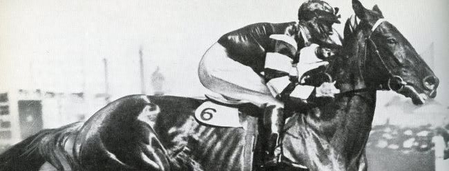

Phar Lap
########

:tags: povídky
:category: Povídky

.. class:: intro

Už asi sedm let mi leží v šuplíku jedna povídka. Vlastně je to jenom převyprávění
jednoho příběhu a ani to jsem nenapsal já. Kdysi, když jsem ještě dělal šéfredaktora
v nýrském školním časopise *Redaktor*, ten příběh pro mne převyprávěl Fanda Bureš.
Nikdy jsem se nedostal k tomu ji někde zveřejnit, tak to činím až teď.

.. class:: em

Mám rád koně. Dá se říct, že je „miluji“; jejich sílu, inteligenci a u
některých jedinců dokonce vůli vyhrávat a radovat se z vítězství.

.. class:: em

Nedávno jsem v televizi na ČT1 sledoval přímý přenos Velké pardubické a znovu
obdivoval souhru dvou tvorů: člověka a koně. Vzpomněl jsem si na jeden příběh.
Hlavní hrdinové byli kůň s velkým srdcem a lidé, kteří ho měli rádi a s láskou
se o něj starali. Rád bych se s vámi o ten pravdivý příběh podělil. Ten kůň se
jmenoval „Phar Lap“.

Pronikavé houkání lodní sirény ohlašovalo příjezd jednoho z četných obchodních
plavidel, které roku 1928 přirážely ke břehům Austrálie. Na lanech jednoho z
přístavních jeřábů se v popruzích odevzdaně houpal mohutný ryzák. Dole na něj
čekal stárnoucí (nijak úspěšný) trenér Harry Telford. Koupil valacha pro svého
zaměstnavatele O. Davise za pouhých 160 guinejí (za ostatní dvouročky se
platilo 10x více).

Tak stanul na půdě Austrálie Phar Lap. Na pohled působil impozantně. Byl o
deset centimetrů vyšší než jiní koně a byl i mnohem těžší. Byl mohutný.

Potom však, co ho majitel uviděl v pohybu, vysloužil si jméno „Louda“. Zklamaný
Davis vynadal Telfordovi a nařídil mu, aby neohrabanou herku okamžitě prodal.
Starý nešťastný trenér se nechtěl vzdát naděje. Neměl na to, aby valacha koupil
sám, a tak usmlouval tříroční splátku. Místo slávy a vítězství sklízel „Phar
Lap“ jednu porážku za druhou.

Strhaný trenér přikročil k zoufalému rozhodnutí - byl přesvědčený, že Phar Lap
má v sobě něco, co neumí uplatnit. Osedlal valacha a zmizel s ním v pásu písku
a nekonečných plání. Honil ho a štval v písečných dunách. Spolu cválali v
těžkém bořícím se písku, bylo to pro oba vysilující. Uřícený Phar Lap v sobě v
písečných dunách objevoval skryté rezervy.

A starý trenér se ukázal jako výborný znalec koní. Když se s Phar Lapem vrátili
na cvičnou dostihovou dráhu, domluvil se s ostatními jezdci, aby ve cvičném
závodě nechali Phar Lapa doběhnout prvního. Aby poznal, jak chutná vítězství.

Potom Phar Lapa přihlásil do dostihové sezony, ale od velkého „Loudy“ nikdo nic
neočekával. Pozornost se dávno soustředila na jiné. Přišel první závod a v
nabitém hledišti seděl jediný člověk, který tiše doufal... Harry Telford.

Bylo odstartováno a pole koní vyrazilo kupředu. Napjatí diváci přiložili k očím
dalekohledy. Každý hledal „toho svého“ favorita. Koně se vřítili do druhé
poloviny závodu, svalnatá těla ještě přidala k obrovskému tempu. Žokejové
obsazovali nejvýhodnější pozice, zvířata pod nimi vytušila finiš...

Telford dalekohled nevlastnil, ale vytušil, že jeho kůň s žokejem v
červeno-bílém dresu se v poli koní posouvá ku předu. A najednou - obrovitý ryzák
Phar Lap vyrazil ze zákrytu koní a razantně se začal vzdalovat svým soupeřům.
Phar Lap prolétl cílem s velkým náskokem a plný energie. Překvapení diváci
zakrátko užaslé ticho přeměnili v obrovský jásot.

Toho dne obrovský ryzák Phar Lap nastoupil cestu, ze které už nesešel. Za jeden
dostihový rok vyhrál 18 dostihů (rovinových) a Australané o něm hovořili jako o
„svém Phar Lapovi“.

Ne všichni z jeho úspěchů měli radost. Zloba, závist a konkurence pátraly po
tom, jak jeho úspěchy zastavit. Phar Lap se stal neporazitelným a podsvětí z
dostihového prostředí v Austrálii najalo profesionálního střelce. Kulka z jeho
pušky jen o pár centimetrů minula Phar Lapovu hlavu. Od té doby valacha
doprovázeli na závodiště policisté. Ale zločinci se nevzdávali. Při prestižním
závodě Melber Cup se snažili všemožně zabránit startu Phar Lapa. Porouchali
motor auta, kterým byl Phar Lap převážen a valach musel poslední 2 km na
závodiště „ docválat po svých“, aby stihl start závodu a s neúměrnou zátěží v
sedle přesto zvítězil. Mnohokrát v Austrálii se snažili zamezit tomu, aby Phar
Lap v rovinových dostizích zvítězil. Byl hrozně přetěžován, ale on poznal, co
je to zvítězit a jeho obrovské, bojovné srdce mu nedovolovalo prohrát.

V roce 1932 se Harry Telford rozhodl odvézt svého ryzáka do Ameriky. Hned druhý
den po úmorné přeplavbě valach startoval ve štědře dotovaném závodě.  Vítězi
bylo určeno 50 000 dolarů. Phar Lap nebyl zcela v pořádku, měl zraněné kopyto,
přesto v závodě nastoupil. V průběhu dostihu se rána otevřela, obvazem
prosakovala krev, ale žokej nedokázal koně zastavit. Phar Lap chtěl vyhrát přes
veškerou bolest. Jeho výkon si podmanil i Američany. Novináři předpovídali, že
se Phar Lap stane koněm roku. Znovu se však objevila lidská nenávist a závist.

Jednoho dne se z boxu Phar Lapa ozvalo bolestivé sténání. Valach trpěl velkými
bolestmi a jeho ošetřovatel Tommy vytušil komplikace. Přivolaný veterinář
nakázal koně okamžitě provést. Velký ryzák byl vyveden před stáj, ale pod
obrovskými křečovitými bolestmi se zhroutil. Další přivolaný veterinář už našel
jen plačícího ošetřovatele Tommyho, zhrouceného na mrtvém Phar Lapovi. Nad
smrtí velkého „Loudy“ se dodnes vznášejí otazníky.  Byl velký Phar Lap otráven?
Příčina valachovi smrti zůstane záhadou. Když se zpráva o smrti Phar Lapa
donesla do Austrálie, lidé plakali na ulicích. Austrálie chtěla vyhlásit
Spojeným Státům válku...

Lodní houkání ohlašuje příjezd lodi do přístavu. Připlouvala z Ameriky. V
přístavu nečekal zchudlý trenér, ale mnohotisícový dav, který vyšel v ústrety
svému miláčkovi Phar Lapovi. Rameno lodního jeřábu vyneslo z útrob lodi tělo
mrtvého koně. Byl to Phar Lap. Velký „Louda“ se vrátil.

.. class:: em

Proč se tento příběh vám snažím předat? Řekl jsem už na začátku: „miluji koně“.
Letos jsem s velkým zájmem sledoval závěrečný souboj dvou favoritů. Byl to
úchvatný souboj. Ale i v obyčejném životě je spousta lásky, úspěchů i
neúspěchů. Tento příběh je příběhem „zvířete“, které mělo obrovské srdce beze
lsti, které toužilo vyhrávat přes všechny překážky. Čestně a upřímně! Není v
tom něco i pro nás?

.. class:: sc

František Bureš
