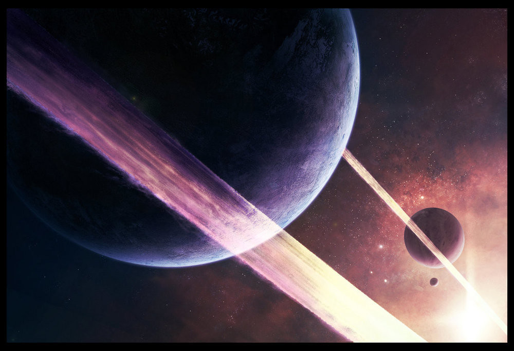

Rozhovor: Jesper Ullbing
########################

:tags: rozhovor
:category: Rozhovory

.. class:: intro

Celkem mám v plánu dva rozhovory a oba už jsou v podstatě připravené. Budou
mít hodně společného - zaměření vyzpovídaných osob. Tvoří takzvaný
"space-art" - grafiku zaměřenou na vesmír, planety, mlhoviny a podobné věci. I
já měl vždycky takový styl rád, obrázky Měsíce, Země a všech možných planet mi
zdobí pozadí v počítači již dlouho...

    Všechny obrázky jsou k dispozici ve větším rozlišení na
    `profilu Jespera (DeviantArt) <http://katenfelix.deviantart.com/>`_.

.. class:: question

Můžeš se nám krátce představit? Odkud jsi, co tě baví...

Ahoj, jmenuji se Jesper Ullbing a žiji v docela malém městě ve Švédsku. Narodil
jsem se v roce 1997 a mezi moje zájmy patří kromě grafiky také atletika, kterou
provozuji třikrát do týdne. Také rád navrhuji mapy pro některé hry, v
současnosti čekám na Cryengine 3, což je editor map pro Crysis 2. Také mne
zajímá astronomie a počítače.

.. image:: images/2011-06-02-rozhovor-jesper-ullbing/jesper.jpg

.. class:: question

Kdy jsi začal dělat grafiku? Jak jsi se k tomu vlastně dostal? A proč sis
vybral právě zaměření na “space-art”?

Umění mne vždycky zajímalo a také jsem byl vždy fascinovaný digitálními médii.
Takže v létě 2009, když mi kamarád pověděl o programu na grafiku zadarmo, jsem
začal objevovat počítačové umění. První výtvor na který si pamatuji, byl
jednoduchý obrázek Země a Slunce. Upřímně nevím, proč jsem se rozhodl vytvářet
grafiku s vesmírnými tématy. Asi jsem měl vždycky pro vesmír slabost.

.. class:: question

Kolik hodin denně strávíš při vytváření grafiky?

V průměru kolem dvou a půl hodiny.

.. class:: question

Máš nějaké vzory v oblasti designu? Nějakého výtvarníka, malíře, grafika?

Ano, pár jich mám. Někteří z mých přátel na DeviantArtu jsou úžasnými
výtvarníky, ke kterým vzhlížím. Je těžké říct někoho konkrétního, ale možná že
by to byl Greg Martin. Miluji jeho tvorbu!

.. class:: question

Obligátní otázka - kde hledáš inspiraci?

Inspirace může přijít vcelku odkudkoliv, ale většinou se tak děje když
odpočívám. Když napůl spím a napůl jsem vzhůru. Myslím, že mám nejlepší nápady
protože nechávám myšlenky náhodně přicházet kdoví odkud.

.. image:: images/2011-06-02-rozhovor-jesper-ullbing/hand.jpg

Pravděpodobně pochází z něčeho, co jsem viděl dříve, jako nějaký cizí obraz, nebo nějaké zajímavé
události. Rád poslouchám hudbu, když odpočívám, takže hodně inspirace pochází i
z hudby. Někdy mne inspiruje nějaký pořad o vesmíru a někdy nápady přicházejí,
když pracuji.

.. class:: question

Který svůj kousek bys doporučil? Který je podle tebe nejlepší?

To je těžké říct, ale jsou dva výtvory, které mám opravdu rád - “Ermerald” a
“The Tree”. Podle mne jsou to nejlépe provedená díla. “The Tree” mám rád,
protože se velmi podobá tomu, jak jsem si ho v hlavě představoval. Pak je tu
ještě spousta dalších, jako například “Time”, “Ring” anebo “Iter”.

.. image:: images/2011-06-02-rozhovor-jesper-ullbing/emerald.jpg

.. class:: question

Už tě potkal nějaký významnější úspěch díky tvé tvorbě? Nebo pořád čekáš?

Pár přátel mne žádalo o nějakou práci, většinou se jednalo o věci jako loga a
grafické návrhy. Zkoušel jsem prodat několik výtisků, ale bez úspěchu. Takže
asi stále čekám.

.. class:: question

V čem svou grafiku tvoříš - jakým nástrojům dáváš přednost?

Pro veškerou práci používám Photoshop. Občas používám i program na vytváření 3D
grafiky, ale nepříliš často. A když kreslím, tak preferuji tablet.

.. image:: images/2011-06-02-rozhovor-jesper-ullbing/crack_light.jpg

.. class:: question

Jaké jsou tvoje plány do budoucnosti? Výstava? Revoluční výtvor? Nebo o
něčem sníš?

V budoucnosti bych rád studoval umění na nějaké umělecké škole, chci se snát
natolik dobrým, abych se grafikou uživil. Ale zatím to dělám pouze pro zábavu a
příliš na vydělávání peněz nemyslím. Užívám si to a to je důvod, proč to chci
dělat.

