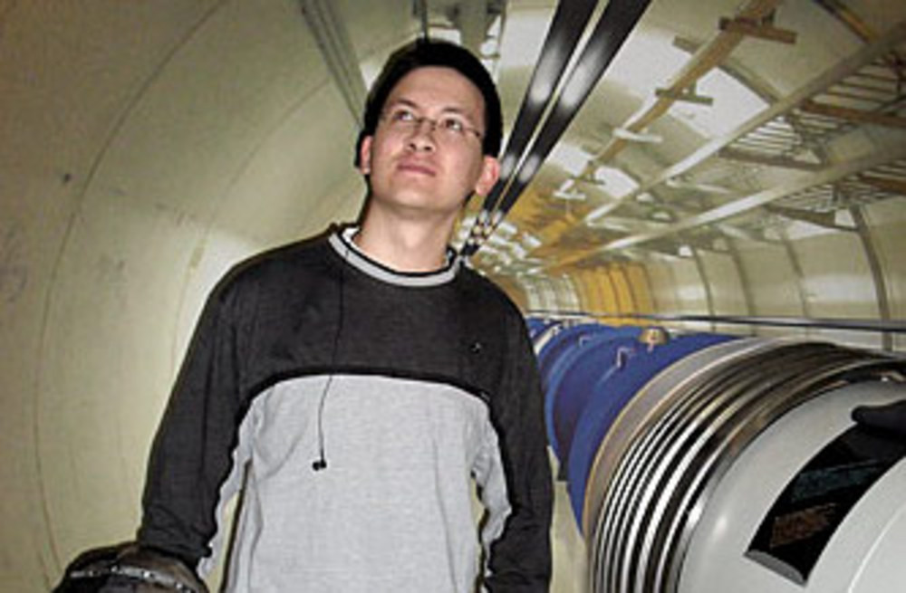
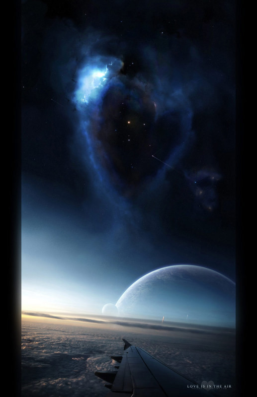
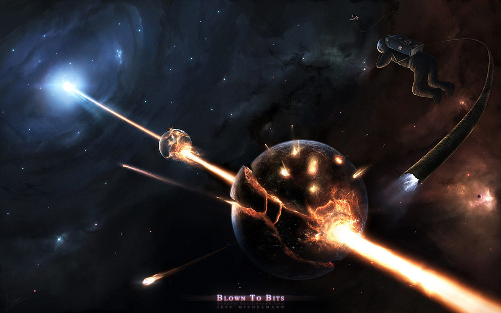
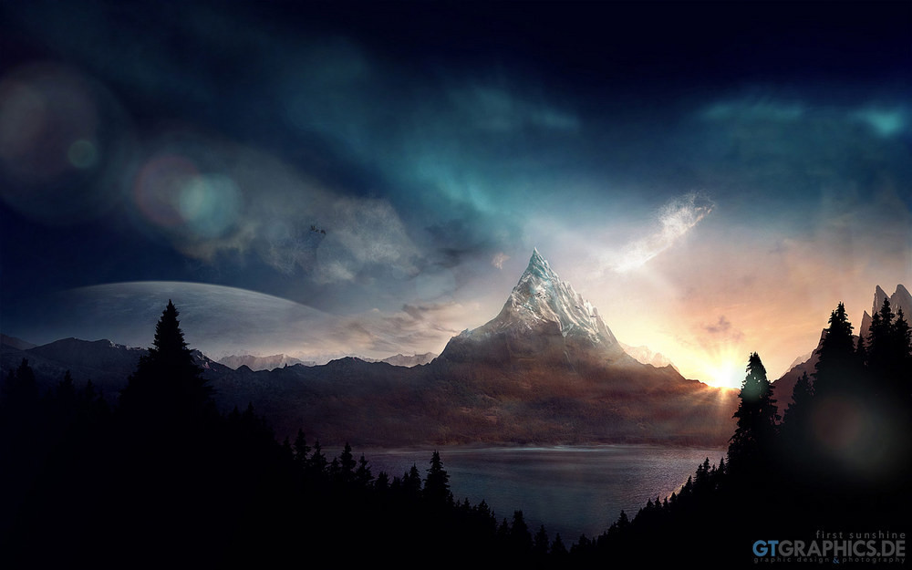
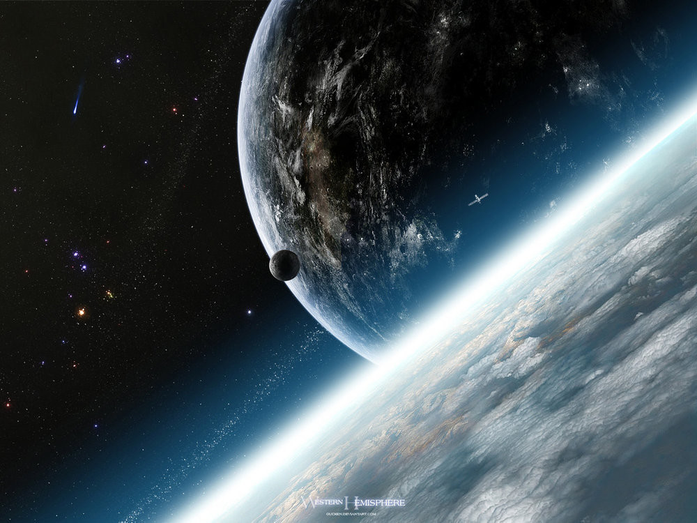
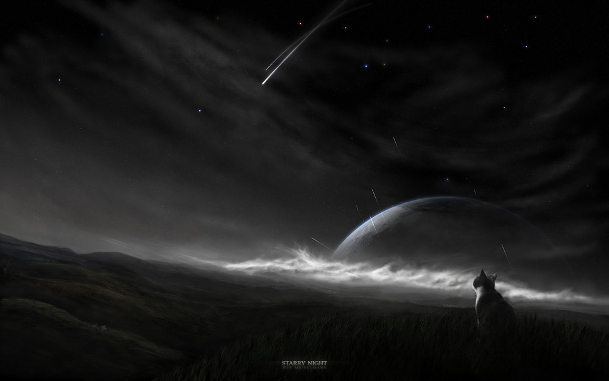

Rozhovor: Jeff Michelmann
#########################

:tags: rozhovor
:category: Rozhovory

.. class:: intro

Jak bylo slíbeno, na světě je i druhý rozhovor. Je tomu předchozímu velmi
podobný, nicméně doufám, že i přesto bude dostatečně zajímavý. Opět jde o
autora ve stylu "space-artu" - Jeffa Michelmanna.

Možná poznamenám, jak jsem k němu vlastně přišel.
Před delší dobou jsem narazil na jeho obrázek `Starry
Night <http://gucken.deviantart.com/art/Starry-Night-146233028>`_ a bez valného
zjišťování informací o autorovi jsem si ho dal jako pozadí na plochu. Když jsem
pak přemýšlel, o čem zajímavém psát, napadlo mne najít autora a udělat s ním
rozhovor. Jak vidíte, zdařilo se.

    Pokud se vám obrazová příloha zamlouvá, můžete se podívat i na `profil na
    serveru DeviantArt <http://gucken.deviantart.com/>`_.

    Dalším pokračováním vaší cesty za uměním můžou být `oficiální
    stránky skupiny GTGraphics.de <http://www.gtgraphics.de/gtgv4/>`_

.. class:: question

Můžeš se nám krátce představit? Odkud jsi, co tě baví...

Jmenuji se Jeff Michelmann a narodil jsem se v Mnichově zhruba před 23 lety.
Jsem grafik samouk, pro radost.

.. class:: question

Kdy jsi začal dělat do umění a co tě k tomu přivedlo? A proč jsi se zaměřil
zrovna na "space-art"?

Myslím, že jsem si svůj kladný postoj k tomuto druhu umění vytvořil už jako
dítě, když jsem byl v tom věku, kdy děti milují sbírání herních karet. Možná že
znáte Magic the Gathering, tak tím jsem s kamarády žil, když mi bylo okolo 12
let.

Samozřejmě jsem sbíral tyto karty kvůli hře a kvůli
tomu, že tu hru hráli všichni, ale když se podívám zpět, mohl bych říct, že
jsem je sbíral i kvůli tomu, jak byly potištěné.

To, že se umění stává součástí mého života jsem si neuvědomoval do té doby, než
jsem potkal Tobiase Roetsche (mého kolegu a velmi dobrého přítele) v online
vesmírné hře, která se jmenovala Freelancer, v roce 2004.

Vždycky jsem byl fascinovaný vesmírem a když jsem se rozhodl, že budu dělat
grafiku, tvoření "space-art" přišlo samo od sebe.

.. class:: question

Jak dlouho ti trvalo se něco takového naučit?

No, grafiku jsem začal dělat od roku 2004 a od té doby se stále učím. Nemyslím,
že bych někdy mohl říct, že už jsem se naučil vše, protože cokoli v umění
děláte je součást procesu, ve kterém se zlepšujete.

A to může být trochu děsivé, vědět, že někde existuje strop, kterého když
dosáhnete, přestanete se zlepšovat a bude vaším omezením.

.. class:: question

Máš nějaké vzory? Nějakého malíře, grafika, umělce?

Prvním z nich je Tobias Roetsch, který mi pomohl stát se grafikem, jakým jsem
dnes. Oba `spolupracujeme na svém webu <http://www.gtgraphics.de>`_, kde se
můžete podívat na některé naše práce.

Pak opravdu obdivuji výtvarníky, kteří zkusili vrátit něco zpátky svým fanouškům
a společnosti. Když bych měl jmenovat, pak bych zmínil třeba `Bobby
Chiu <http://digital-bobert.cgsociety.org/gallery/>`_,
`Helen Rusovich <http://slide.cgsociety.org/gallery/>`_
a `Johannes Voβ <http://algenpfleger.deviantart.com/>`_.

Nejen že jsou neuvěřitelně zkušení, ale kvůli publikování různých tutoriálů, návodů
a tipů jak se stát lepším umělcem, věřím, že tito lidé a kdokoli, kdo dělá to
samé, si opravdu zaslouží obdiv.

Samozřejmě je zde ještě mnoho dalších výtvarníků, kteří si to samé zaslouží pro
kvality, které mají.

.. class:: question

Stejná otázka zas a pořád dokola: kde hledáš inspiraci?

Možná to bude znít jako ohromné klišé, ale získávám inspiraci z života samého.
Všechno, co vidíte, vás inspiruje, přestože je to denní rutina.

.. class:: question

Kolik času obvykle strávíš prací, než o dílu prohlásíš, že je hotové?

No, to velmi záleží na tom, na čem zrovna pracuji. Někdy nejsem s obrázkem
spokojený a ten pak leží v počítači po celé týdny nebo dokonce
měsíce. Říkával jsem, že mi obvykle trvá kolem 20 hodin, než dílo dokončím, ale
skutečný potřebný čas může být hodně odlišný.

.. class:: question

Který ze svých kousků bys doporučil? Které jsou podle tebe nejvíce vydařené?

Mými nejznámějšími jsou `Love is in the
air <http://gucken.deviantart.com/art/Love-is-in-the-air-78229048>`_ a `Starlit
Night <http://gucken.deviantart.com/art/Starlit-Night-52427606>`_. Ale ta, na
které jsem nejvíce pyšný, jsou asi `Blown To
Bits <http://gucken.deviantart.com/art/Blown-To-Bits-138432534>`_ a `First
Sunshine <http://gucken.deviantart.com/art/First-Sunshine-165589690>`_.

No upřímně, u každého díla se najde něco, na co jsem trochu hrdý. Může to znít
špatně, ale opravdu musíte mít rádi svoje výtvory. Když ne vy, kdo jiný?

.. class:: question

Už jsi měl nějaký významnější úspěch se svojí tvorbou? Nebo stále čekáš?

Samozřejmě mám několik cílů, kterých jsem zatím nedosáhl. Ale to převážně
znamená, že stále můžu jít a zkusit jich dosáhnout.

Přesto jsem zažil několik okamžiků, které mi daly pocit úspěchu. Například, na
vesmír zaměřené GTGraphics.de (Tobiasova a moje galerie) bylo právě oficiálně
zveřejněné Microsoftem pro Windows 7 *(jako zdroj pozadí na plochu, poznámka
redakce)*.

.. class:: question

Jaké používáš nástroje pro vytváření grafiky? Jakému software dáváš
přednost?

Nyní používám hlavně Adobe Photoshop a tablet Wacom.

.. class:: question

Máš nějaké plány do budoucnosti? Výstavu, revoluční
výtvor? Nějaké dosud neuskutečněné sny?

Mým jediným snem je stát se lepším výtvarníkem. Nějaké revoluční dílo by bylo
samozřejmě pěkné, ale pokud se budu dále zlepšovat, budu spokojený.
