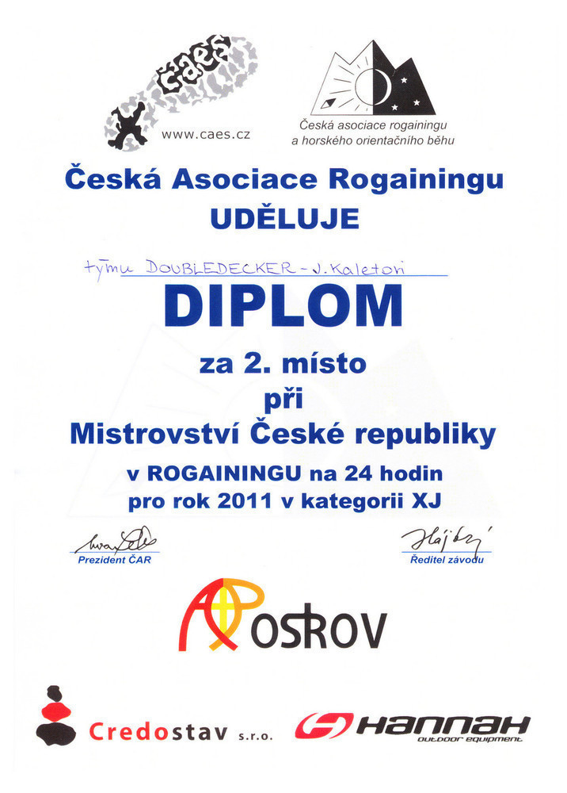

Zelenáči na mistrovství
#######################

:tags: rogaining, Tchoříci, cestování
:category: Tchoříci

.. class:: intro

Omlouvám se, ale žádné fotky zničených nohou a utahaných tváři ke mně ještě
nedorazily. Nechcete-li o ně přijít, navštěvujte tuto stránku co nejčastěji.
Zároveň tak budete mít dobrý skutek, protože mi uděláte radost. Možná by k tomu
pomohlo stisknutí CTRL+D ;-)

Tak jsem se poprvé zúčastnil mistrovství, mistrovství České republiky. A to
konkrétně v rogainingu. Asi už z toho, že jste o něčem takovém v životě
neslyšeli, tušíte, že to mistrovství zas až takové terno nebude. Co to tedy
vlastně rogaining je?

Hodně dlouhý orientační běh...
******************************

Ale ne tak úplně. Oproti klasickému orientačnímu běhu, se kterým má rogaining
dost společného, je tu i pár zásadních rozdílů. V klasickém orienťáku jde o
čas. Čím rychleji sesbíráte všechny kontroly v zadaném pořadí, tím větší máte
šanci se dobře umístit.

U rogainingu můžete zapomenout na to, že byste dokázali posbírat všechny
kontroly. To byste museli být buď hodně dobří, nebo by závod musel být opravdu
lehký. Z toho plyne, že nejde tolik o rychlost, jako o to, kolik kontrol
dokážete posbírat. Ty jsou ještě ke všemu různě bodově ohodnoceny...

Další rozdíl je v tom, že se rogaining neběhá v jednotlivcích, ale po dvou až
pětičlenných týmech.

Nejvyšší kategorie rogainingu je ta na 24 hodin. Pak jsou obvykle i kratší,
třeba na 12 nebo jenom na 6 hodin, ale to už není taková sranda. A jaké to je,
jít celý den a celou noc?

Doubledeckeři vyráží
********************

.. figure:: images/2011-06-25-mcr-rogaining-2011/mapa.jpg

    Náš postup podle počítače. Ve skutečnosti byly úseky mezi kontrolami mnohem méně přímé...

Původně jsme měli být v týmu tři, ale třetí člen svoji účast odvolal. Takže
jsme s Jáňou Spěváčků vyrazili směr Bělá nad Radbuzou a pak pokračovali do
blízkého Smolova. Cestou nás naložil německý pár a ty čtyři kilometry nás
svezli. Jo, hodí se to, když se alespoň jeden člověk z týmu dokáže německy
domluvit. Taky bych to chtěl umět...

Start závodu byl až druhý den, v sobotu, v poledne. Do té doby se tak různě
polehávalo po území základního tábora, vymýšlely se různé strategie a postupy a
čekalo se, až to konečně přijde.

A když už se to konečně přiblížilo, dostal každý člen týmu speciální mapu a mohlo
se začít plánovat. To je mimochodem jeden z nejdůležitějších momentů závodu.
Musíte si totiž dát pozor na několik věcí: musíte být realisté a dokázat
odhadnout z mapy, jak rychle asi budete v terénu postupovat, vybrat správně
kontroly tak, abyste získali co nejvíce bodů. Ty lépe hodnocené kontroly jsou
samozřejmě na nedostupnějších místech.

Takhle, myslím, by to mělo fungovat, pokud to umíte. My to neuměli. Nad
mapou jsme seděli dlouho a váhali, kterou kontrolu vzít a kterou nevzít, kterou
si nechat na ráno a na kterou se vykašlat.

Ideální strategie je prý taková, udělat si dva okruhy - první vetší a
náročnější, pak se vrátit do tábora, na pár hodinek se vyspat a pokračovat po
kratším okruhu. I my si to tak naplánovali.

A když už sedíte nad mapou dost dlouho, zavolají všechny soutěžící k hromadnému
startu, padne výstřel a jde se. Někteří blázni i běží. Nechápu, jak někdo může
nebýt černoch a vydržet čtyřiadvacet hodin běžet. A ještě se neztratit. My se
vyhecovat nenechali a ač naše tempo bylo celkem svižné, neběželi jsme.

Zajímavé je, že hned po startu se soutěžící rozdělí na dvě skupiny, které
zamíří opačným směrem. Pak už lidé odpadávají od toho velkého chumlu pomalu.
Jen občas na rozcestí některý pár zabočí jinam než zbytek. Takže pokud se držíte davu,
nebývá problém dojít k první kontrole. Samozřejmě se ten vepředu nesmí splést.
My se davu drželi, samozřejmě pouze proto, že jsme měli úplně stejné úmysly a cestu,
a první kontrolu jsme opravdu našli.

Bažinky, hustníky a mokro v botách
**********************************

Na pokračování závodu není zas tolik co popisovat. Prostě jdete a jdete, když
si myslíte, že jste kontrole dostatečně blízko, švihnete to azimutem do lesa a
pak, pokud máte štěstí, kontrolu najdete.

Občas se taky stane, že kontrolu nenajdete. Nebo že ji najdete úplně jinde, než
jste čekali. To je jedna z věcí, která dělá tenhle extrémní sport tak
zajímavým.

A rozhodně to není zábava pro bačkory. K jedné kontrole jsme se museli dostat
přes poměrně velkou bažinu. Ne takovou, kde zapadáte po pás, ale takovou, ve
které když jdete půl hodiny, tak máte boty durch a náladu ještě horší.

Nicméně ze začátku se jde dobře. Jste ještě čerství a plní sil a hlavně - je
světlo. I nám bylo jasné, jaké nám světlo dává výhodu a snažili se urazit co
nejdelší kus, dokud se nezačne stmívat.

Protože jakmile je tma, přestává být hledání kontrol tak snadné. Pokud někdy
snadné bylo. A pokud se do toho přidá ještě mlha, ve které není vidět na metr
před sebe, máte o zábavu postaráno. Takhle se nás v krásné mlze sešlo na jednom
kopci asi sedm, pročesali ho v rojnicích skrz na skrz a nakonec jsme asi po
hodině kontrolu nalezli.

A pozor si musíte dávat i když kontrolu nehledáte. Ne všude vedou cesty a když
jsme z onoho kopce v mlze sbíhali, zamotali jsme se do hustníku, kterým se
prodírat nebyla žádná legrace.

Zpátky a spát!
**************

To už bylo dávno po půlnoci a my byli sotva za polovinou prvního plánovaného
úseku. V té chvíli už jsme si byli jistí, že naše plány byly značně nadnesené a
že těch dalších dvacet kontrol (ne-li víc) už nestihneme. Z mapy jsme si navíc
snadno dokázali spočítat, že do základního tábora nám zbývá okolo osmnácti
kilometrů, což jsou tři hodinky chůze. A pokud budeme chtít najít ještě nějakou
kontrolu, čas se ještě prodlouží.

A my ještě něco najít chtěli. Na další kontrolu s pořadovým číslem 42 jsme se
dostali bez problémů. I tu další jsme našli celkem rychle. Ale vzhledem k tomu,
že pro nás byla hodina na nalezení kontroly průměrná a půl hodina dobrá, bylo
už něco už kolem třetí ranní. V tu chvíli už jsme ptali sami sebe, v kolik
hodin začíná svítat.

V plánu jsme měli ještě asi tři kontroly, ale pak jsme se zase zamotali do
hustníků a jejich obcházení a když začalo svítat, rázovali jsme si to dolů z
kopce, na hony daleko od všech kontrol.

    Tak takhle vypadá diplom. Ještě jsme dostali medaili a nutelu.

Vysoká tráva byla mokrá, nálada podstatně chladnější než ráno a cesta, na
kterou jsme měli narazit, nikde. Mám za to, že právě odsud jsem si odnesl svých
osm klíšťat. Takže se tam nemusíte bát - všechna klíšťata jsou vysbírána.

Asi po dvou hodinách jsme se dostali k jedné vesnici, což pro nás znamenalo, že
jsme o něco dál od cíle, než by nám bylo milé, ale zároveň to byla dobrá zpráva
díky silnici, která vedla až domů.

V okolních lesích už pobíhali nadšenci, kteří se vydali na hledání hub a my se
pomalu blížili ke konci své vskutku celodenní výpravy. Na druhou část nezbyla
chuť ani síly a navíc jsme si říkali, že napoprvé nám bude z mistrovství ČR
stačit i to třetí místo. Já se o tom ještě  nezmínil, ale v naší kategorii byly
pouze tři týmy.

Ve Smolově jsme se usadili v hash housu, hangáru s občerstvením a po zdolání
guláše, čaje a palačinek si "odpípli" cíl a prohlásili svůj závod za ukončený.
Od startu v té chvíli uplynulo přesně dvacet hodin, dvacet osm minut a dvacet dva
sekund. Takový dvojkový výkon si zasloužil minimálně dvouhodinový spánek.

.. figure:: images/2011-06-25-mcr-rogaining-2011/casovy-rozpis.jpg

    Můžete si prohlédnout, jak dlouho nám to trvalo z jedné kontroly na druhou. Za povšimnutí stojí, že v hash housu jsme strávili přesně hodinu.

Za průběžného balení jsme naslouchali vyhlašovaní výsledků ostatních kategorií
a s překvapením si došli pro krásné druhé místo. Ti třetí za námi byli o
čtyřicet bodů - jedna kontrola, žádný velký náskok.

A snad pár slov na závěr
************************

Abyste tedy konečně měli představu o tom, co to rogaining je, zkusím ho krátce
a snad i přesně vystihnout: závod, ve kterém se až dvacet čtyři hodin můžete
prodírat hustníky, topit se v bažinách a sbírat šrámy a klíšťata, jen proto,
abyste jednou za čas mohli prohlásit, že máte opravdu dost, abyste mohli celý
další den prospat a pár dalších dnů věděli o svých nohou, které vám za tento
výlet patřičně vynadají.
