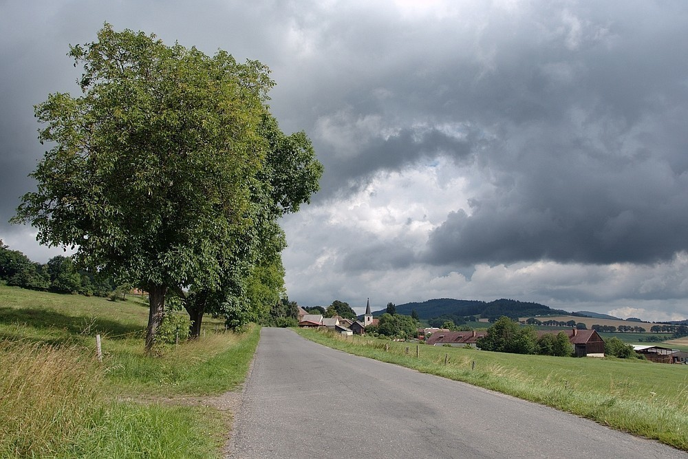
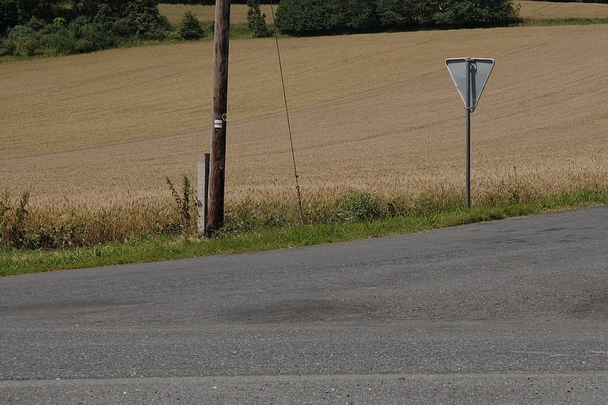

Ze severu - den první
#####################

:tags: Krušné hory, fotky
:category: Cestování

.. class:: intro

Vydal jsem se na sever. Pěšky a sám. Batoh, foťák, boty. Občas horko, jindy
zima, nohy bolely od tvrdého asfaltu. Klíšťat dost, pozabíjel jsem jich tucty
a vytahoval asi jenom tři. Párkrát jsem se svezl a nakonec dorazil až do
Krušných hor. Menší fotoreportáž na pokračování.

10:03
-----

Ze začátku to nevypadalo úplně nadějně. Mraky byly temné a občas něco i káplo. Naštěstí toho nikdy nebylo moc. Ta vesnice v pozadí je Dlažov, doufám.

12:40
-----

Jak vidíte, za dvě hodinky už to bylo s počasím o hodně lepší, skoro až o moc. Potil jsem se. Vesnice vzadu je Poleň.

12:46
-----

Čechy jsou zemí asfaltu. Sice je často mizerný, jak mi vyprávěl pán, který mě kousek svezl do Žlutic, před kterými opravují silnici každým rokem, ale je. A pokud si chcete rychle zničit nohy, choďte po něm pěšky.

14:24
-----

Jít na sever není vždy úplně nejjednodušší. Občas prostě silnice není. Ale když máte štěstí, narazíte na takovouto severnajku. Cestu směřující přímo na sever. Až budete na rozcestí váhat, severnajka vás nikdy nezklame.

16:32
-----

A k večeru už bylo horko nefalšované. Tenhle kostelík se nachází kousek od vesnice Buková. Pak byl už jenom dost rozsáhlý les, sympatická hospoda v Líšině, polévka z pytlíku a spacák.
