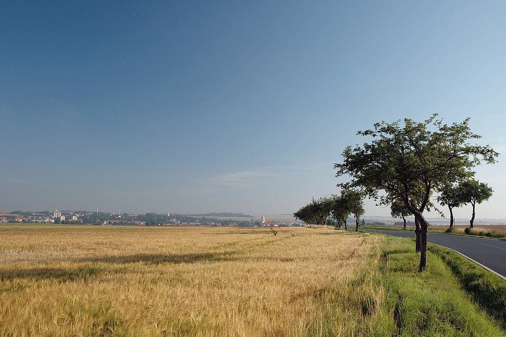
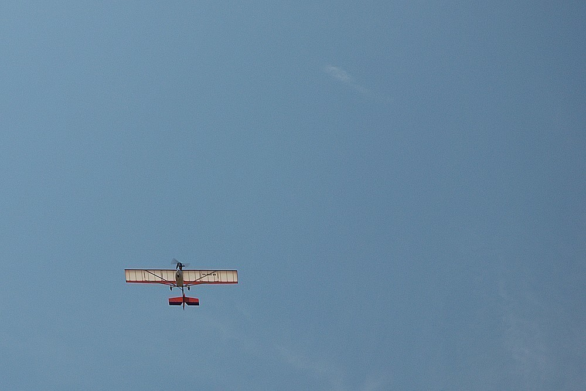
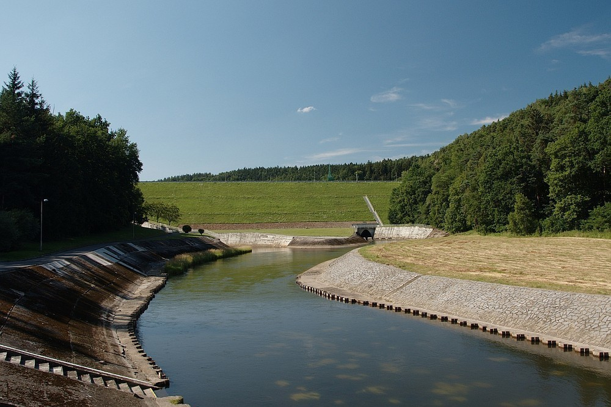
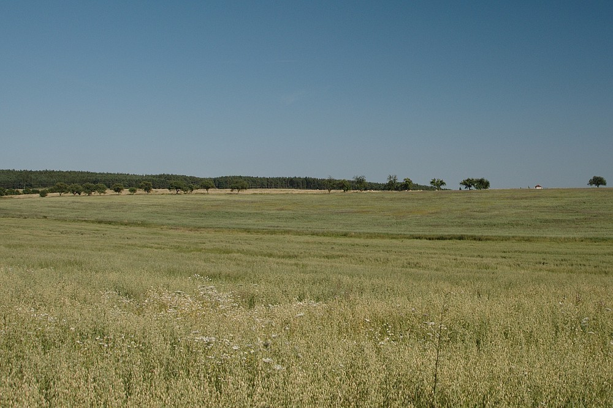
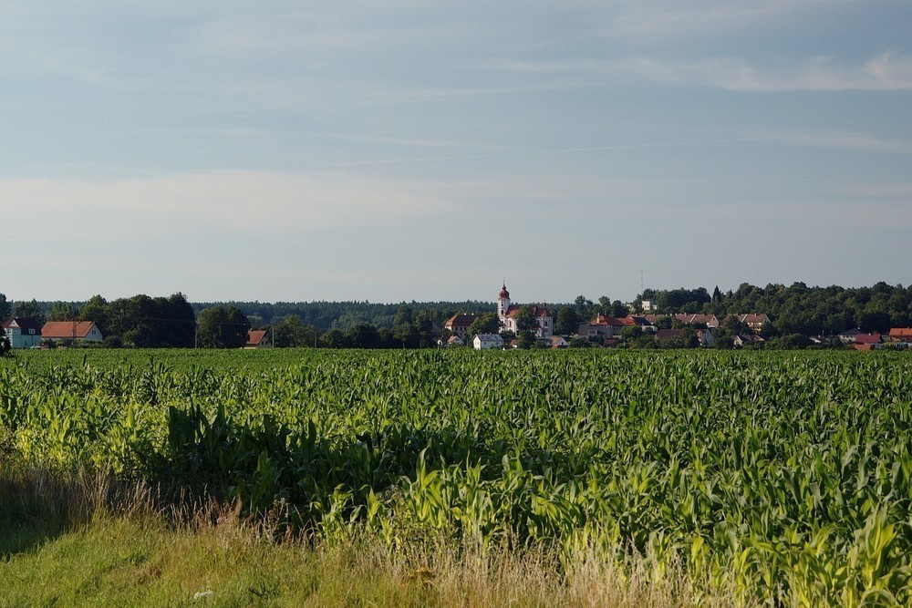

Ze severu - den druhý
#####################

:tags: Krušné hory, fotky

.. class:: intro

Druhý díl z vyprávění. I podle fotek je poznat, jak byl ten den nudný a horký.

7:13
-----

Tohle je prosím výhled na Stod. Bylo krátce po sedmé. Moc dobře jsem se nevyspal, večer na mne útočili komáři, v noci otravovaly srnky, které mi strkaly hlavu do spacáku. Celou noc bylo hrozné horko. Tak jsem byl docela rád, když začalo být světlo a já mohl jít dál.

14:56
-----

Letadlo, které mi přeletělo nad hlavou. Já vím, fotka nic moc, ale z toho dne toho moc lepšího nemám. Obloha byla bez mráčku, kdo to má fotit?

16:24
-----

A hádanka pro zeměpisce, co je to za vodní dílo? Ono pokud sledujete mojí cestu s mapou, tak na to není těžké přijít. Každopádně mne přehrada trochu překvapila, po hrázi se přejít nedalo, musel jsem až o trochu níž a dost jsem si zašel.

17:29
-----

Důkaz o tom, že ten den bylo opravdu horko. To jsem zrovna vylezl z lesa a zjistil, že cesta tu končí. Porost mi sahal nad kolena a prodírání bylo šílené. Nevěřili byste, jak po tom svědí nohy.

18:36
-----

A trochu nepovedený pohled na vesnici Líšťany. Vypadá to, že už jsou, co by kamenem dohodil, ale silnice se tak točila, že odsud to byly nejméně dva kilometry.
