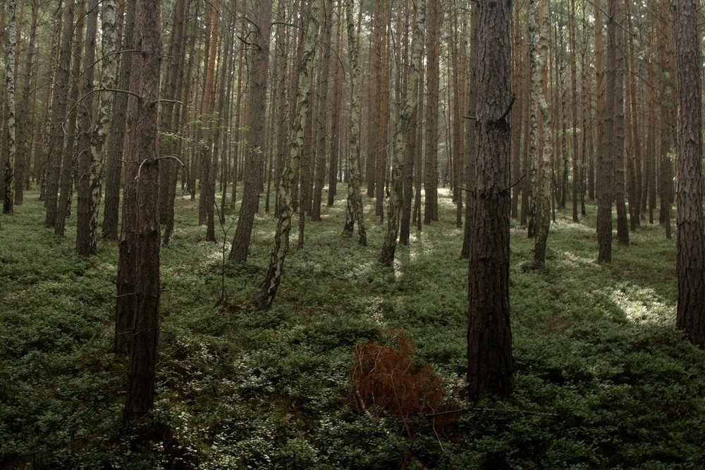
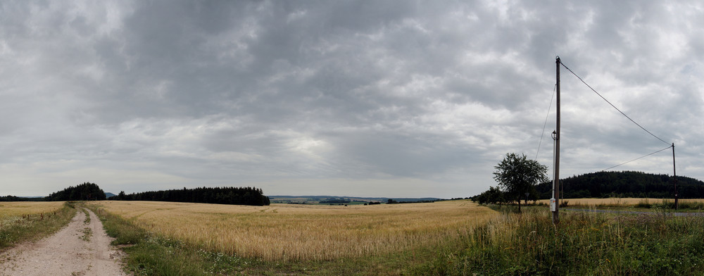
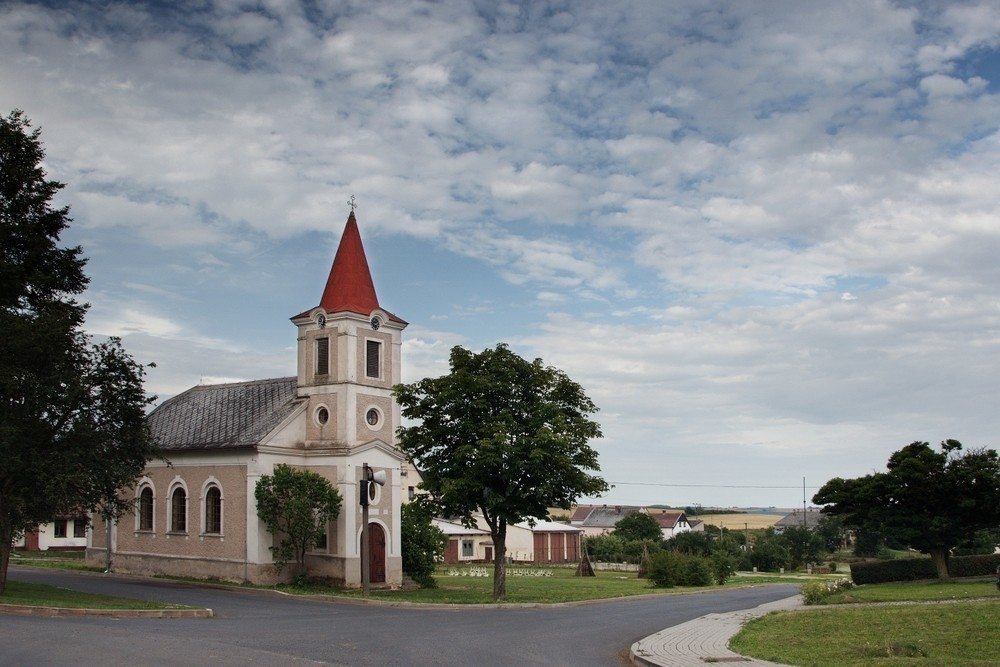

Ze severu - den třetí
#####################

:tags: Krušné hory, fotky

.. class:: intro

Třetí díl. Horko ze včerejška vydrželo, fotek bylo ještě méně.

9:01
-----

Lesy manětínské vrchoviny. Bloudil jsem v nich celé dopoledne a protože jsem
byl bez mapy, začínal jsem být ke konci už trochu nervózní, protože lesy ne a
ne skončit. Pak jsem konečně vylezl přímo nad Manětínem. Celkem pěkné město s
ještě hezčím kostelem. Ani nevím, proč jsem tam nic nevyfotil.

17:17
-----

První panorama na zkoušku. Až se dostanu ke Krušným horám, bude jich více a budou lepší.

18:04
-----

Kostelík ve vesnici Pšov. Kousek za vesnicí mi zastavil pán, který jel do
Karlových Varů a svezl mne až před Žlutice.
