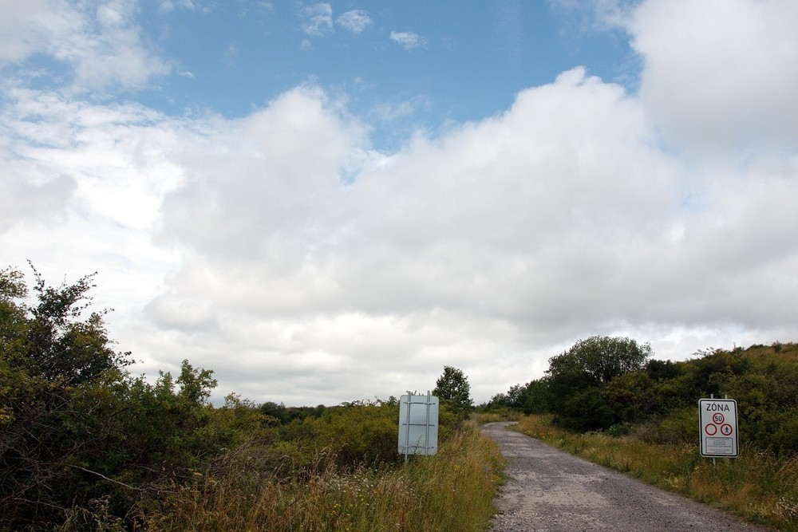
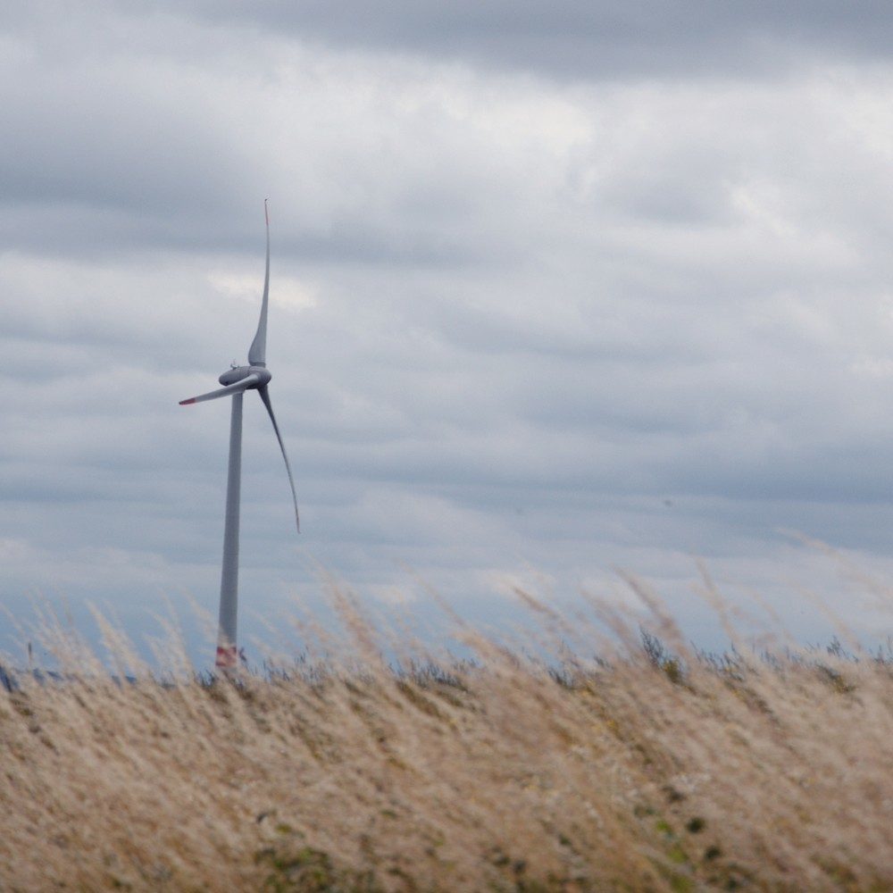
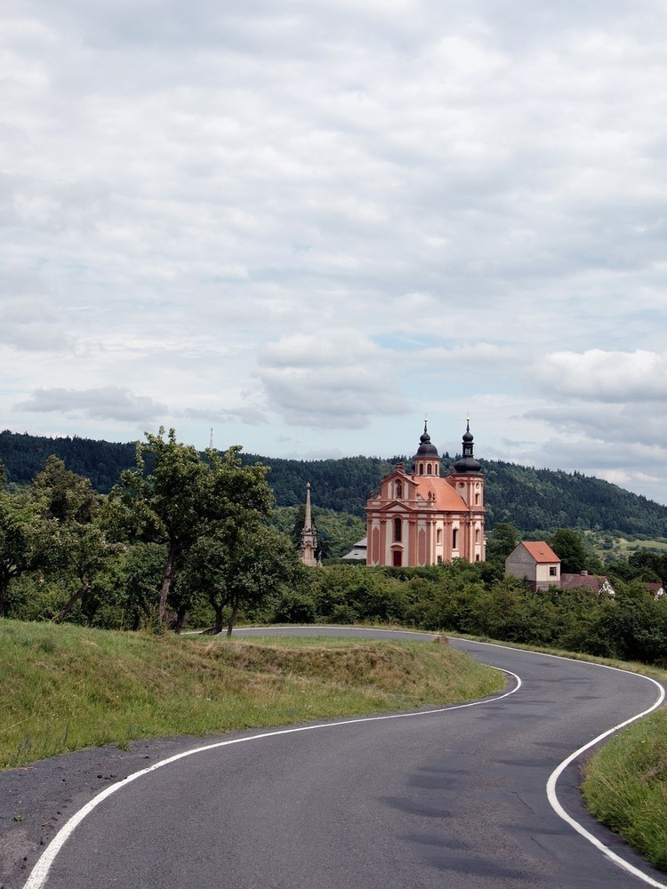
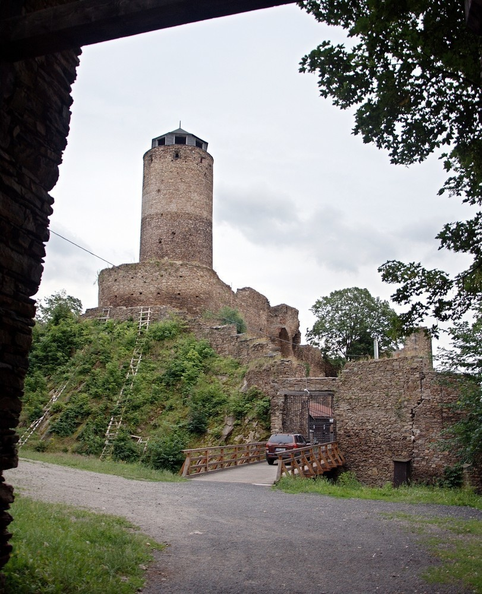

Ze severu - den čtvrtý
######################

:tags: Krušné hory, fotky

.. class:: intro

Další várka fotografií. Tentokrát už méně horký den a o trochu zajímavější.

11:52
-----

Takhle to dopadá, když jdete přímo na sever a dopředu si to moc nepromýšlíte.
Dostal jsem se do Doupovských hor, kde se nachází vojenský areál. A jak se
říká, na to projít ho jsem neměl koule. Obcházení mi zabralo celý den.

13:26
-----

U nás si pomalu zvykáme na tucty solárních panelů. Nahoře zas mají spoustu
větrných elektráren. Tohle byl jeden z prvních větrníků, který jsem potkal. Na
hřebeni Krušných hor jich ale byly vidět celé tucty. To byl hnus, velebnosti.
Ale hlavně když je to eko, že?

14:11
-----

Pohled na kostel Nejsvětější trojice ve
`Valči <http://cs.wikipedia.org/wiki/Vale%C4%8D_%28okres_Karlovy_Vary%29>`_.
Taková průměrná česká horská vesnička, která má ale zámek a hned dva kostely. Na tomhle se podílel i Matyáš Braun, stejně jako na sloupu u něj.

14:20
-----

.. image:: images/2011-08-11-ze-severu-iv/ctvrta.jpg

A tohle je ten novější. Kostel Narození svatého Jana Křtitele stojí na náměstí a z lavičky se mi na něj při svačině pěkně koukalo.

18:54
-----

A tohle už je hrad Hasištejn. Vystoupal jsem k němu z vesničky Prunéřov a docela jsem se při tom zapotil. Možná se divíte, jak jsem se tak rychle dostal přes celou Kadaň a okolí. Kus jsem se svezl s panem, který taky holdoval trampování a skvěle jsme si popovídali.

Ještě pod kopcem se mi stala zajímavá příhoda. Procházím vesničkou a z dálky vidím nějakou cyklo-rodinku, která stojí u ohrady a hladí si koně. Jak tak přicházím, kobyla (jsem přesvědčen o tom, že to byla kobyla) od nich odstoupí a začne se dívat na mne. Popojdu ještě pár metrů z rodinku, a kobyla za mnou popoběhne, tak jsem také neodolal a párkrát ji podrbal za uchem. Když jsem pak odcházel, kobyla se snažila protlačit přes ohradník za mnou. Tak nevím, jestli se do mne zamilovala, nebo jsem po těch čtyřech dnech prostě tolik voněl...

