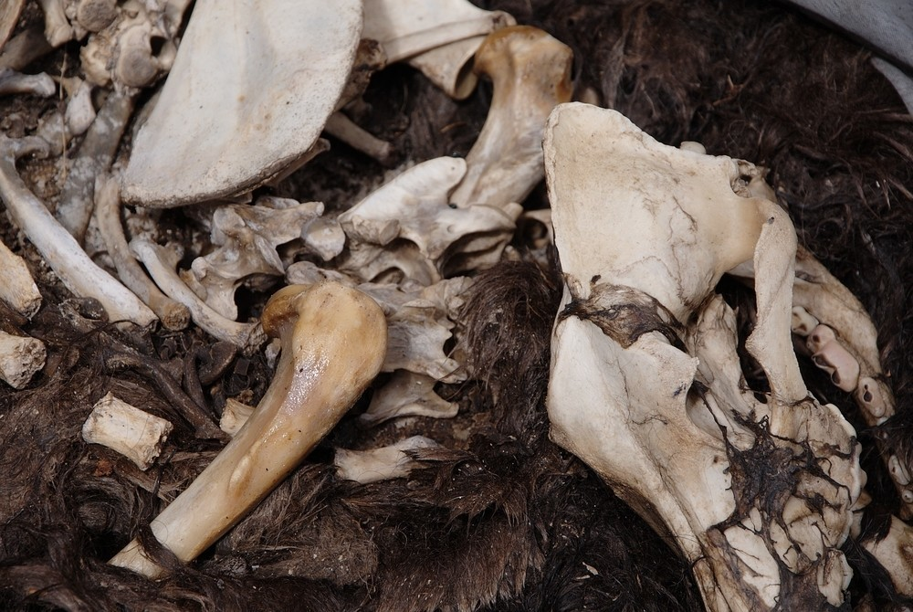
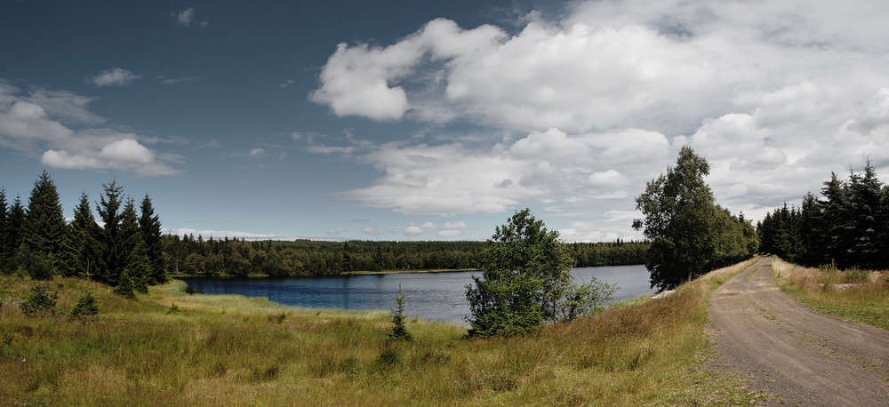
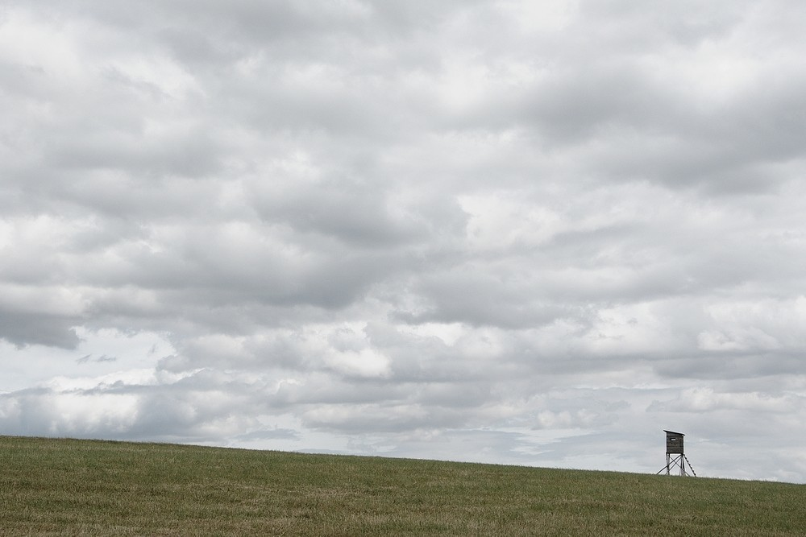
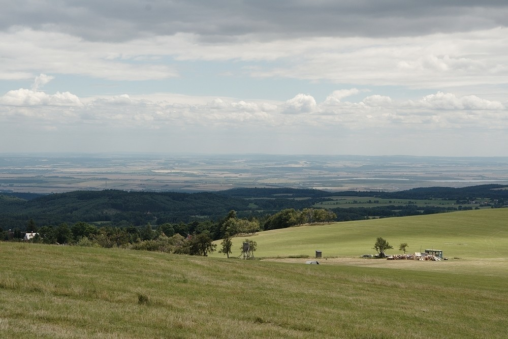
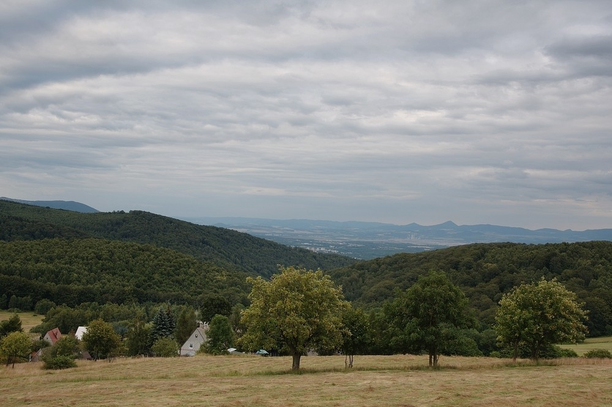
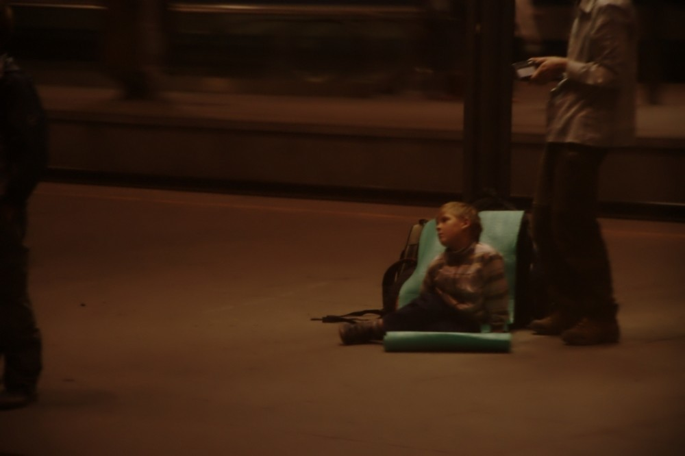

Ze severu - den pátý
####################

:tags: Krušné hory, fotky
:category: Cestování

.. class:: intro

A poslední várka fotek ze severního putování, která se sem dostává s menším zpožděním. Toho dne jsem se konečně dostal do Krušných hor.

10:48
*****

Snídaně. Doufám, že jsem neurazil čtenářův jemnocit, jen mi přišla ta hromada kostí zajímavá.

12:15
*****

Snad druhou fotkou trochu vylepším situaci. Tohle je kus za vesnicí Hora Svatého Šebestiána. Takovýchto rybníčků bylo v oblasti spousta. Lesem se šlo příjemně, sice bylo všude asfaltu také dost, ale lepší než ty dny před tím.

14:43
*****

A on tam stál a `koukal do polí <http://www.youtube.com/watch?v=d9zMeHb2X1E>`_. Sice to není strom, ale to jsou ty volný asociace...

14:50
*****

To abyste uvěřili, že je to opravdu z Krušných hor. Po cestě ze Zákoutí do Mikulovic byla spousta pěkných výhledů dolů do České kotliny.

19:15
*****

Další výhled, tentokrát o kus dál. Už na sestupu dolů k Litvínovu. Pak to totiž chytlo rychlý spád. Do Litvínova jsem se svezl stopem, z Litvínova mi jel vlak do Teplic a z Teplic rychlík do Prahy.

23:41
*****

A z Prahy rovnou do Plzně. Tohle je záběr z půlnočního hlaváku. Noční cestování českými městy je stejně úplně nejlepší. Byl pátek a všude se vítal přicházející víkend. Z Teplic jela parta Romíků do Ústí, popíjeli při tom rum a poslouchali staršího pána, který jim rozdával Gedeonky a povídal o věčném životě. Jo a zpívali. A fakt dobře, to se musí nechat.

V Praze jsem jenom přestoupil, nic zajímavého a ve vlaku do Plzně zkoumal očíslování sedaček. Zato v Plzni bylo veselo. Vlak mi jel totiž až za tři hodiny, první ranní, a tak jsem vyrazil do města. Tam to žilo. V jedné ulici spolu dva mlátili až tam přijeli s rozsvícenými majáčky. O kus dál, na náměstí, do sebe strkali až se jedna výloha vysypala. Muži zákona se rozhodně nenudili. Já pojídal maršmelouny a pozoroval veselé kolemjdoucí.

Kdosi mi nabízel, ať s ním sjedu řeku. Sice nevěděl jakou, ale povídal: "Ty si blázen, já sem taky blázen. Ty vole vožerem se a sjedeme to". Nebyl jsem si tím úplně jistý. K ránu jsem pro změnu narazil na skejťáka, který znal jiného skejťáka v Klatovech a tak jsem hned byl za kamaráda a kamsi mě zval. Nešel jsem, musel jsem na vlak...
