Na HDR bez bolestí
##################

:tags: návod, fotky

Hadr aneb krátký návod na omalovánky
************************************

Komu je pojem HDR fotografie neznámý, pak vězte, že je to taková ta hodně
barevná fotografie, která vypadá až neskutečně a přitom úžasně. A ona opravdu
většinou neskutečná je. Pro lepší představu vám raději hned podstrčím obrázek.

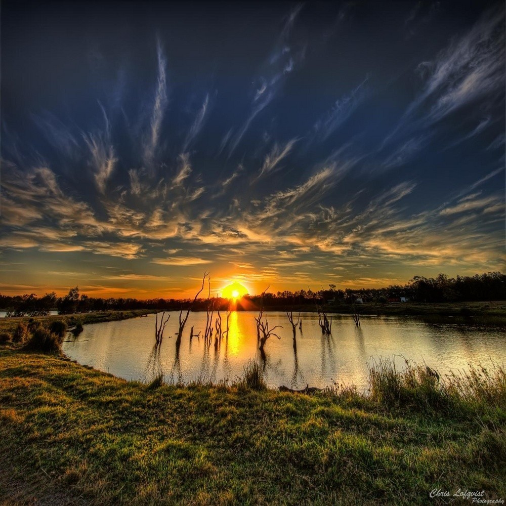

Někomu se to líbí, někomu ne. Skrze prsty na to koukají zastánci filozofie
neupravování fotek v počítači. Každopádně ať si kdo chce, co chce, říká, mnohým
fotkám tato úprava pomůže. A tak raději, něž přejdeme k samotnému návodu, jak
fotografii upravit, zdůrazníme pár bodů, kterými je třeba se držet, aby vás
ostatní nevypískali.

Zásady HDR fotografie
---------------------

1) **Ze špatné fotky dobrou neuděláte.** To platí vždycky. Obráceně už zdaleka ne.
2) **Nekažte fotky.** První pravidlo naopak neplatí. Z dobrých fotek lze snadno pomocí HDR udělat fotky špatné a mizerné. Nervěte tento efekt všude!
3) **Netvořte omalovánky.** Čeho je moc, toho je příliš.

A abych to jen utvrdil, ukázka vyloženě špatně provedené úpravy, odstrašující
příklad.

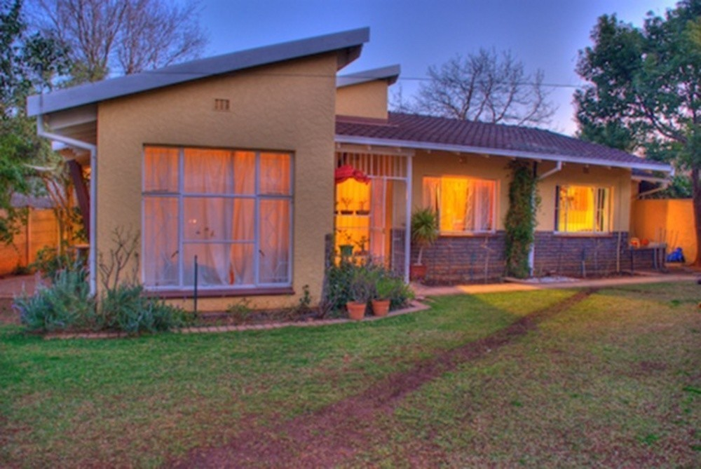

Když pominu to, že fotka sama o sobě žádný zázrak není (a tím nesplňuje první
bod), třetí bod - omalovánky - je evidentní. Poskytuje také ukázku častých
začátečnických chyb, třeba světlá obloha v okolí stromu v pravém horním rohu.

.. class:: em

Abych byl přesný, celou dobu trochu mystifikuji. Pojem HDR je přísně vzato
postup, kterým se jakoby zvětší dynamický rozsah fotografie na vašem monitoru.
Jinak řečeno, uvidíte i přepálená a podexponovaná místa dobře. Kouzlení s
barvičkami se nazývá tone-mapping. To zmiňuji, jen abych učinil povinnosti
zadost. Celý tento postup se zabývá kombinací obojího a nadále tomu budu říkat
jednoduše HDR.

Teď už se ale pusťme do samotného pracovního postupu...

Co budeme potřebovat
********************

Fotoaparát
----------

Překvapivé, že? Ideální je na to zrcadlovka, případně kterýkoliv kompakt, který
umí fotit do RAWu. Pokud to ten váš neumí, neznamená to, že je všechno
ztracené. Je možné vytvořit více snímků s různou expozicí. Ale to je práce
navíc a zabývat se tu tím nebudu. Jiné speciální nároky nejsou.

Luminance HDR (qtpfsgui)
------------------------

http://qtpfsgui.sourceforge.net/

Tento program za vás oddře většinu práce - stará se o samotný efekt. Mám ho rád
proto, že je k dispozici i pro Linux (pro Windows samozřejmě taky, dokonce i
pro Mac). Nabízí celou řadu filtrů, některé použitelnější některé méně.
Samozřejmě existují i alternativy.

GIMP
----

http://www.gimp.cz/

Známý program pro úpravu fotografií, nám poslouží na výsledné doladění. Někdo
dává přednost Photoshopu, budiž, postup je obdobný. Nám chudým studentíkům
postačí výborně.

A jdeme na to
*************

1. Výběr fotky
--------------

Když už máme vše připraveno, jediné, co nám schází, je nějaká fotka. Skvělý HDR
fotograf, `Trey Ratcliff <https://plus.google.com/105237212888595777019/posts>`_,
říká, že se musíte naučit koukat a umět si představit, jak fotografie bude
vypadat ve výsledku.

Naučit se to není samozřejmě jen tak a chce to zkoušet a zkoušet. Proto nebude
vadit, když ze začátku vybereme klidně i slabší fotografii a zkusíme, co to s
tím udělá. Jen musíme počítat s tím, že neuděláme díru do světa a že není
potřeba se s prvním pokusem chlubit.

Na ukázku jsem si vytáhl z alba tuto fotografii z nedávné návštěvy Liberce.

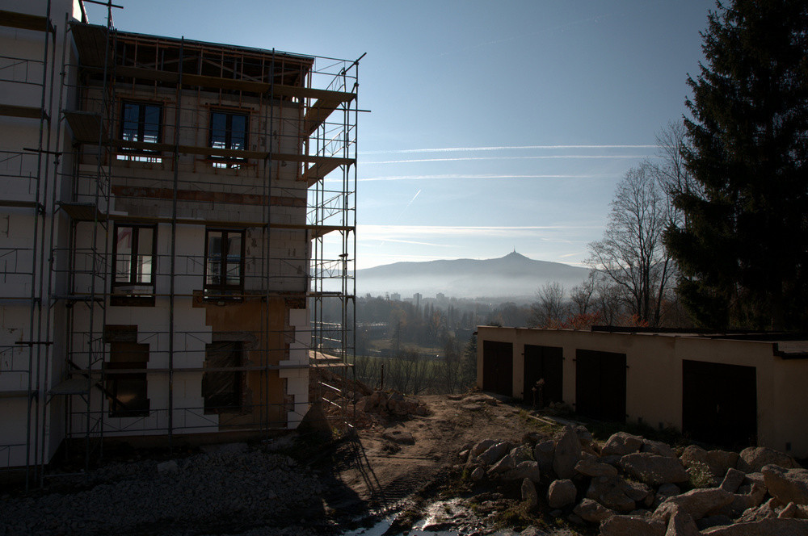

Pro ukázku by měla být postačující - máme tu jak velmi světlá, tak velmi tmavá
místa, celkem pestrou scénu a Ještěd v dálce.

2. Luminance HDR
----------------

Máme-li fotku, můžeme se vrhnout do prvního z programů - Luminance HDR.
Příjemné na něm je už jen to, že dokáže načíst i RAW soubory. Stačí kliknout na
*Open HDR image* a danou fotografii najít.

.. class:: em

Mám program v takové napůl přeložené verzi. Nevím, jak jste na tom vy. Doufám,
že všechny popisky najdete bez problémů.

Po úspěšném načtení fotografie bychom měli mít před sebou okno podobné tomuto:

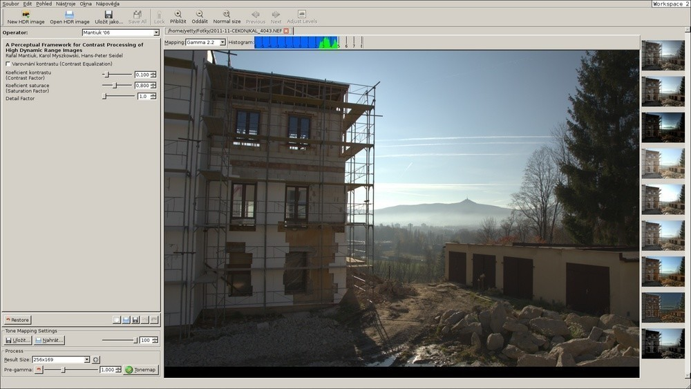

Co jaké tlačítko dělá si můžete vyzkoušet sami. Z těch nejdůležitějších je to
nabídka *Operator*, která dává na výběr z možných filtrů. Osobně nepoužívám
téměř nic jiného, než *Mantiuk '06*.

V bloku o něco níže jsou pak nastavení daného filtru. Pokud zůstanu u Mantiuka,
mám možnost tří hejblátek - první z nich je "*Koeficient kontrastu*". Čím bude
toto číslo menší, tím více znát bude efekt. Na vašem vkusu a cítění je už najít
co nejvhodnější číslo.

Druhou možností je "*Koeficient saturace*". Díky tomu dosáhnete oněch úžasně,
až kýčovitě, zabarvených fotografií. Čím je číslo vyšší, tím živější jsou
barvy. Na druhou stranu pak budou upadat do šedi.

"*Detail factor*" vám jaksi zvýrazní detaily. Vyšší čísla působí na fotografii
dost zvláštně.

K vytvoření upraveného snímku slouží dole vlevo tlačítko *Tonemap*. Ve stejném
bloku je ještě možnost výsledné velikosti (*Result Size*). Pro zkoušení, jak to
bude vypadat, doporučuji rozlišení okolo 1024x678px. Až budete spokojení,
vytvořte obrázek v co největším rozlišení a nezapomeňte ho poté uložit.

Já jsem si nastavil hodnoty popořadě na 0,150 - 1,700 - 1,0. Výsledkem je tento
obrázek.

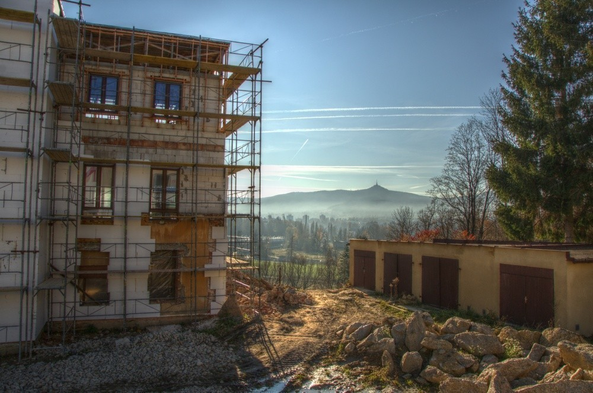

To už vypadá celkem dobře, ale...

3. GIMP
-------

...stále to není ono. Okolo budovy a stromů nám to vytvořilo nehezky světlou
oblohu, což působí zvláštně. Chtělo by to vůbec ještě některé detaily doladit -
doostřit, upravit kompozici.

Na řadu přichází GIMP nebo jiný program na úpravy fotografií. Základem je vzít
jak původní fotku, tak novou fotku v HDR a pracovat s nimi, jako s dvěma
vrstvami.

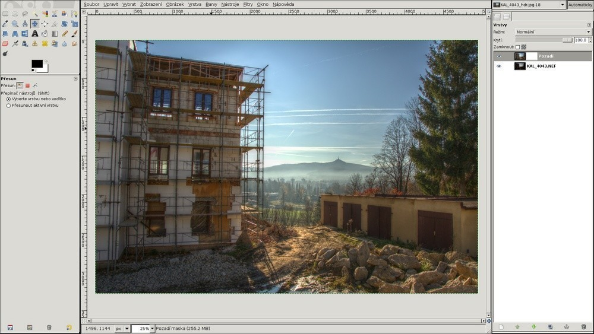

Na pozadí mám původní obrázek, v hořejší vrstvě upravený. K němu jsem zároveň
přidal masku. Místa, která se mi zdají příliš světlá mohu jednoduše pomocí
masky částečně zprůhlednit. Pro ty, co s maskami pracují poprvé existuje
`spousta materiálu <http://goo.gl/hxp8S>`_.

Vhodné je pomocí naduplikované spodní vrstvy ještě ztmavit oblohu - pomocí opět
nějaké masky a lineárního přechodu. Po úpravách můžeme docílit takovéhoto
výsledku:

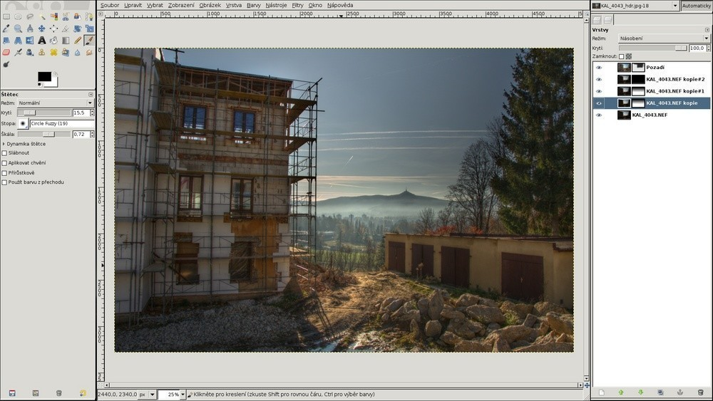

Zbývá jen doostřit a je hotovo, můžeme slavit a plánovat skvělé zítřky:

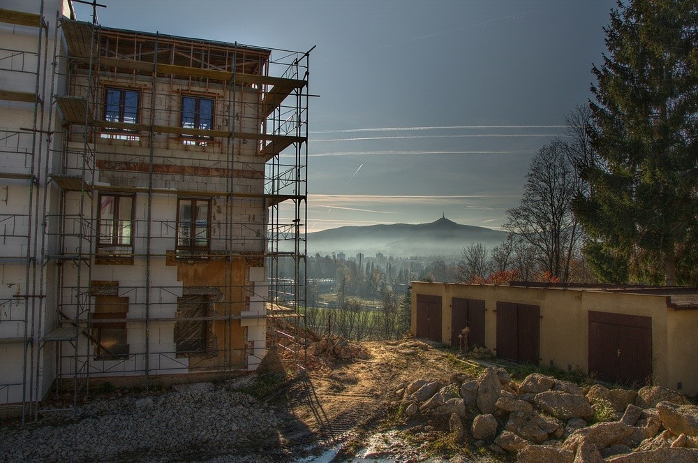

A to je vše.
************

Skutečně. Ještě dodám, že toto je pouze návod. Nezaručí vám, že vaše fotky se
hned začnou vystavovat a prodávat. Nezačnou. Ale můžete si prohlédnout pár
fotografií, ke kterým se můžete časem přiblížit.

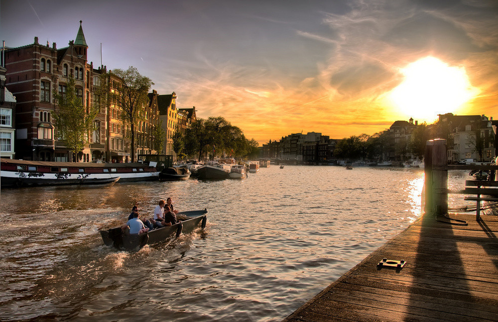

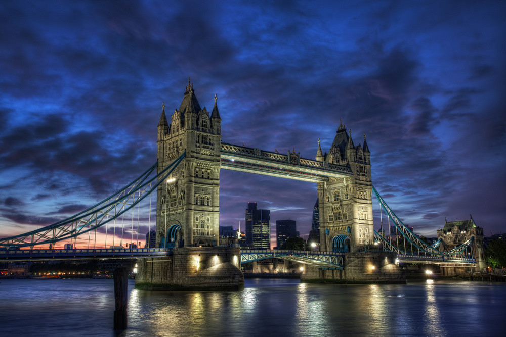

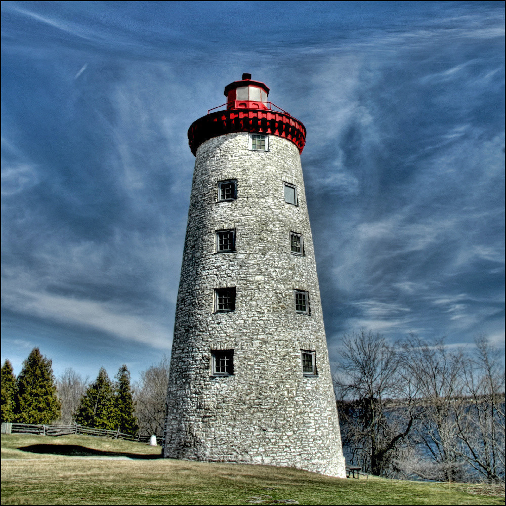
