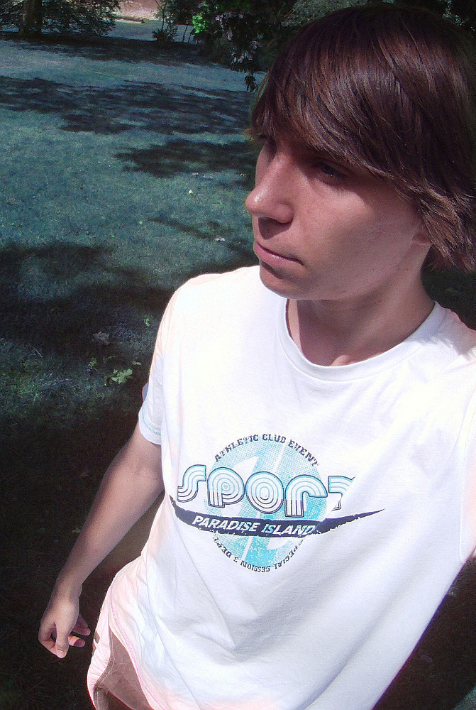

Rozhovor: Patrick Macharovský
#############################

:tags: rozhovor
:category: Rozhovory

.. class:: intro

Netrvalo dlouho a máme tu další rozhovor. A to rozhovor v řadě ohledů velice
nevídaný...

Poprvé jsem totiž dělal rozhovor s Čechem. Já vím, je to celkem zvláštní, ale
je to tak. Patrick je mladík z Ústí nad Labem a i když jste o něm možná
neslyšeli, je možné, že jste už viděli jeho video, které nedávno kolovalo po
českém internetu. Video najdete uprostřed článku...

.. class:: question

Asi bude nejlepší začít jako obvykle - mohl by ses čtenářům krátce
představit? Odkud jsi, co studuješ...

Mé jméno je Patrick Macharovský, je mi 17 let, jsem z Ústí nad Labem a studuji
střední průmyslovou školu s oborem pozemního stavitelství.

.. class:: question

V posledních pár dnech ses po českém internetu proslavil svým videem o
YouTube ve skutečném životě. Jak ses k natáčení videí vlastně dostal?

Já už si ani nepamatuji, kdy to začalo - asi od narození. Ze začátku, když jsem
byl malý, jsem se snažil rozpohybovat obrázky v počítači. Pak si rodiče koupili
foťák, tak jsem začal blbnout a dělat první testy. To mi vydrželo až do teď,
jen už jsem si koupil vlastní kameru.

.. class:: question

Z čeho a jak ses úpravy videí učil? Knížky, návody na internetu?

Učil jsem metodou pokus-omyl - zapnul jsem si třeba nějaký program a zkoušel
jsem, co v tom jde. Občas se kouknu na nějaký tutoriál na internetu, abych
zjistil nějaké skryté funkce nebo fígle.

Nutno dodat, že s každým novým videem se učím nové a nové věci.

.. class:: question

Na svém profilu na YouTube máš vystavenou pěknou řádku videí
podobného stylu. Jak vlastně takové video vznikne? Dostaneš nápad,
napíšeš scénář, seženeš si herce a jde se natáčet? Jak dlouho
obvykle trvá, než video natočíš?

Většina těchto videí jsou právě ty testy, tam jsem žádné přípravy nepotřeboval.
Dostal jsem nápad, vzal jsem někoho, kdo byl po ruce, i když z toho nebyl moc
nadšený a natočil jsem to, ale u posledních dvou videí už to chtělo nějakou
přípravu, obzvláště když tam mají být nějaké vizuální efekty, je dobré si
rozmyslet kde co bude, protože to může hodně usnadnit práci pak při úpravě.

Konkrétně u videa YouTube v reálném v životě to bylo tak: dostal jsem nápad,
pak jsem dlouho hledal vhodné místo, podle něj jsem napsal scénář, aby mi tam
seděly ty efekty, sehnal jsem pár lidí, šli jsme točit a nakonec jsem to
upravil.

.. raw:: html

    <iframe width="650" height="360"
    src="http://www.youtube.com/embed/GBOzsFUvQrA?hd=1"
    frameborder="0" allowfullscreen></iframe>

.. class:: question

Jak sháníš herce? Jsou to pořád ti samí lidé, nebo vždy vezmeš
toho, kdo je po ruce?

Nevím, jestli se jim dá říkat herci, spíše kamarádi a známí, kteří mají zrovna
čas a nestydí se.

.. class:: question

Pokud si píšeš scénáře, jak vypadají? Jsou hodně podrobné s každým
detailem a pohybem kamery nebo je to nástin v základních bodech?

Jelikož se nikdy přesně nevědělo, kdo z "herců" bude mít čas, tak píšu jen
základní body, které jim pak na místě ukážu.

.. class:: question

Co ti během vzniku klipu zabere nejvíce času? Máš někdy chuť
mlátit hlavou o klávesnici a na všechno se vykašlat?

Tak nejvíce času mi zabere úprava vizuálních a zvukových efektů. Ano, i takové
chutě mám a to v případě, kdy se mi můj projekt, na kterém jsem pracoval třeba
měsíc, nechce otevřít z důvodu nějaké neznámé chyby a jedinou cestou je, že to
musím dělat celé od znova nebo od nějakého záchytného bodu.

.. class:: question

Co chystáš? Bude nějaký další shot nebo rovnou třeba krátký film?
Po současném úspěchu bys možná neměl problém sehnat dostatek lidí.

Zatím ještě nevím, co přesně, ale rozhodně to nebude film, protože to je velmi
náročné. Spíš nějaké krátké video.

Co pokládáš za dosavadní největší úspěch? Tvé video se objevilo na
řadě prestižních serverech českého internetu - objevil se třeba
článek na Programujte.com, psala o tobě Alza.cz na svém facebooku.

Asi to, že se mé poslední video samo prosadilo, bez nějaké propagace a že se
alespoň většině lidem líbí a sdílejí ho.

Předpokládám, že ti moderní technika není cizí. Jaký odhaduješ
vývoj ve světě filmování? Jak se podle tebe budou točit filmy za dvacet, za
padesát let?

Snažím se držet krok, ale v dnešní době, kdy to jde všechno tak strašně rychle
kupředu, je to těžké. Vzhledem k rychlosti tohoto vývoje opravdu netuším, jak
to bude vypadat za padesát let, možná se už napojíme na nějaký systém a film se
nám bude promítat v mysli, tak jako sny.

Určitě se necháváš inspirovat i řadou filmů - jaké máš raději,
přehlídku triků a efektů, nebo raději film s myšlenkou? Máš své
oblíbené?

Mám rád oboje, ale víc se mi líbí filmy s myšlenkou. Do mých oblíbených filmů
patří kvůli efektům Transformers a kvůli suprové myšlence Počátek a Matrix.

A co ostatní - co posloucháš za muziku, co čteš...

Poslouchám v podstatě cokoliv, ale upřednostňuji dubstep. Moc toho nenačtu,
protože většinu času mi zabírá škola a když mám volno tak se snažím dělat videa
nebo odpočívat. Občas si zahraji golf nebo si zaplavu.

Co bys poradil tomu, kdo by si rád něco takového vyzkoušel - třeba
natočil krátkou scénku, ale nemá s tím zkušenosti a neví jak začít?

V tomto ohledu asi moc neporadím. Zkrátka, ať začnou s tím, co mají a zkusí si
prostě něco natočit. Tak jsem začal i já.

Co bys rád v životě dělal? Točil filmy? Jako řežisér, kameraman
nebo někdo v postprodukci?

Tak tuto otázku si také pokládám...

.. raw:: html

    <iframe width="650" height="360" src="http://www.youtube.com/embed/84dPdpBc7wA?hd=1" frameborder="0" allowfullscreen></iframe>
