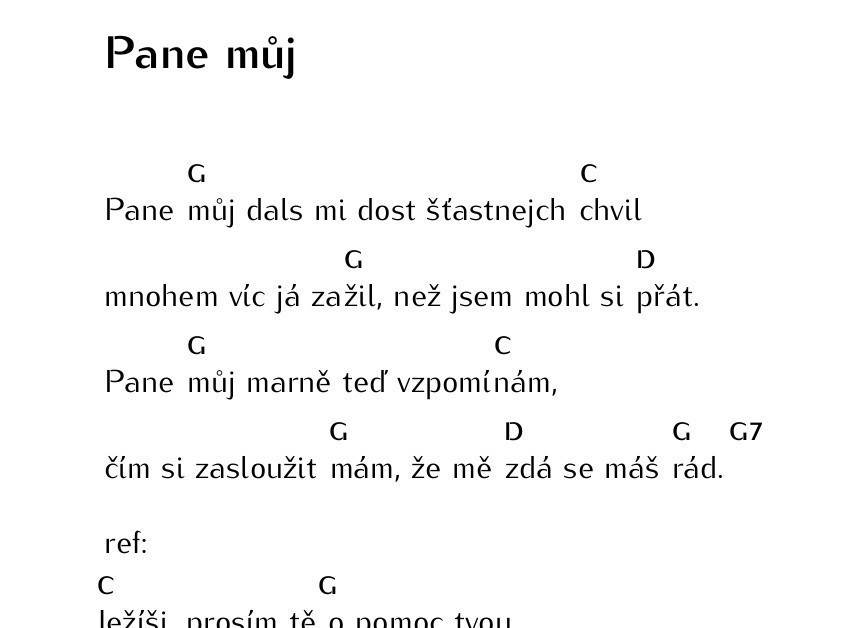

Jak vysázet akordy v TeXu
#########################

:tags: návod, LaTeX
:category: Latex - tipy a triky

.. class:: intro

Krátká poznámka o tom, jak vysázet akordy v LaTeXu. Třeba někomu pomůže. Píšu si
to zde proto, abych to jednou nezapomněl. Lépe řečeno, abych to dokázal najít,
až to zapomenu...

Základní makro
**************

.. code::

    \newcommand{\ch}[1]
    {
        \makebox[-6pt][c]{\raisebox{12pt}[24pt]{~~{ \footnotesize \textbf{#1}} }}
    }

Použití
*******

.. code::

    Pane \ch{G}můj, dals mi dost štastnejch \ch{C}chvil,
    mnohem víc já za\ch{G}žil, než jsem mohl si \ch{D}přát.

Výsledek
********

A jak nasázet celý zpěvník?
***************************

Na sazbu zpěvníku jsem si napsal skript v Pythonu. Kdo by se chtěl podívat,
zdrojové kódy jsou umístěny na `GitHubu <https://github.com/yetty/Zpevnik>`_.

Co skript umí?
--------------
- Akordy lze zapisovat zjednodušeně do hranatých závorek
- Vytáhne všechny soubory z adresáře
- Písně seřadí
- Vytvoří přehledné PDF i se seznamem písní.

