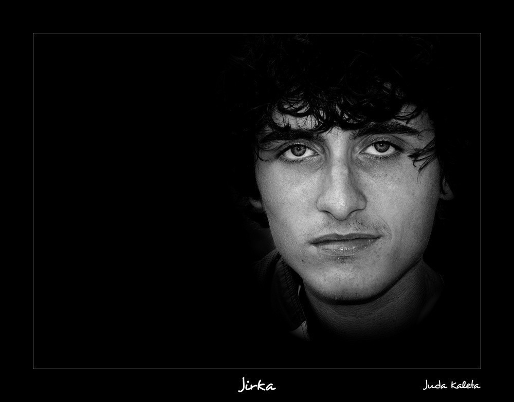
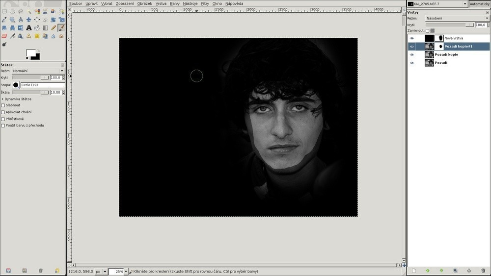

Tutoriál: hrajeme si s portréty v Gimpu
#######################################

:tags: fotky

.. class:: intro

Instruktážní článek pro úpravu fotografií v editoru GIMP. Na myšlenku postupu
mne přivedl fotograf `Mike Shaw <https://plus.google.com/102518365620075109973/posts>`_,
který takto s oblibou portréty upravuje.

Dlouho jsem nemohl vybrat žádnou fotografii, na které bych postup předvedl.
Nakonec padla volba na jednu z letního putování po Šumavě s Vaškem a Jirkou.
Doufám, že mi to Jirka odpustí. Každopádně mu vy odpusťte ten výraz. Je to focené
po třech dnech s batohy na zádech, po ránu, kdy byla docela zima.

1. Vybíráme fotografii
**********************

Na podobnou úpravu se hodí téměř jakákoliv fotka, kde máte obličej ve slušné
velikosti rozumně zaostřený. Moje vypadala původně takto:

2. Ořez
********

Osvědčilo se mi hned zpočátku si fotku na hrubo oříznout. Jednak tím získám
lepší představu o tom, jak by měla vypadat ve výsledku, ale hlavně čím menší
fotografie, tím rychlejší jsou pak úpravy. Zvláště pokud už nemáte nejnovější
stroj.

3. Převod do Č&B
*****************

Pokud chcete mít výsledek černobílý, není proč to oddalovat...

.. image:: images/2012-01-02-tutorial-gimp-portrety/03.jpg

4. Překrýváme černou
********************

V dalším kroku vytvoříme novou vrstvu, která nebude obsahovat nic jiného, než
černou barvu.

5. Maska k černé vrstvě
***********************

K nové vrstvě vytvoříme ještě masku, díky které budeme části vrstvy schovávat.
Masku nastavíme na úplné krytí.

6. Odkrýváme obličej
********************

Nyní začneme do masky černou barvou pomocí štětce kreslit tak, aby se nám
odkrýval obličej a vůbec části, které chceme mít zobrazené. Nemusíte si příliš
dělat hlavu s přesností.

7. Rozmazáváme masku
********************

Pomocí Gaussovského rozostření masku rozostříme. Poloměr závisí na rozlišení
fotografie, je třeba si s tím chvíli hrát a laborovat.

8. Duplikujeme základ
*********************

Následně základní vrstvu zduplikujeme a u nové vrstvy nastavíme režim na
"Násobení". Tím se nám fotografie jakoby ztmaví.

.. image:: images/2012-01-02-tutorial-gimp-portrety/08.jpg

9. Maska k násobné vrstvě
*************************

K nové vrstvě opět vytvoříme ještě masku s úplným krytím. Znovu do masky
malujeme černou barvou, tentokrát už ale pouze přes obličej. Opět si nemusíte
nechávat záležet na přesnosti, raději si zachovejte odstup od kraje.

Tuto masku opět rozostřete. Poloměr rozostření dávám tak poloviční k tomu,
kterým jsem rozostřoval černou vrstvu.

Pomocí této vrstvy vznikne silnější nasvícení obličeje a skrytí okrajových
částí.

10. Hrajeme si s kontrastem
***************************

Podle vlastního cítění si můžeme pohrát s kontrastem a jasem v podstatě u všech
vrstev.

.. image:: images/2012-01-02-tutorial-gimp-portrety/10.jpg

11. Finální ořez
****************

Ještě doladíme ořez a umístění a už jsme skoro u cíle.

.. image:: images/2012-01-02-tutorial-gimp-portrety/11.jpg

12. Rámeček a finální úpravy
****************************

A tím jsme v podstatě hotovi. Ještě můžete provést finální úpravy - vyretušovat
dámám vrásky, doladit celkový kontrast a jas, doostřit, přidat rámeček a je to...

.. image:: images/2012-01-02-tutorial-gimp-portrety/12.jpg
