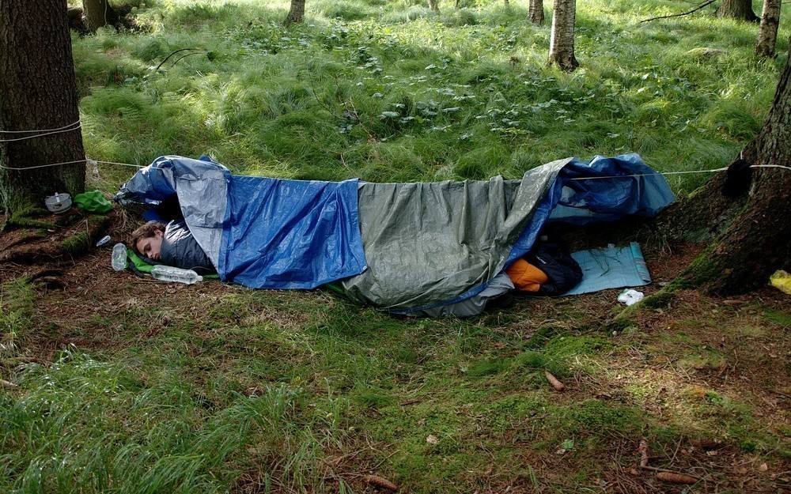
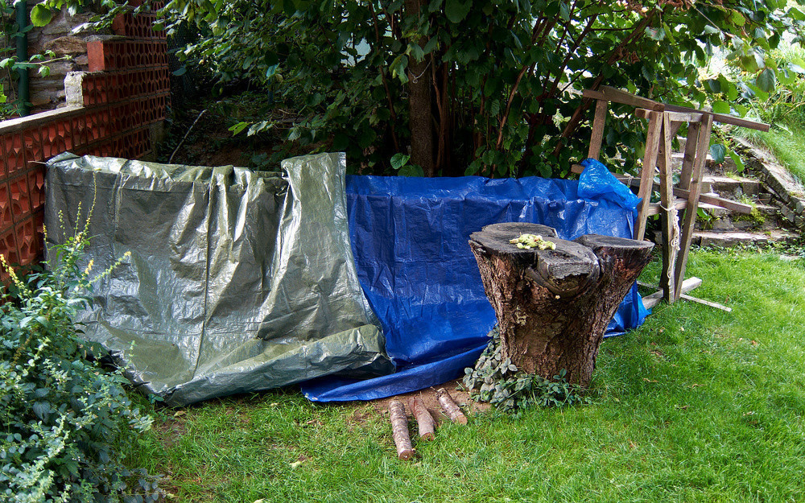

Nocležiště
##########

:tags: Tchoříci, Šumava
:category: Cestování

.. |copy| raw:: html

    &copy;

.. class:: intro

Fotky u `článku o bezdomovcích na idnes.cz <http://goo.gl/KHK43>`_ mi připomněly
fotky z našeho letního čundru po Šumavě.

**První den** to opravdu vypadalo všelijak. Musím ale poznamenat, že po odchodu
po nás nezůstalo ani smítko - příští rok budu muset fotit i stav po sbalení,
abych měl čím to dokázat.

**Druhý den** už to vypadalo vzorněji. Ale možná to je jenom tím, že toho na
fotce není tolik vidět... (|copy| Vašek)

.. image:: images/2012-02-02-nocleziste/2.jpg

Fotku ze **třetího dne** nemám, protože večer jsme zalehli pozdě, v noci začalo
pršet, my nebyli úplně připravení a ráno jsme měli dost svých starostí.

**Čtvrtý den** jsme raději už nic nepodcenili a raději si nachystali základní
konstrukci pro spaní.

.. image:: images/2012-02-02-nocleziste/3.jpg

**Pátý den** to vypadalo ještě hůře, tak jsme se raději pod plachty schovali.
Ale nepršelo.

**Šestý den** byla dokonce v okolí bouřka, na nás ale ani tak nic nekáplo.
Možná to bylo větvemi smrků nad námi.

**Sedmý den** už se konečně plachty vyplatily, i když jenom tak kapalo.

.. image:: images/2012-02-02-nocleziste/6.jpg

Poslední přespání **sedmý den** na zahradě u Vaňkátů, ale to už jsem spal v
teple domova... (|copy| Vašek)

To že naše nouzové nocležiště vypadají všelijak je dáno i tím, že jsme měli
zajímavý styl pochodu - přes poledne odpočívat, večer jít klidně až do půlnoci
a ráno vstávat o něco déle. Takže na to, že všechno bylo stavěno za tmy, to
není ještě tak strašné...
