Jak Praktica k Nikonu přišla
############################

:tags: vybavení, fotky

V šuplíku mi ležela postarší Praktica spolu s objektivem a protože éra
klasického filmu je už jen pro fajnšmekry (vždyť i Kodak bankrotuje), hledal
jsem pro objektiv nové využití.

Ideální by bylo, kdyby se mi ho podařilo napasovat na tělo od Nikonu. Na první
pohled nechybelo moc, a tak přišel na řadu pilník a dvě hodinky poctivé práce.

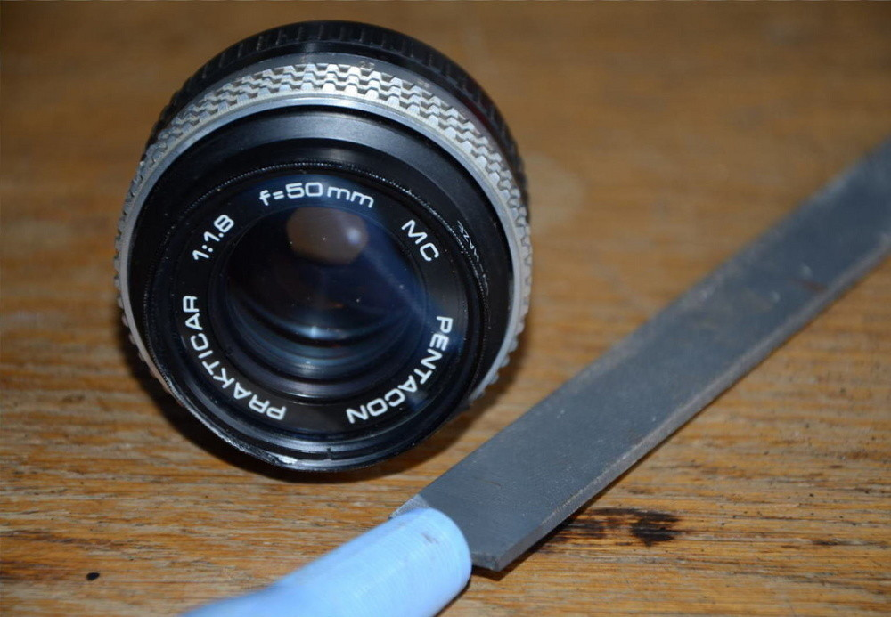

Výsledek byl trochu zfušovaný, objektiv obroušený ze všech stran.

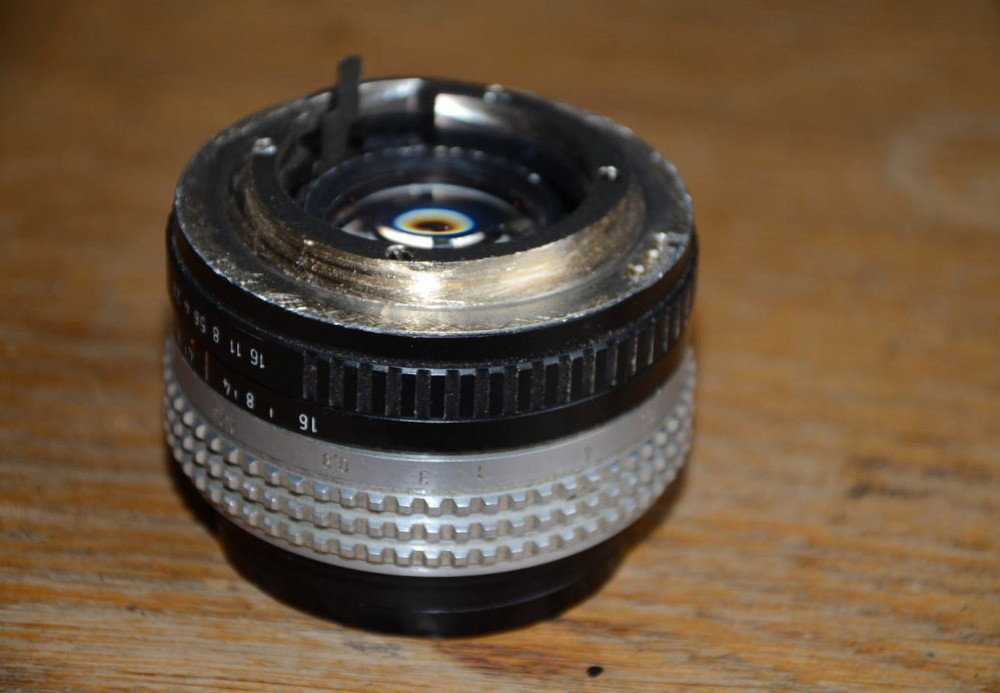

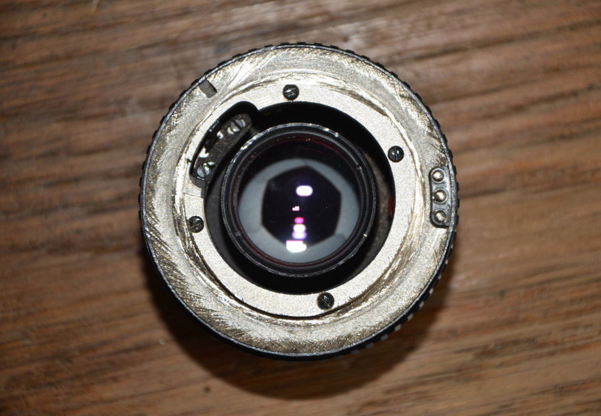

Důležité ale je, že na tělo pasuje. Ano, z technického hlediska to přiliš pěkné
není, ale funguje to. Nikonu D7000 nedělá problém poradit si i s takovýmto
objektivem.

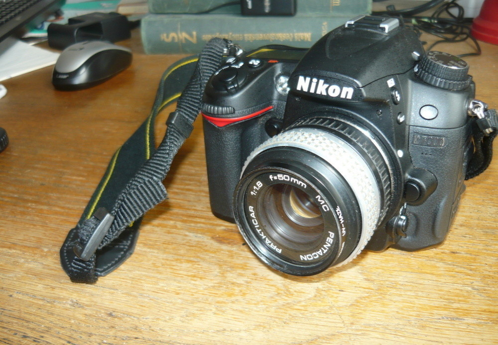

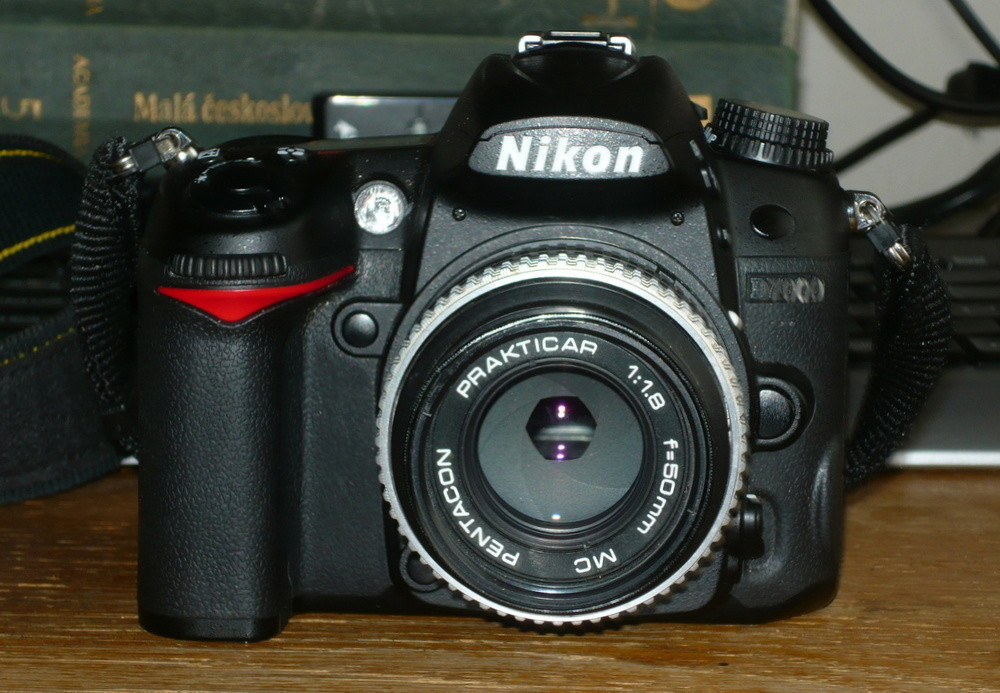

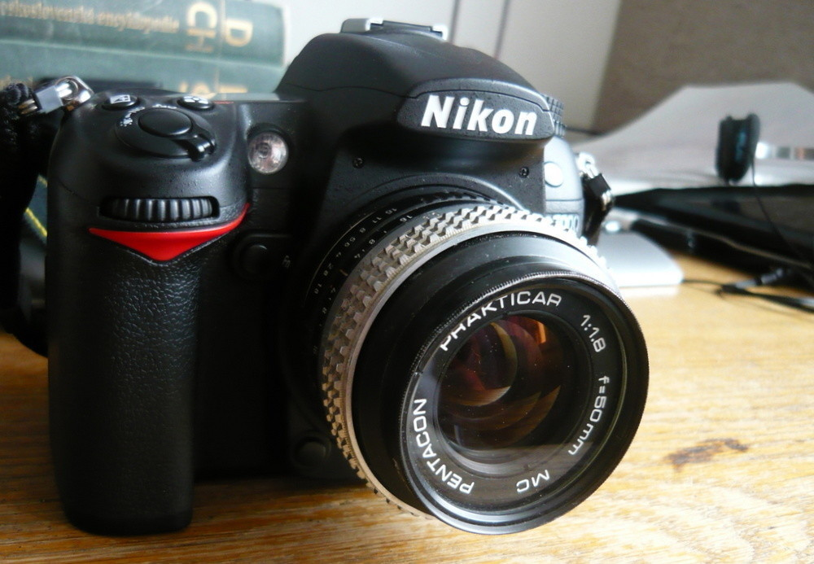

A nejdůležitější část - jak to fotí? Protože je čip od objektivu trochu dál,
než by měl být, neostří objektiv do nekonečna a hodí se tak spíše na drobnější
věci, případně portréty.

Má skvělou hloubku ostrosti, až je s tím někdy problém přesně zaostřit
(objektiv má pouze manuální ostření).

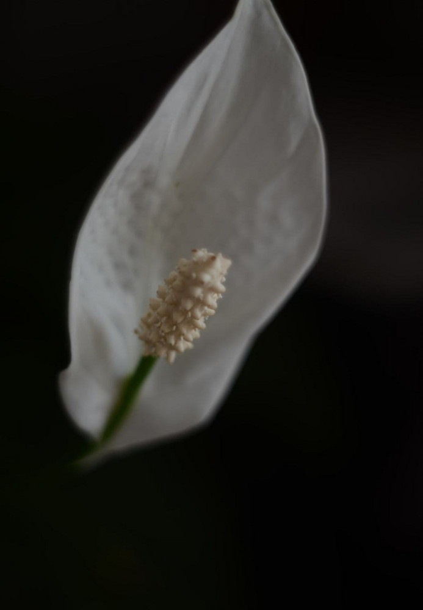

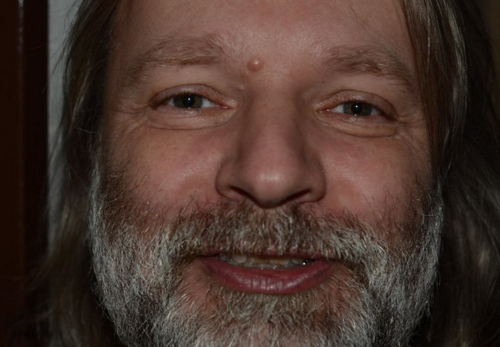

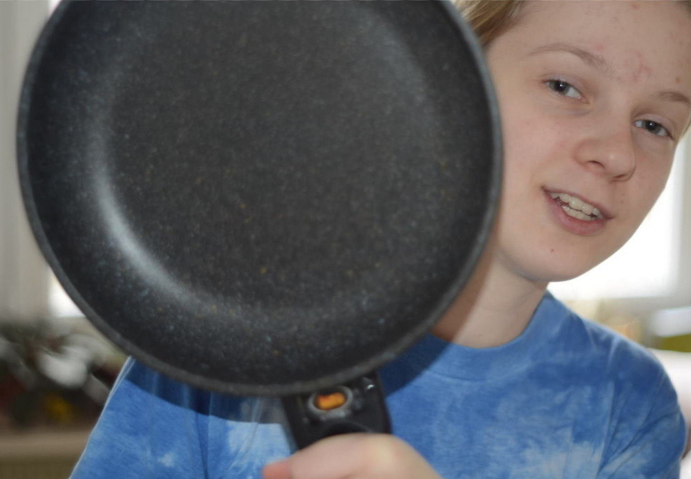

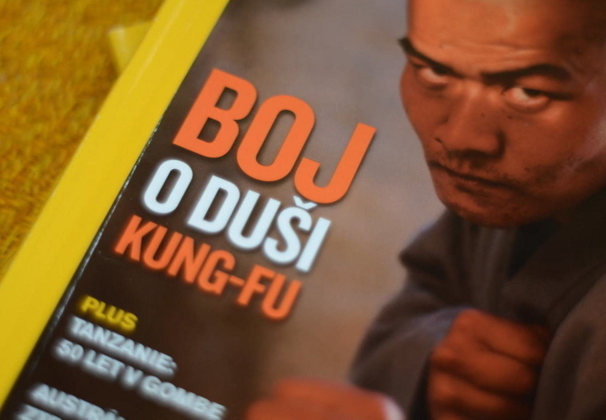

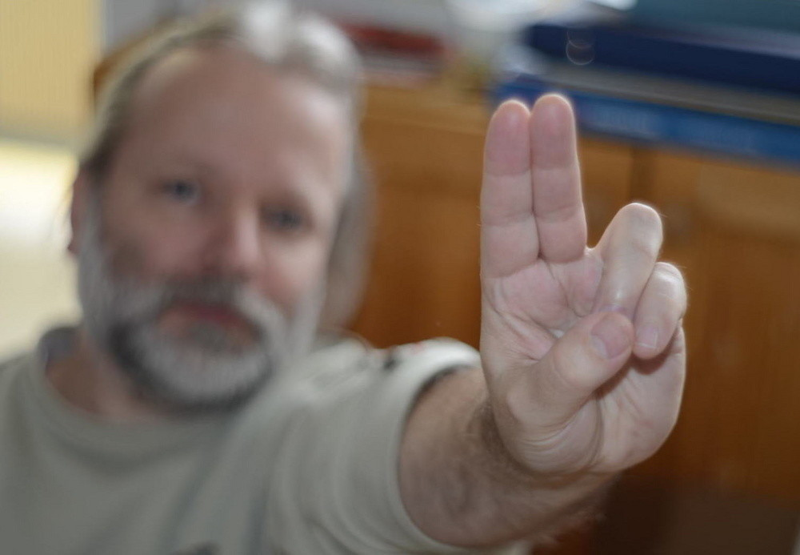
