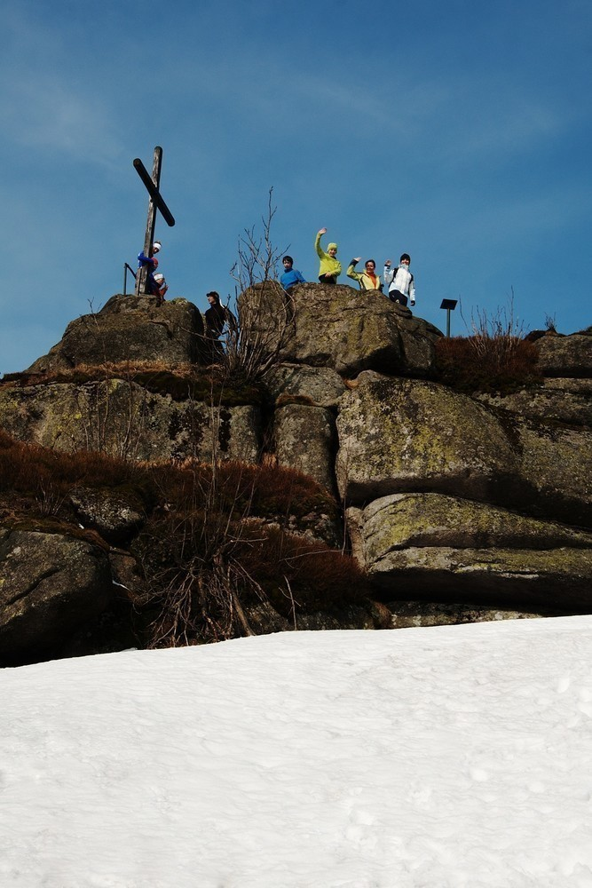

V Jizerkách na sněžnicích
#########################

:tags: Tchoříci, Jizerky
:category: Cestování

.. class:: intro

Za zapůjčení sněžnic děkujeme `půjčovně Špičák <http://lyzovani.spicak.cz/>`_ a
mnoha dalším.

Stejně jako loni i letos o Velikonocích se nám nechtělo zůstávat sedět doma a dumali
jsme, kam vyrazit. Nabízela se opětovná návštěva Jizerských hor, kde jsme před
půlrokem řezali dřevo na topení.

Drobný zádrhel nastal v tom, že v Jizerkách bylo ještě v půlce března mnoho
sněhu a nezdálo se, že by to do prázdnin mohlo zmizet. A protože se nám táhnout
běžky nechtělo, vymýšleli jsme alternativní řešení.

A řešení bylo nasnadě - sněžnice. Málokdo z nás si je už někdy vyzkoušel, nikdo
k nim nechoval averzi tak jako k běžkám, nikdo je neměl spojené s úpornou
dřinou a mazáním vosků.

Trochu problém nastal s jejich sháněním. Je pravda, že sněžnice nejsou zrovna
výbavou každé rodiny. Naštěstí v rozhozených sítích sněžnic uvázlo dost.

Tento článek budiž záznamem do Tchoří kroniky i očitou zkušeností, jaké to
vlastně na těch sněžnicích je.

Vlak v Klatovech nečeká...
**************************

.. image:: images/2012-04-02-v-jizerkach-na-sneznicich/1.jpg

Jako obvykle jsme se vzhledem k místům, ve kterých žijeme, rozdělili do dvou
cestovních skupin. Naše půlka vyrážela z Klatov brzy ráno, protože jsme chtěli
být na severu Čech co nejdříve.

Na nádraží se nás sešlo letos neobvykle mnoho. Já přijel z Nýrska, klan
Novotných už v Klatovech přespával, k nim se na nádraží připojil ještě Kuba
Vašta a Karolína Šotů. Jen Jenda Prosner nikde a nikde.

Těsně před odjezdem jsme začali být trochu nervózní. Výpravčí zapískal, vlak se
rozjel a nám stále jeden člověk scházel.

U Prosnerů už ale vybíhali z domu a naskakovali do auta, aby vlak ještě
dohnali. Ve Švihově jsme před nimi měli ještě kousek náskok, ale v Borovech už
vlak závod s automobilem prohrál a naše sestava tak byla kompletní.

V kupíčku bylo trochu plno. Každý měl svou krosnu a sněžnice, pár jsme jich
navíc vezli ještě pro druhou půlku.

Co ještě dodat k cestě? Možná to, že kdybyste náhodou někdy s Ondrou hráli
kontakt nebo podobnou hru, můžete zkusit slovo `folikulofílie <http://www.urbandictionary.com/define.php?term=Folliculaphilia>`_.

Sibiřani v Praze
****************

V Praze na nás koukali trochu jak na zjevení. Stali jsme se subjektem mnoha
učených tatínků, kteří svým ratolestím museli dávat výklad, co si to s sebou
vlastně táhneme. Jedna holčička na autobusovém nádraží se dokonce odvážila na
jednu sněžnici sáhnout. Nekousala.

Další zajímavou zkušeností bylo mít objednaná místa v autobuse Student Agency.
Zatím jsme vždycky jezdili trochu vabank a když místo nezbylo, museli jsme jet
dalším.

Sice jsme byli rychlejší, než jsme čekali a bývali bychom stihli i předchozí
autobus, ve kterém mimochodem seděla půlka jedoucí z Horažďovic. Počkat na
Studenta se ale vyplatilo. Cestou jsme sledovali Toma a Jerryho a popíjeli
čokoládu.

Máme takovou zajímavou tradici. Vždycky když z Liberce jedeme vlakem, ujede nám
těsně před nosem. Vloni v srpnu doslova, tentokrát jsme ho odjíždět neviděli.
Opět jsme totiž byli rychlejší, než jsem čekal a nevěděl jsem, že kdybychom
trochu chvátali, mohli jsme být v Josefově Dole o něco dříve.

Dlouho jsme ale nečekali. Ve vlaku jsme pak zahráli pár inteligentních her (třeba Hu!),
ve Smržovce přestoupili a pak už jenom koukali ven a čekali, kdy se konečně
objeví onen slibovaný sníh.

Nazouváme sněžnice
******************

.. image:: images/2012-04-02-v-jizerkach-na-sneznicich/2.jpg

A sníh se ne a ne objevit. Okolo trati byly občas malé ostrůvky, ale jinak nic.
Ani v Josefově Dole u nádraží skoro nic nebylo. U babičky jsme se sešli s druhou
skupinou a zvesela vyrazili do hor.

U začátku stopy se objevil konečně i sníh. Celí nedočkaví jsme se nazuli do sněžnic,
abychom si je konečně vyzkoušeli.

Jaké to na sněžnicích je?
-------------------------

Asi nejhodnotnější část článku shrnu už zde - poznatky, jaké to vlastně
na sněžnicích je, k čemu jsou dobré a jestli se vyplatí nad nimi uvažovat.
Sněžnice jsou fajn, ale..

- v terénu a do kopců výborné. Proti běžkám lahoda.
- z kopce dolů to jde oproti běžkám pomalu. Není se čemu divit, ale divoké sjezdy si neužijete.
- hůlky jsou fajn. Já je neměl a chvílemi to byla makačka. Hlavně když se šlo po vrstevnici a noha vám ujížděla do strany
- po tvrdém upraveném povrchu (např. stopa) se jde špatně. Navíc vás budou běžkaři přímo milovat.
- návleky jsou velice užitečné. Zvláště pokud je čerstvý sníh, budete si ho házet přímo do bot.
- sněžnice nejsou nezničitelné. Nám se podařilo zničit dvoje. Pro odborníka by patrně nebyl problém je spravit (s náhradními díly), my ale sebou na opravu nic neměli, ani vybavení, ani zkušenosti.
- dá se na nich jít celkem svižně, ale člověk se rychle unaví. Zvláště pokud na to není zvyklý, na stehnech svůj výkon pocítí. Pro delší vzdálenosti by to chtělo asi trochu tréninku.

.. image:: images/2012-04-02-v-jizerkach-na-sneznicich/3.jpg

Pomalu jsme se došoupali až k naší milé chatičce a jak to tak bývá,
začali jsme se zabydlovat. Chystat si postýlky, zatápět v kamnech, dojít
pro vodu do studánky, uvařit čaj a začít připravovat večeři. Dokonce i kytaru
jsme našli.

Okolo Jizery
************

Protože spousta účastníků byla na Jizeře poprvé, první výprava byla
průzkumná - rozděleni na dvě skupiny, vydali jsme se po vrstevnici
okolo kopce. Každá skupina na jinou stranu a schválně, jestli se najdeme.

Málem jsme se nenašli. Naštěstí naše skupina byla zkušená a dělala
dostatečný kravál, takže nebyl problém nás zaslechnout a dohonit.

Po šťastném shledání jsme zamířili na vrchol. Pokochali se výhledem do
kraje, slezli na plácek pod skálou a zahráli si pár her - na kočku a myš,
kung-fu a různé honičky á la kámen-nůžky-papír.

Když jsme se dost vyběhali, vrátili jsme se do tepla srubu a cosi snědli
k obědu.

Trochu akční odpoledne
**********************

Odpoledne mělo být ještě o něco akčnější. Naplánován byl seběh z Jizery.
To se člověk obleče, co to jde, ucpe všechny díry, pečlivě zaváže boty,
utáhne návleky. Pak se v hromadném startu všichni rozeběhnou dolů z kopce
a kdo je u Kůrovce první, vyhrává.

Pokud je správný sníh, je sběh opravdu zábavný. Člověk se snadno propadne
po pás a než se vyhrabe, je zbytek závodníků daleko pod kopcem. Z toho plyne
jasná výhoda mladších a lehčích.

.. image:: images/2012-04-02-v-jizerkach-na-sneznicich/5.jpg

Dole na plácku u Kůrovce se opět hrály hry. Nejdříve nějaké honičky, přesně nevím,
zrovna jsem nebyl přítomen, pak se přeskakovaly provázky, stavěly sochy
a nakonec přišel zlatý hřeb odpoledne - rugby.

Asi už jsem naše rugby popisoval, hráli jsme ho loni na Zlaté Studně. Abych to
příliš nerozepisoval znovu, podívejte se na `australský fotbal <http://goo.gl/Ii3Qn>`_,
pak si představte něco podobného sněhu, na menším prostoru a zhruba pětkrát drsnější.

Po pár hrách jsme byli dostatečně zničení a už jsme se chystali vrátit se
na chatu. V poslední hře, vylezl Vojta z jedné valné hromady a prohlásil,
že už hrát nebude, že ho bolí ruka a že se vrátí nahoru.

.. image:: images/2012-04-02-v-jizerkach-na-sneznicich/6.jpg

Trochu nás znepokojilo to, že s rukou nemohl vůbec hýbat a že ho to očividně
dost bolelo. Sice neomdléval, ale chvílemi to vypadalo, že k tomu nemá daleko.

A tak začala velká operace. Ondra s Kubou vyběhli nahoru do chatičky, kde
zrovna hlídala Jáňa, aby vytáhla mobil a zavolala horskou. Ondra ve výběhu do
kopce patrně pokořil všechny existující rekordy, bohužel mu nikdo čas neměřil.
Vrátil se po pár minutách i s kartičkou pojišťovny.

Sváťa s Jendou zatím doběhli na Štolpišskou (o které jsem se domníval, že je Kasárenská,
ale to už je drobnost) a stopovali projíždějící běžkaře, jestli by je nenechali
si zavolat. My jsme totiž pochopitelně zrovna nikdo mobil u sebe neměl.

První, koho se jim podařilo zastavit, byl nějaký Němec, milý pán s velkým Samsungem.
Když jsme se s Vojtou k silnici blížili, už Sváťa mluvila s dispečinkem
na 112. Moc si s nimi asi nerozuměla, protože jakmile jsem se přiblížil, se mobilu
zbavila.

Já si s pánem v centrále nerozuměl o moc víc, protože ať jsem se snažil sebevíc,
nemohl najít, kde asi jsme. Nakonec jsme se nějak domluvili a on slíbil,
že to předá horské a že se nám ještě ozvou.

My se zatím pomalu s Vojtou, celou tlupou i panem Němcem vydali pomalu směrem
ke Smědavě. Pan Němec byl vůbec super. Já si z němčiny nepamatuji nic normálně,
natož v takovéto situaci. On pro změnu neuměl moc anglicky, tak jsme se
domlouvali tak všelijak.

Ve Smědavě jsme zalezli do hospody a čekali na příjezd horské. Opravdu po pár
minutách přijel chlapík na skútru. Sympaťák. A navíc my máme u tamější horské
už docela jméno. Když před pár lety sváželi Jendu z chaty, byla to jejich akce
roku a docela rádi na ni vzpomínají.

Pak jsme všichni společně čekali na příjezd záchranky. Mezitím se rozběhlo
organizování co dál. Vojtu měli převézt do Frýdlantu. Trochu jsme se báli,
co tam s ním provedou a sháněli jsme někoho, kdo by se o něj mohl postarat.

Jak to přesně probíhalo mám jen hrubou představu. Každopádně se rozdrnčely
telefony po půlce republiky. Nakonec to dopadlo dobře. Vojtu v nemocnici
prohlédli a nic mu nezjistili (mimochodem teď už má ruku v sádře, ve Frýdlantu
to prohlédli špatně), Vojta přespal u Bajzíků v Liberci a ráno ho horská
odvezla až pod kopec na skútru. Díky!

Odpočinek pro vedoucí
*********************

.. image:: images/2012-04-02-v-jizerkach-na-sneznicich/8.jpg

My se zatím pomalu vrátili na chatu (taky jsme se svezli na skútru, heč). Večeře,
sezení u stolu, pití čaje, hraní na kytaru, povídání o našich školách a učitelích.
Klasický večer.

Další den jsme Tchoře vyslali na výpravu na Černý vrch. Potřebovali jsme si promyslet
program na odpoledne a na večer, museli jsme vyzvednout Vojtu a tak jsme si
potřebovali od našich náročných zodpovědných postavení trochu odpočinout.

Odpoledne se neslo v duchu her a odpočinku všech. Hrál se kufr, na kterém jsme si
s Jáňou dali záležet a některá slova stála opravdu za to. Hrála se zelená karta,
hrálo se cosi s biblickými postavami (já si ten název nejsem schopný zapamatovat),
hrál se gauč a kdoví, co všechno se ještě hrálo.

.. image:: images/2012-04-02-v-jizerkach-na-sneznicich/9.jpg

Odpoledne nám tak rychle uteklo a přiblížil se večer. Ten byl pečlivě naplánován.
Jen co padla tma jsme nazuli sněžnice a vydali se směrem k Zelenému vrchu. Každé
družstvo dostalo nejdříve za úkol vykopat záhrab, ve kterém by dokázali přežít
noc. Trochu jsme jim to usnadnili a nenechali je kopat záhraby holýma rukama - dostali
po jednom hrnci.

Když byly záhraby vyhrabány, přišla náročnější část. Uvařit si čaj. S krabičkou
ve které byly pouze tři sirky, s jedním pytlíkem čaje, trochou papíru a spoustou sněhu okolo.
A musí se uznat, že si všichni vedli velice dobře. Chvíli oheň hořel všem,
Sváťa s Jendou dokonce dokázali přivést vodu téměř k varu a kdyby se nám už nechtělo
domů, určitě by se jim vařit začala. Je pravda, že čaj byl cítit vším možným, jen
tím čajem ne, ale to už je podružnost.

A chce to pořádný ruský bunkr...
********************************

Protože se nám kopání záhrabů zalíbilo, další den jsme věnovali podobné
činnosti. Rozděleni do dvou skupin jsme si dali za úkol postavit pořádné
pevnosti. Byl jakýsi mlhavý plán, že by se je dalo využít pro nějakou hru,
nakonec ale pro dokonalost bunkrů z toho sešlo. Některá zabezpečení pevností
se svou nebezpečností mohly směle rovnat s ostnatým drátem pod proudem.

Když jsme se dost vyřádili, trochu uklidili jizerský prales a pochutnali
si na polévce, vydali jsme se na procházku po okolí. Po Kasárenské jsme
zamířili směrem ke Knajpě. Cestou jsme hledali tatínky a překvapivě je
i nalezli.

U Knajpy jsme pro změnu pobavili pár běžkařů, když jsme si i se sněžnicemi
sedali do kolečka (více pochopíte z fotky). Po Pavlově cestě jsme se vrátili
zpátky k úpatí Jizery a začali podruhé stoupat na vrchol.

Do chatičky jsme se dostali akorát ve správný čas, abychom začali chystat
večeři. Pak jsme zase seděli, jedli sušenky, popíjeli čaj.

Protože to byla naše poslední noc v Jizerkách, s pár nadšenci jsme vyrazili
na Jizeru ještě potřetí. Půlnoční vycházka, spousta světýlek. Krása.

Jedeme domů
***********

A jak to tak bývá, po pár dnech nastal čas návratu. S tím spojené uklízení
chatky, zametání, zahrabávání záchodů, zavírání studánky... Práce nám šla od
ruky a tak jsme již po osmé milou chaloupku opouštěli.

Pak zase po Kasárenské ke Knajpě, z Knajpy dolů na Čihadla a hurá až do Josefáče.
Tam jsme se posilnili menším obědem, objednali místa ve Studentovi a za chvíli
už jsme sebíhali dolů na nádraží.

Nic nám neujelo, všechno klaplo. Snad až na to, že ve Studentovi pouštěli opět
Toma a Jerryho a poslední díl jsme opět nestačili dokoukat. V metru se naše
cesty rozdělily. Horažďovická parta pokračovala na Anděla, my na Hlavák.

Pak už vlakem až domů, sbohem a šáteček. A zase někdy příště.

.. image:: images/2012-04-02-v-jizerkach-na-sneznicich/13.jpg
