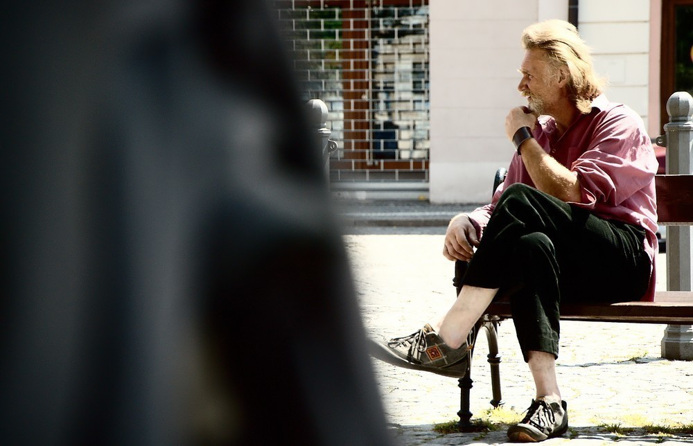

Do Trsic nechoďte!
##################

:tags: Tchoříci, Šumava
:category: Cestování

"Do Trsic nechoďte, tam jsou magoři! Já už jsem tam dvaadvacet let a mám jich
plný kecky," prohlásil a vykopl nohou nahoru, abychom si ty kecky mohli pořádně
prohlédnout.

Zrovna jsme se zvedali z našeho ležení na louce nedaleko od Trsic, když tu
vidíme, jak si to do kopce kdosi svižně vykračuje. Už z dálky nás zdravil -
nevzpomínám si, jak přesně, ale i ten pozdrav byl dost svérázný.

Kousek od nás se zastavil a prohlásil, ať do Trsic nechodíme, že jsou tam
magoři. Nakonec ještě dodal, že psa nechal doma, že mu, chudák, nestačí. Pak si
to odkvapil dále do kopce a šel opravdu svižně.

My se vydali za ním - do Trsic jsme nechtěli. Šel před námi celou cestu až do
Volšov. Tam se nám ztratil a pak jsme ho viděli znovu až v Sušici, kde jsem měl
příležitost ho i vyfotit.

To jen tak abyste věděli, jací zajímaví lidé se dají potkat, pokud se touláte po
Šumavě.
