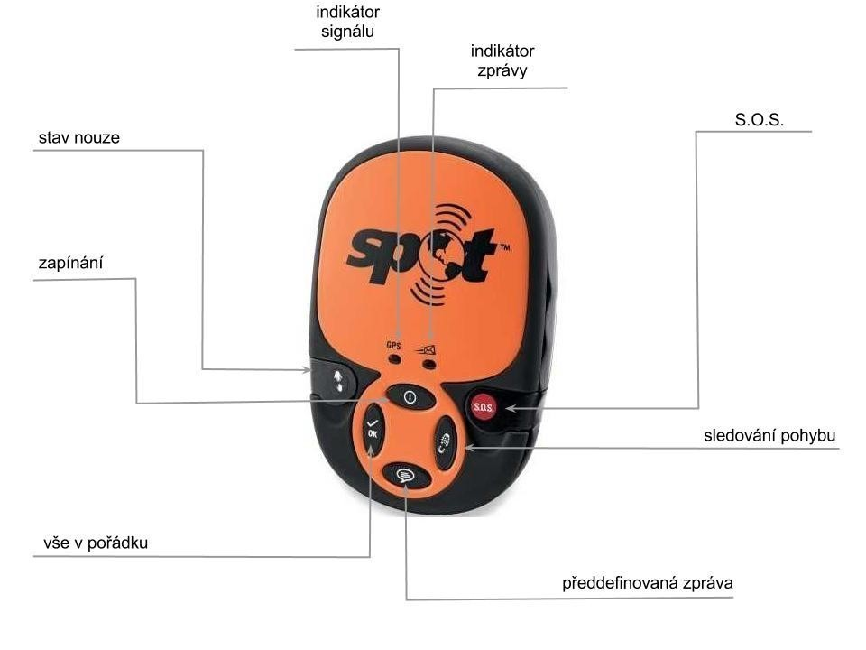

Na cesty s jistotou - SPOT Satellite Messenger
##############################################

:tags: Tchoříci, Švédsko, vybavení
:category: Cestování

.. class:: intro

Mnozí již postřehli, že jsem v půlce června zmizel s dalšími pěti
`Tchoříky <http://www.tchorici.cz/>`_ a
vydali jsme se na cestu do neprozkoumaných polárních oblastí - dvě stě
kilometrů na severní polární kruh do švédského pohoří
`Sarek <http://www.tchorici.cz/akce/1-np-sarek-svedsko-2012.html>`_. Na to, jak přesně
cesta probíhala a co jsme všechno zažili si ještě počkáte. Už teď ale můžu
prozradit, že toho nebylo málo. Těšte se.

Když se začínalo chýlit k odjezdu, začali být naši rodiče trochu nervózní -
hlavně matky. Kam že se to chystáme?! A co když se vám tam něco stane? Nesmí,
odpovídali jsme. Příliš je tato odpověď neuspokojila a vzhledem k tomu, že po
většině Sareku není dostupný telefonní signál, začali si říkat, kam že nás to
vlastně pustili.

Kterou chytrou krabičku?
************************

Hledali proto, co by nám mohli dát, abychom mohli - v případě katastrofy -
zavolat o pomoc. První možností byl satelitní telefon. Jenže zakoupení není v
možnostech obyčejných smrtelníků a i při zapůjčení se platí poměrně velké
zálohy a ani půjčení není nejlevnější. Nehledě na to, že jsou to docela velké
krávy a my počítáme každý gram.

Druhou možností byla krabička s názvem *SPOT Satellite GPS Messenger*. A na
základě systému GPS umí odesílat aktuální polohu, při čemž je možné rozlišovat
několik předdefinovaných zpráv.

Pořízení je stále poměrně drahé, lépe už ale vychází zapůjčení. My přístroj
měli zapůjčený od pana Vladimíra Štádlera (http://www.stadler-shop.cz) -
zapůjčit si ho je možné za `70 Kč na den <http://www.stadler-shop.cz/pujcovna/>`_.

SPOT Satellite Mesenger - co to umí?
************************************

Základní princip fungování je velmi jednoduchý - odešle aktuální pozici
vyjádřenou v souřadnicích a příslušnou nadefinovanou zprávu.

Možnosti zpráv:
---------------

1. *vše v pořádku* - informace o tom, že vše jde podle plánu.
2. *předdefinovaná zpráva* - obsahuje libovolný text, který lze nastavit v online administraci.
3. *sledování pohybu* - při aktivovaném režimu odesílá informaci o poloze v pravidelných intervalech.
4. *stav nouze* - posílá zprávu o stavu nouze, problémech a podobných věcech. Opět lze nadefinovat.
5. *S.O.S* - spouští záchranou operaci.

Posíláme zprávy
***************

Samotné poslání zprávy není úplně triviální a je dobré si ho předem vyzkoušet.
Postup je následující:

1. Stiskneme tlačítko pro zapínání a držíme ho dokud nezačne zeleně blikat. Odhadem je ho potřeba držet stisknuté 3 až 5 sekund.
2. Stiskneme požadované tlačítko se zprávou a opět držíme, dokud nezačne blikat zeleně.
3. Pokud lze navázat spojení s družicí, bliká indikátor signálu zeleně. Pokud nelze, bliká červeně.
4. Rozbliká se indikátor zprávy. To znamená, že zpráva je odesílána.
5. Podle typu zprávy se liší počet pokusů o odeslání. Např. tlačítko *vše v pořádku* odesílá zprávu třikrát během dvaceti minut.
6. Jakmile přestane tlačítko pro odeslání zprávy blikat, je možné přístroj vypnout.

Odeslání zprávy trvá poměrně dlouho - závisí to na viditelnosti družic, počasí
a dalších faktorech. Nejlepší zkušenost máme při odesílání za bezmračné oblohy.
V budovách naopak nejde zprávy posílat vůbec.

Jak dlouho vydrží?
******************

Přístroj funguje na třech AAA bateriích - je nutné využít lithiové baterie. Ty
nejsou nejlevnější, ale zajišťují výdrž udávanou výrobcem. Neměli jsme
příležitost vybít baterie úplně, takže nemám přímou zkušenost, nakolik se
udávané hodnoty shodují s praxí.

Podle těch by měl přístroj vydržet zapnutý tři měsíce. Odesílání závisí na
obloze - při jasné obloze může přístroj vysílat *S.O.S.* nebo *stav nouze* šest
dní. Zprávu *vše v pořádku* je možné odeslat 700-krát. Při zatažené obloze
(50%) se hodnoty snižují na polovinu.

Další informace
***************

- `Manuál produktu <https://docs.google.com/open?id=0BwlwCxlM5bwJYzlReUZtMllJMk0>`_ (anglicky)
- `Rychlá karta <https://docs.google.com/open?id=0BwlwCxlM5bwJUmFkdU5TeFVUc1k>`_
- `Detail produktu na stránkách půjčovny <http://www.stadler-shop.cz/globalstar/>`_
