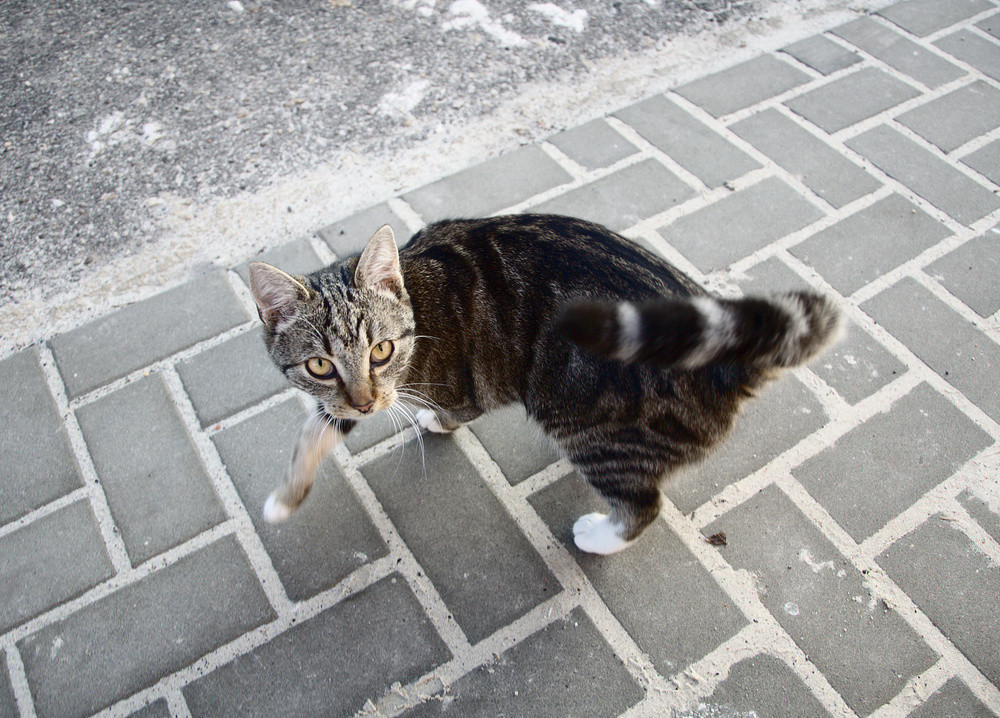

Tak jsem chtěl dát fotku na Facebook
####################################

:tags: fotky

Znáte to. Vyfotíte něco, chcete se tím pochlubit. Tak to šupnete na Facebook.
Sledujete, jak vám přibývají lajky a pochvalné komentáře... Vzpruha pro jedince s nižším sebevědomím.

A tak jsem i já chtěl po dlouhé době dát fotku veřejnosti k mání. Jenže ouha.
Zkouším to už pomalu deset minut a přes veškeré mé umění je systém nedobytný.
Zkouším to všude. Chromák. Lišák ohnivák. Opera. I po IE bych pomalu sáhl. Nic.
Mám to rozbité.

A tak jsem musel napsat tenhle článek. Vlastně jenom proto, abych mohl někde
zveřejnit tu fotku. Ne že by za tolik stála. Ale já si řekl, že se nedám. Že
mne nějaký fejsbůk nemůže zastavit. Tak ji tu máte.

Z Frýdlantu.

Pro technicky zdatnější
***********************

Docela by mně zajímalo, proč mi to nefunguje. Po letmém gůglení se zdá, že jsem
zatím sám. Kliknu na přidat příspěvek a jako by se nic nestalo. Náhled do
chybové konzole odhalí následující:

.. code::

    OPTIONS https://upload.facebook.com/media/upload/photos/composer/?__user=100001641710848&__a=1&fb_dtsg=AQBPF3m9
    404 (Not Found) s-static.ak.fbcdn.net/rsrc.php/v2/yC/r/yyyW98LOODG.js:50
    XMLHttpRequest cannot load https://upload.facebook.com/media/upload/photos/composer/?__user=100001641710848&__a=1&fb_dtsg=AQBPF3m9.
    Origin https://www.facebook.com is not allowed by Access-Control-Allow-Origin.
    Refused to get unsafe header "X-FB-Debug"

