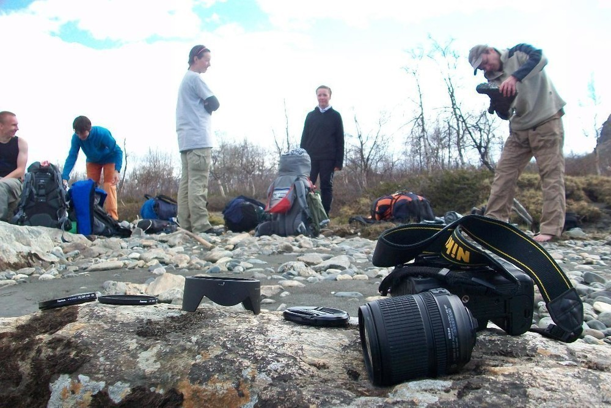
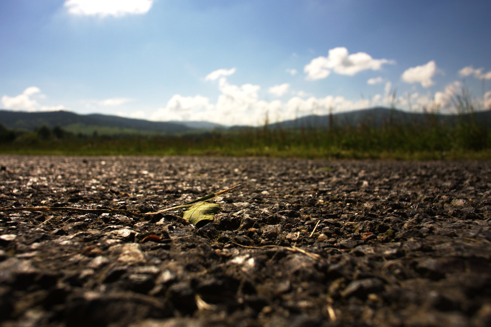
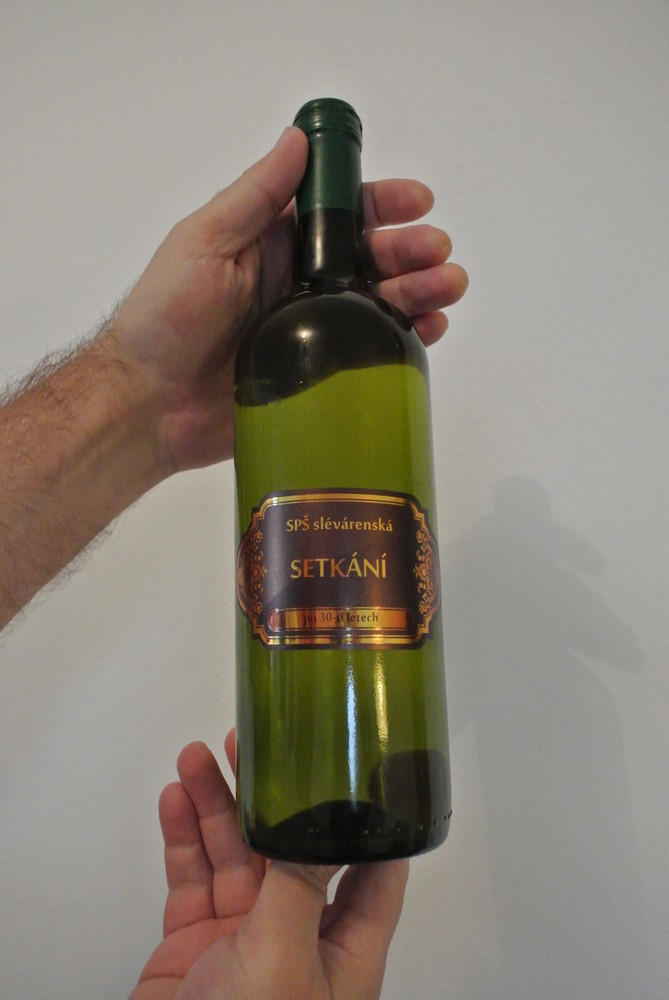

Jak jsem zkoušel Nikona 1
#########################

:tags: fotky, vybavení

.. class:: intro

Jak jistě `víte <http://www.tchorici.cz/akce/1-np-sarek-svedsko-2012.html>`_,
téměř přesně před rokem se mi podařilo v jedné severské řece
řádně vykoupat svou zrcadlovku. Kupodivu se z dvoutýdenního kómatu probrala a
dále spolehlivě sloužila. Drobnou vadou byl flek na snímači a čistit snímač, to
není jen tak. A tak jsem se rozhoupal k tomu, že svého drahouška prodám a
pořídím si něco jiného.

Nikon D7000 mi poměrně vyhovoval. Nebyl to úplně nejlevnější nákup, ale
vyplatil se. Přesto by se na něm nalezlo pár nedostatků - většina z nich není
chybou, pouze vlastností:

1. **pořádný foťák něco váží**. Ale co, alespoň jsem posiloval ruce. Přesto tahat se s ním po horách nebylo nejpohodlnější.
2. přemýšlel jsem o tom, že bych ve velkém začal fotit `časosběrná videa <http://vimeo.com/14352658>`_. Ale na druhou stranu mi bylo líto **ničit si na nich závěrku**.
3. poměrně rychle **ztrácel na ceně**. Jak kdosi prohlásil, tělo zrcadlovky je jenom spotřební zboží. Než pořizovat "dělo" je možná lepší pořídit postačující typ a častěji inovovat výbavu.

Co pořídit?
***********

S přihlédnutím k výše uvedeným nedostatkům jsem přemýšlel nad tím, co
pořídit. Chtěl jsem zůstat u Nikonu - přece jen mi zůstal poměrně slušný
objektiv a na fungování této společnosti jsem za ony dva roky nenašel vážnější
chyby - servis funguje dobře, ovládání přístrojů mi vyhovuje, ceny objektivů i
těl jsou rozumné. Snad jen ceny doplňků - pořizovat originální mikrofon nebo
GPS modul je slušné plácnutí přes kapsu. Naštěstí jsou i jiné varianty.

Více a více jsem přemýšlel nad bezzrcadlovkou Nikonem 1, konkrétně nad modelem
V1. Sliboval jsem si od toho slušný kompromis mezi velkou a těžkou zrcadlovkou a kompaktem s omezenými
možnostmi. Výhodami bylo slušné video, výměnné objektivy, kvalita snímače i cena, která se po pár letech od
vydání dostala na přijatelnou hladinu. A tak jsem objednal. Bílou variantu.
Protože byla levnější (šlo o vystavovaný kus).

První dojmy
***********

Rozbalování krabice je vždycky nejlepší. Zvlášť když jsou velké. Ale tahle moc
velká nebyla - jen spousta papírů, kabelů a pak taky ten foťák.

Samotný přístroj mne **překvapil svou hmotností**. Je sice o dost lehčí než zrcadlovka, ale
také o dost těžší než kompakt. A protože postrádá ergonomii zrcadlovky, nedrží
se nic moc - nemůžete s ním mávat v jedné ruce a být si jistí, že ho
nezahodíte. Také vás budou pěkně bolet prsty, pokud se ho budete snažit ovládat
jednou rukou.

Co se týče kvality fotek, je pravda to, co se dočtete kdekoli - je to takový
slušnější kompakt. A protože se tomu "jak to fotí" věnují všude, zaměřím se
trochu víc na to, jak se to ovládá.

A abych pravdu řekl, byl jsem zhýčkaný svou *sedmitisícovkou*. Přeci jen když
máte kolečka na nastavování času i clony a vůbec všeho hned po ruce, je to příjemnější, než
když musíte v nastavení hledat přepnutí na poloautomatiku a pak točit kruhovým
voličem, který je šíleně citlivý. Časem by mne to asi dovedlo k převážnému
používání automatiky, která funguje poměrně dobře.

Přístroj nabízí **dva typy závěrek** - mechanickou a elektronickou. Nejsem si úplně
jistý, jak mechanická funguje - cosi vevnitř cvakne. Význam neznám.

Pak se najdou drobnější nedostatky - třeba **krytka na blesk, která snadno vypadává** a hrozí, že ji jednou nenajdete. Sáňky na blesk jsou atypické a
přístroj **zabudovaný blesk nemá**. To je vlastnost, se kterou je třeba počítat.

Dalším nedostatkem je, že **intervalové snímání funguje až od pěti vteřin výše**.
Což je dost dlouhý interval. Skoro těžko uvěřit, co všechno se za těch dlouhých
pět vteřin změní. Záleží, co přesně chcete časosběrným videem natočit. Ale i na
mraky je to příliš pomalé.

**Velkým zklamáním je kvalita mikrofonu**. Množství šumu je obrovské a zvuk je
hodně plechový. Ve srovnání s D7000 to je nebe a dudy, spíš by se to dalo
přirovnat k průměrnému mobilu.

Přístroj má elektronický hledáček - rozdíl mezi ním a skutečným hledáčkem
poznáte na první pohled, nicméně je celkem využitelný, zvláště z přímého
slunce. Výhodou je, že si v něm můžete prohlížet to, co jste nafotili a vůbec
funguje jako kopie displeje.

Hledáček se sám zapíná a vypíná pomocí detektoru vzdálenosti, který je podle
mne nastaven zbytečně na velkou vzdálenost - do hledáčku se přístroj z displeje
**přepne už od vzdálenosti šesti centimetrů**.

Při usilovnějším používání se přístroj relativně dost zahřívá. Alespoň není
zima na ruce.

Další vychytávky
----------------

Fotoaparát nabízí kromě klasických videí ještě speciální režim s natáčením
videa s 400 snímky za sekundu a pak ještě tuším s 1200. Problém je, že se
podstatně sníží rozlišení a tak si nedovedu představit vážnější využití. Ale
vypadá to efektně.

.. raw:: html

    <iframe width="560" height="315" src="http://www.youtube.com/embed/PSLkEyFtshk" frameborder="0" allowfullscreen></iframe> .<>

Úplně nepochopitelnou funkcí je režim *živých momentek*. V podstatě jde o
krátká zpomalená videa, ke kterým vám foťák přidá lacinou muziku. Z tohoto
videa to umí vybrat ten nejlepší snímek, ale i tak nevím...

Závěrečné hodnocení?
--------------------

Přístroj má i řadu kladů. Fotí pěkně. Skvěle funguje zaostřování, zvláště pokud
natáčíte video. Není ani slyšet. Je rychlý, ve srovnání s běžnými kompakty
velmi rychlý. Baterie zdá se vydrží poměrně dlouho. Umí fotit do RAWu. Jenže
zrcadlovka to není a je chyba to čekat.

Pokud tedy potřebujete foťák na rodinné momentky a nemáte příliš požadavků,
snad jen kvalitní výsledek, asi budete spokojení. Ale pokud jste už přičichli
světu zrcadlovek, jako úplná náhrada za pořádný přístroj vám to stačit nebude.
