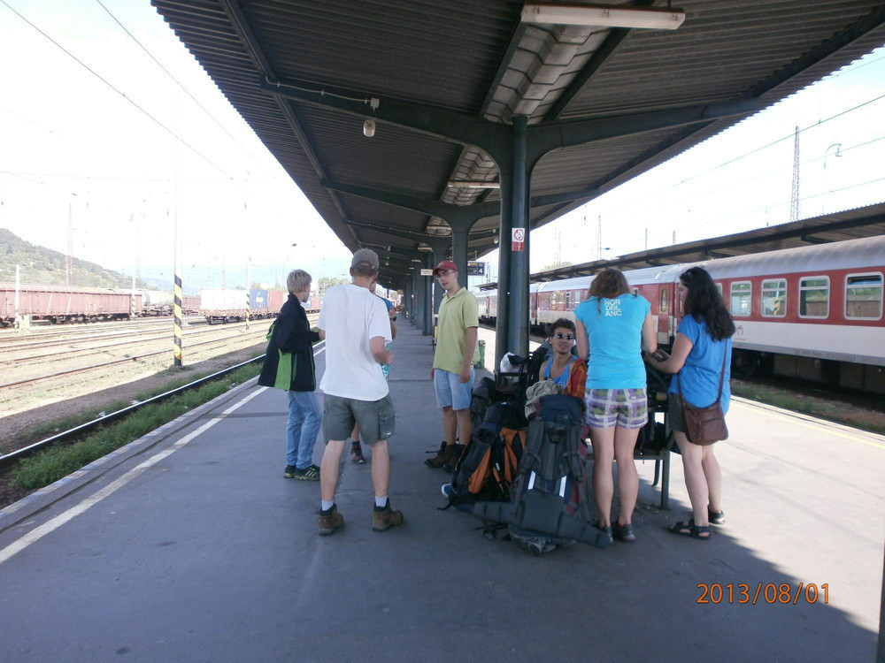
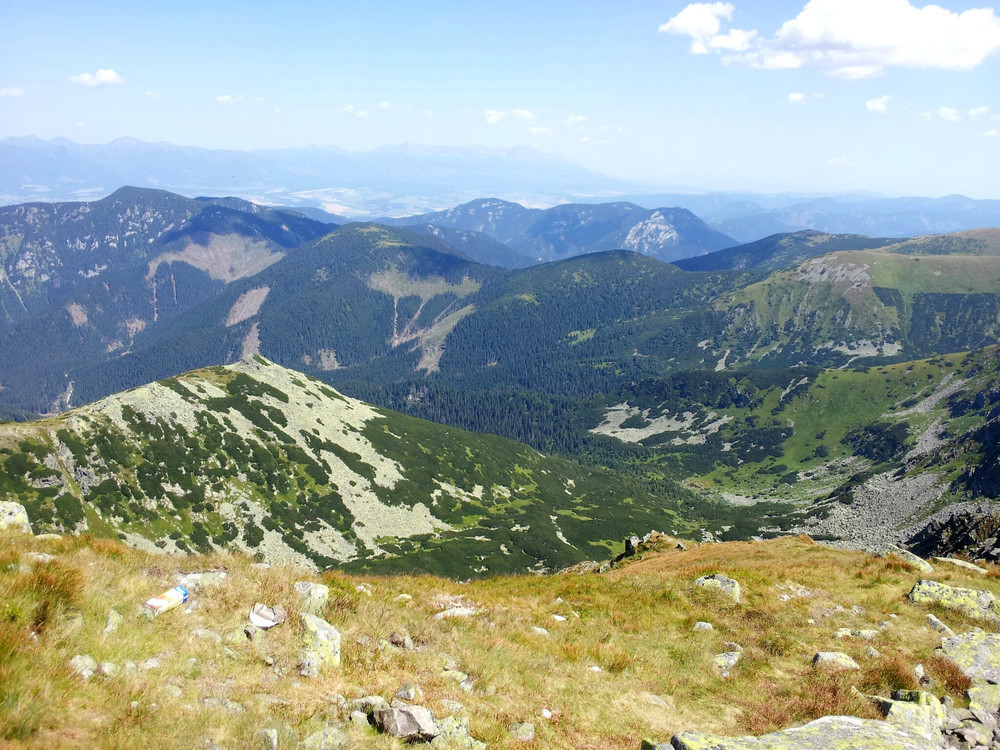
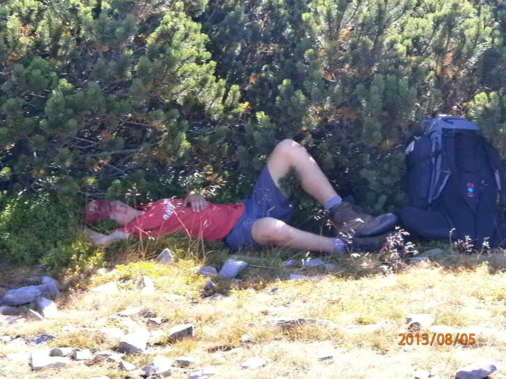

Poznámky ze země sluncem spálené
################################

:tags: Tchoříci, Slovensko
:category: Cestování

.. class:: intro

Po roce znovu na Slovensko. A to by bylo tak všechno, co se s loňskem shodovalo.
Tehdy jsme jeli v autíčku Kočerů, letos sami vlakem. Změnilo se i složení -
kromě ostřílených pardálů Kuby, Kláry a Ondry vyrazila na Campfest ještě Bětka
S., Markéta V., Jéňa P. a Kája K.

    Walk off the Earth Ukulele

Cesta začala být zajímavá hned kus za Berounem. Vlak zde kohosi srazil a my
čekali, až to páni policisté vyřeší a vlaky znovu začnou jezdit. Čekali jsme a
čekali. I ukulele jsme vytáhli, abychom se moc nenudili, a přemýšleli, jak
to uděláme s navazujícími spoji.

Začalo se totiž ukazovat, že je nestíháme. Ze slibovaných dvaceti minut se stala
půlhodinka, z půlhodinky hodinka a nakonec bylo zpoždění rovných sto minut. Od
průvodčího jsme dostali potvrzení o zpoždění a truchlili nad svými koupenými
místenkami.

    Cesta byla dlouhá

Co se dalo dělat, nastoupili jsme do dalšího vlaku, našli pár volných míst a se
svými krosnami se do vagónu vtěsnali. Průvodčí na nás koukali překvapeně, ale
byli rozumní a rychle pochopili, že to opravdu není naše vina - to že jedeme
špatným vlakem.

Dále už cesta probíhala poklidně až do Žiliny, kde jsme z vlaku vyskočili,
abychom učinili jeden z posledních přestupů - a můj úplně poslední. Opouštěl
jsem zbytek výpravy o něco dřív, v Ružomberoku, abych se vydal přímo do kopců
Velké Fatry. Campfest mne letos dostatečně nenalákal a tak jsme si řekl, že
radši projdu další kus světa, ve kterém jsem ještě nebyl.

A tak vám ani nemohu vyprávět, jak se letošní Campfest povedl. Prý tam bylo zase
o něco víc lidí a nahluchlí zvukaři to z reprobeden pouštěli zase o něco víc
nahlas.

Velká Fatra
***********

Já hodil civilizaci za hlavu a svižně stoupal po červené pryč z města. Moc
jsem nekoukal na mapu a říkal si, že červená je vždycky nejlepší. Když jsem za
chvíli hekal do opravdu prudkého stoupáku, začal jsem si říkat, jestli by se mi
po té modré, co vede o trochu níž pěkně po vrstevnici, nešlo lépe.

    Velká Fatra poprvé...

Vylezl jsem na kopec Velká skála a po krátkém zvažování jsem se rozhodl, že to v
příštím sedle zkusím. Dostat se z hřebenu dolů pod kopec prudkým srázem bylo
trošku o ústa, ale z výsledku jsem byl potěšen - modrá byla krásná lesní
pěšinka, vedoucí velmi zvolna do kopce. Šlo se krásně. Žádné hekání jako
předtím.

Z Hrabovského potoka jsem doplnil vodu a za chvíli už stoupal pod vlekem na horu
Malinné (1.209). Zrovna zapadalo slunce a vůbec bylo pěkně. Pak ale začal les a
v něm šero a já přemýšlel nad tím, kam hlavu složit.

Zaneprázdněn uvažováním jsem přestal dávat pozor na cestu a zakrátko už bloudil
po lesích. Podařilo se mi to totiž záhadným způsobem sejít z modré a  kdyby to
dolů k Čutkovskému potoku nebyl takový krpál, asi bych slezl až tam.

    ...a podruhé

Když jsem se zase našel, neměl jsem moc chuť pokračovat dlouho dál a tak jsem u
laviček v sedle pod Vtáčnikom rozbil tábor. Trochu mne překvapilo, že zanedlouho
po cestě, která sedlem vedla, projelo auto. Houby divočina.

Další den jsem vyrazil poměrně brzy, což se později ukázalo jako dobré
rozhodnutí. Byl jsem na suchu a pramen pod Vtáčníkom se mi nalézt nepodařilo. I
po ránu bylo docela teplo, ale cesta vedla povětšinou lesy a tak voda ani tolik
nescházela.

Nabral jsem ji až v potoku před Smrekovicou. Po druhé snídani jsem pokračoval
dále po zelené směrem k Rakytovu (1.567).  Výšlap nahoru mi dal docela zabrat,
ale stál za to. A pak zas dál až ke Grúňu, kde se mi podařilo z pěkného pramene
doplnit vodu.

Šlo se dobře. Lidí jsem potkával málo, zvláště ve srovnání s Tatrami, kde jich
byly mraky. Dokonce tak málo, že jsem v salaši Mandolína spal sám. Trochu
zvláštní pocit.

Zase jsem byl bez vody. Pramen jsem nenašel, vracet se mi nechtělo a tak jsem
snídani zapil posledními doušky vody a vydal se po červené dál. Od Ostredoku
(1.592) začalo lidí přibývat a kolem Križné (1.574) už to byla hotová dálnice.

Já se vydal směrem ke Králově studni, kde jsem doufal, že nějakou vodu najdu.
Byla tam. Sice ubohý čůrek, který ani náhodou velká plechová koryta zaplnit
nedokázal, ale alespoň něco.

Naplnil jsem, co jsem mohl a pustil se zpátky. V tom horku, které panovalo, se
voda opravdu hodila. Připadal jsem si trochu jako továrna na sůl. Plánoval jsem,
že přespím pod Repišťom, ale z údajné chaty zbyla jenom střecha a tak jsem
pokračoval dál.

Cesta už zase vedla většinou lesy a tak se horko dalo vydržet. To byl ale asi
jediný pozitivní bod, protože jinak bylo putování utrpením. Cesta vedla nahoru dolu a
znovu a zas a když už jsem šplhal asi na pátý kopec, abych z něj zase slezl, měl
jsem toho docela dost. Navíc se mi v hlavě bez ustání honil Ježíšek od Nohavici.

Na Motyčské hole (1.292) jsem se utábořil, uvařil polévku a kochal se hvězdami.

Další den byl zase horký, ale naštěstí už mne nečekala žádná velká štreka.
Potřeboval jsem jenom dojít do Donoval, kam odpoledne měl přijet zbytek bandy a
odkud jsme měli vyrazit do Tater.

Seběhl jsem ze Zvolenu (1.403) a u potoka, který tekl přes cestu se umyl. Bylo
úžasné ze sebe smýt všechnu tu sůl a prach. V Donovalech jsem se usídlil před
kostelem, kde jsem poslouchal katolické chorály a kontroloval Facebook na zdejší
veřejné wifi. Do kostela se seběhly snad celé Donovaly. Stálo se i venku. Pro
Čecha trochu neobvyklý jev.

Nízké Tatry
***********

.. figure:: images/2013-10-02-poznamky-ze-zeme-sluncem-spalene/02-vyrazime.jpg

    Připraveni vyrazit, Donovaly

Odpoledne zbytek skutečně dorazil. Kuba s úpalem. Po občerstvení zmrzlinou jsem
vyrazili směr Nízké Tatry. Největší horka už naštěstí byla pryč a cesta zase
vedla chvíli lesem. V dobré náladě jsme vyběhli na Kozí chrbát a zase z něj
sběhli, abychom se utábořili v Hiadelském sedle. Kuba sice na Kozí chrbát
vzpomíná nerad, ale to bylo dáno spíš jeho současným stavem než čímkoli jiným.

.. figure:: images/2013-10-02-poznamky-ze-zeme-sluncem-spalene/03-kozi-chrbat.jpg

    Výhled na Kozí Chrbát

V útulně v sedle bylo lidí tak akorát. Spalo se nahoře i dole. V prostřed noci
přišla pěkná bouřka a průtrž mračen a ti, co spali dole, strávili noc
zabalení v pláštěnkách. U nás nahoře tu a tam kapalo, ale jinak se vyspat dalo.

Ráno bylo příjemně. Vlahý vzduch po dešti se krásně vdechoval a tak i stoupání
na Prašivou (1.652), Malou (1.720) a Velkou Chochuli (1.753) bylo snesitelné.
Kuba už se z úpalu oklepal a do kopců běhal jako první, my ostatní supěli za
ním.

    Kocháme se pohledem na krajinu před Velkou Chochulou

Vzduch se ale ohříval víc a víc a za pár hodin už bylo utrpení jít pod žhavým
srpnovým sluncem. Užívali jsme si každý stín, na který jsme narazili. A že jich
moc nebylo.

    Kuba vychutnává odpočinek ve stínu

Na útulňu pod Chabencom jsme dorazili v rozumném čase. Umyli se, uvařili večeři,
zahráli pár kol kenta a anonyma a chystali se jít spát. Ne však chatár, který s
pár hosty popíjel a pouštěl si muziku na plný pecky. Já, poučen z cesty do
Skotska, jsem nasadil špunty a za chvíli už spal.

Co se v tu noc dělo, znám jenom z vyprávění. Holkám neudělalo dobře ostré horké
sluníčko a skončily s podobným úpalem, jako Kuba před nimi. A tak střídavě
vybíhaly z chaty, úpěly a zbavovaly se večeře. A do toho chatár se svojí
muzikou.

Když už toho na Bětku bylo moc, vzbudila ho, protože mezitím usnul na stole a
poprosila, jestli by nemohl ten kravál vypnout. On na to, že jestli se jí to
nelíbí, ať se sbalí a vypadne. To se jí pochopitelně nechtělo a tak radši
zalezla do spacáku a snažila se noc nějak přežít.

    Kdesi v Tatrách

Ráno vypadaly obě holky dost zbědovaně. Chatár už vystřízlivěl a opřekot se
omlouval a dával rady, co máme dělat. Nakonec nám vrátil i část peněz a
kdybychom chtěli, asi by nám vrátil i mnohem víc.

Podle plánu jsme měli před sebou pořádnou štreku. Chtěli jsme totiž dojít až na
Ramžu - platit za ubytování na Chopoku nebo na Štefáničce se nám nechtělo. Teď
byly naše představy ohroženy a my připraveni k sestupu do údolí, pokud by to dál
nešlo.

.. figure:: images/2013-10-02-poznamky-ze-zeme-sluncem-spalene/07-kamzici.jpg

    Ochočení kamzíci kus za Chabencom

Vyrazili jsme. Ne úplně brzo, ale také ne úplně pozdě. Horko už docela
bylo a při výstupu na Chabenec (1.955) jsme se pořádně zapotili. S vidinou
lanovky na Chopoku v dáli jsme ukrájeli ze zbývající cesty.

Za Polanou (1.890), kterou jsme raději obešli zespoda, začala pravá horská
dálnice. Míjeli jsme davy turistů, které sem vyvezla lanovka, aby se nadýchali
čerstvého vzduchu. Možná i proto jsme skoro běželi, abychom to měli rychle za
sebou.

    Výhled při cestě

.. figure:: images/2013-10-02-poznamky-ze-zeme-sluncem-spalene/09-derese.jpg

    Výhled na Děreše

Na Chopoku (2.000) jsme dali delší pauzu na odpočinek. Já si odlovil kešku, Kuba
vyběhl na vrchol a holky usnuly. Ďumbier jsme z časových důvodů oželeli, i když
nám to bylo trochu líto. Na druhou stranu jsme mohli o to déle posedět před
Štefáničkou u sklenice kofoly, kterou jsme koupili za vrácené peníze z Ďurkové.

.. figure:: images/2013-10-02-poznamky-ze-zeme-sluncem-spalene/10-zmozena-betka.jpg

    Vyčerpaná Bětka odpočívá u Štefáničky

Holky už se trochu oklepaly a tak se pokračovalo ve veselé náladě. I přes to
horko. Polovinu těl už jsme měli dokonale spálenou. Do Čertovici jsme dorazili k
večeru a řekli jsme, že už to na tu Ramžu přece jenom dojdeme. Do osmi tam
budem!

    Krajina před sestupem do Čertovici

Do osmi jsme tam nebyli. Ale opravdu jsme tam dorazili. S krásnými třiceti
kilometry horským terénem v nohách. Další přespávající v útulně jen kroutili
hlavami.

Na Ramže bylo plno. Na holky zbyly poslední dvě volná místa a my s Kubou spolu s
půltuctem dalších horalů spali venku. Noc byla poklidná a ráno jsme nikam
nechvátali - slíbili jsme si zasloužený odpočinek. Holky se z útulni vybelhaly,
teprve když poslední skupina odešla.

.. figure:: images/2013-10-02-poznamky-ze-zeme-sluncem-spalene/12-ramza.jpg

    Snídaně na Ramže

V klidu jsme posnídali a před polednem se vydali za dalším dobrodružstvím. Bylo
vedro. Vzduch se ani nehnul a my se prodírali přes prales popadaných stromů a
větví, abychom vylezli na Homolku.

.. figure:: images/2013-10-02-poznamky-ze-zeme-sluncem-spalene/13-horko.jpg

    Pot z nás tekl proudem

Pekelně nás pálily spálené půlky těla a když jsme se museli prodírat ostrými
větvemi kleče, jeden by bolestí brečel. Seběhli jsme do sedla Priehyba, kde jsme
dohonili skupinu, která z Ramži vycházela před námi.

Obsadili jsme břehy potoka, který v oněch místech teče. I tekoucí voda se nám
zdála býti dost teplá, ale i tak bylo příjemné zase smýt pot, prach a sůl z těl.
Osvěženi jsme vyběhli na Velkou Vápenicu v rekordním čase a za zpěvu "Oh,
Freedom" jsme dorazili až k útulně Andrejcová.

.. figure:: images/2013-10-02-poznamky-ze-zeme-sluncem-spalene/14-zapad-slunce.jpg

    Západ slunce u Andrejcové

Ani nás nepřekvapilo, že bylo zase plno. Naštěstí to nevypadalo, že se něco
přižene a i kdyby, dovnitř bychom se taky nějak vešli. Uvařili jsme si polévku,
pojedli kaši a s plnými břichy a hvězdnou oblohou nad hlavou šli spát.

    Dovnitř jsme se se nevešli

Ráno jsme zase nikam nechvátali a zase vyráželi jako poslední. Horko bylo pořád,
ale už ne takové, jako dny před tím. Výstup na Královu Holu jsme si užívali.
Netrvalo dlouho a už jsme sbíhali dolů směrem na Pusté Pole. U chalupy Pod
Košariskom jsme se brzy odpoledne utábořili, máchali se v potoce a dojídali
zásoby. Taky jsme odháněli medvědy naším brnkáním na ukulele.

    Zasloužený odpočinek na Králově Hole

Následující den jsme se s menšími obtížemi dostali do Popradu. Autobusová
zastávka v Pustých Polích je dosti svérázná, ale i tak se nám autobus zastavit
podařilo.

    Slasti přírodní koupele

Jak bývá naším zvykem, naše cesty ve městě směřovaly nejdříve do obchodu. Na
plánovaný průzkum Popradu nedošlo, protože se přihnala bouřka s lijákem, který
vydržel celé odpoledne.

A pak hurá domů. Trochu nás překvapilo, že musíme ve studentovi platit za
zavazadla. Cesta byla poklidná a v ranních hodinách jsme rozlámaní vylézali na
Florenci.

Nestačilo? Tak koukněte na `video <http://vimeo.com/72304002>`_.

