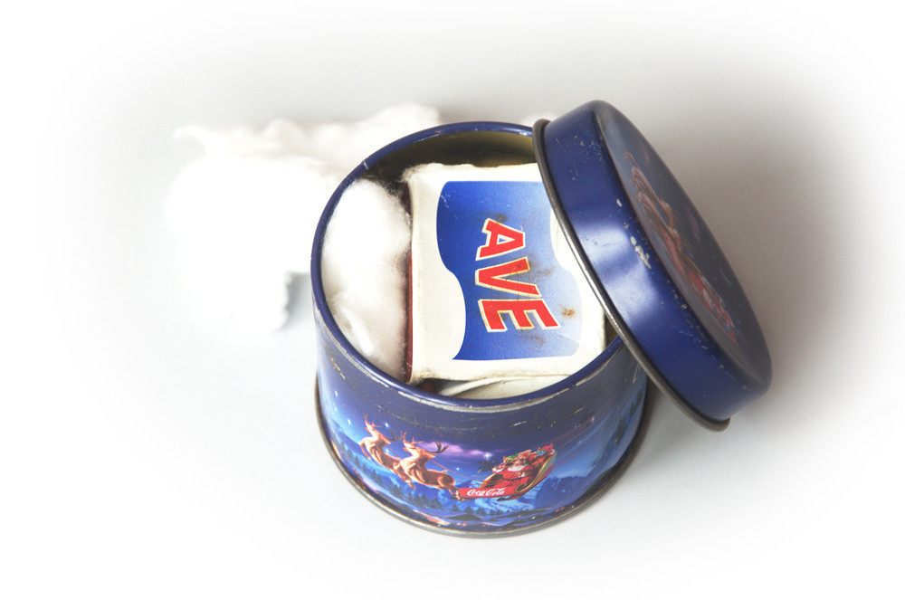

Obsah mé KPZ
############

:tags: vybavení
:category: Cestování

.. class:: intro

Nevěřili byste, kolikrát už mi má krabička poslední záchrany pomohla. A
kolikrát naštvala, když v ní nebylo to, co by tam být mělo. Nejčastěji proto,
že jsem to na některé z posledních výprav použil, ztratil nebo zničil. A tak si
tu zakládám seznam, abych si snáze vzpomněl, co mi tam schází.

- složený list bílé A4
- z obou stran ořezaná tužka
- krabička sirek
- čajová svíčka
- 50, 20, 10, 5, 2, 1 Kč
- vata
- bílá a černá niť
- jehla
- špendlík
- spínací špendlík
- 2 kancelářské sponky
- 2 knoflíky
- ½ metru provázku
