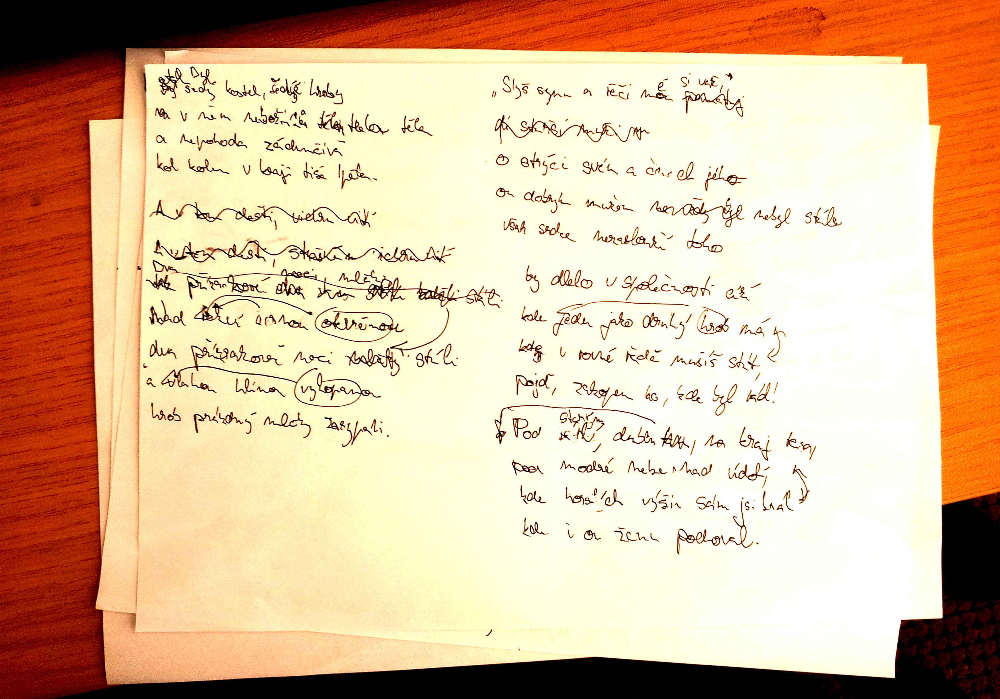

Srdečná
=======

:tags: básně, doporučuji

|
| Byl šedý kostel, šedé hroby,
| v nich nebožtíků spala těla
| a zádumčivá nepohoda
| kol skrytá v kraji tiše lpěla.
|
| Dva přízrakové noci stáli
| nad rakví černou otevřenou,
| hrob prázdný zasypali mlčky
| tou vlahou vykopanou hlínou.
|
| "Slyš synu a řeči mé si važ
| o strýci svém a činech jeho.
| On dobrým mužem ne vždy byl -
| však srdce nezaslouží toho,
| by dlelo v společnosti cizí
| - ti v rovné řadě musí stát,
| zde hrob jeden jako druhý má -
| pojď, zakopem ho, kde byl rád!
|
| Pod starým dubem, na kraj lesa,
| kde horských výšin sám jsi král,
| pod modré nebe, nad údolí,
| kde i on ženu pochoval."
|

