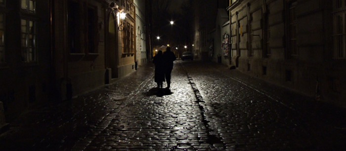

Čtyři za stolem
===============

:tags: povídky, Polsko, doporučuji

.. class:: intro

Povídka!

    `Kraków Street at Night <https://www.flickr.com/photos/hegarty_david/2226358287/in/photolist-4oJEKH-dqxj36-dqxs8m-NGwfA-NGwe9-NGYxB-NGweN-dVqyqd-dqxjke-5fvvss-9jejVD-aQnESp-ajfpRS-2y2cUt-6vMkfr-bU3Zhe-dqxsnW-dqxjqB-2pUXT-2pVLq>`_, David Hegarty.

Nevím, čím to je. Rád jsem si do svých povídek vypůjčoval historky, které mne potkaly na kolejích. Semafory svítily, průvodčí štípali jízdenky a světem vládl řád - když čekáte na nádraží, máte jistotu: jednou to přijede! Možná pozdě. Ale určitě právě po těch kolejích, které teď běží před vámi někam do nekonečné dálky.

Jenže teď se to změnilo. Možná málo jezdím vlakem. Nebo je to jen spisovatelský posun. Posun do různých pochybných podniků, barů a hospod. Kdekdo teď ohrne nos a už už mne uvidí jdoucího ve stopách básníků utápějících své bolestně hluboké prožitky v opojení. 

Zde se ovšem drahý čtenář mýlí. Nejsem básník. Nejsem snad dokonce ani umělec. Jako pouhý spisovatel sedím v rohu, popíjím dávno zvětralé pivo a pozoruji. Nevytvářím! Jen zapisuji příběhy, někdy je opráším a narovnám, někdy vyčistím od rzi.

Tentokrát jsem však neseděl sám. Představme si, že to bylo v jedné malé hospůdce starého města krakovského. Pár kroků od náměstí, za kostelem svaté Anny, patronkou horníků. Nepřikládejte tomu přespříliš významu. Představte si navlhlou vůni starého kamene, směs neznámých zvuků a cizích řečí, společnost veselou a v dobrém rozmaru.

Zapadli jsme dovnitř toužící svlažit své krky tím prastarým patokem a nyní už uspokojeni seděli u poloprázdných sklenic. Nejvyschlejší hrdlo měl jako obvykle kolega Kočí, jak jsme mu s oblibou říkali. S věčně nastraženým uchem hudebníka seděl a naslouchal šišlavé kakofonii zvuků. Pak se usmál na mezi stoly pobíhající dívku a nechal si od ní přinést jedno další.

"Dziękuję bardzo," prohodil s nepříliš povedeným přízvukem, když se mu pivo objevilo před nosem. Pak se otočil na nás, "ten hlas, ta holka, ta číšnice, hlas fakt pěknej. Sice šišlá, jako všichni ti Poláci, ale od ní to znělo fakt pěkně. Fakt."

Napil se a takto posilněn neváhal začít s obhajobou svého tvrzení.

"Fakt pěknej. Trochu dětský, ale to vůbec nevadí, vůbec. Takový jemný a správně dívčí. Jemný, jo, hladký. - Jen to pohladilo, když promluvila..." 

Kdybychom smíchem neprozradili své velké pobavení, patrně by ve svém oceňování jejího hlasu hned tak neskončil. Takto se zatvářil uraženě a v hlubokém mlčení upíjel ze svého tupláku. 

"Běž si za ní, ty náš Romeo," snažil se ho rozpálit Pavel. Seděl hned vedle něj a cosi si čmáral na kus ubrousku. 

"Vole, sám seš Romeo," nedal se kolega Kočí a vytrhl mu papír zpod ruky, "vole, vždyť ji sám maluješ!" dodal překvapeně, když se na nákresek podíval.

"Do toho ti nic není," urazil se Pavel a rychle mu obrázek zase sebral. Chvilku mlčel a pak i on spustil svojí obhajobu, "To ti nedá. Normálně bych řekl, že za to ani nestojí. Hubená, pobledlá, tmavé vlasy na můj vkus zbytečně krátké... A ta ofina zastřižená nad čelem. No hrůza. - Ale dohromady na tom něco je. Taková ta krása z padesát let starých fotografií. Úplná babička za mlada, jako bych ji viděl."

Teď se zas společnost bavila na jeho účet. Zahleděn do dáli náš smích asi ani nevnímal.

"Jen by mne zajímalo, jak se jmenuje. S tak tvarovaným obličejem. To je skoro na nějaké francouzské jméno. Catharina. Možná. Nebo Isabella."

"Jdi do háje s žabožroutskýma jménama," zavrčel kolega Kočí. "Dovedeš si představit, jak by to znělo? Jak by to znělo, když by to tím svým medovým šišlavým hlasem vyslovila? Ta se musí jmenovat jinak. Polsky. Třeba Agnieszka. To by pasovalo. Na samohlásku to musí začínat. Aby to bylo... aby to bylo takové... takové pozitivní."

Napjatě jsme ztichli, protože nám na stůl putovala další várka občerstvujícího moku a my bedlivě pozorovali ruku, která ho podávala. Po chvilce přerušil mlčení Lukáš, který byl dosud ticho a smál se vzrušené debatě obou kamarádů.

"Vy úplně přehlížíte to nejdůležitější. Ty oči, ten záblesk, který z nich vždycky vylítne. Já vám říkám, že ten když holka má, tak je úplně jedno jak vypadá a jak mluví. Vždycky je s ním krásná a -"

"Vždycky?" přerušil ho s úšklebkem kolega Kočí.

"Vždycky!" nedal se rozhodit Lukáš. "Ten plamének, ten věčný svit, - to je ta pravá krása. Na ten se díváš a vždycky je něčím novým. Odrazem slunce i hvězd zároveň. - Mlhotavým světlem měsíce. - Všechna krása je vtělena do toho odrazu!"

"A hele, pan básník!" neodpustil si poznámku Pavel. 

"Táhni se svojí Agnieszkou. To musí být jméno, které stejně jako její oči obsahuje ten svit věčnosti. - Kdyby se bývala narodila do antického Říma, mohla by být volána Selenou či Lunou. Kdo ví, jaké jméno naše uvadlá společnost přiřkla. Snad Zorza, - to by bylo krásné."

Tvářil se, jako by mu právě ona záře, o které tak básnil, zahalila smysly. Zvedl jsem se, abych je na chvíli nechal opuštěné v jejich hloubání o tom správném jménu, které by mohlo plně vyjádřit krásu oné bytosti, která už spíše než za výčepem existovala jen v jejich představách.

"Marie." prohodil jsem, když jsem se ze své procházky vrátil. "Zeptal jsem se."

Kdyby pohledy zabíjely, nebyl bych tu více.

"Co tak koukáte, - vždyť to jste chtěli vědět, ne?" couval jsem pomalu ke dveřím, před jejich záplavou výčitek a obvinění, - povídali cosi o zrušení kouzla a zničení tajemství, o tom, že veškerá krása nepoznaného pominula a že jsem hajzl a že jsem se vůbec ptát neměl, že oni byli s těmi svými jmény docela šťastní. 

"Marie, takový tuctový jméno," zaslechl jsem ještě, když jsem za sebou rychle zabouchl dveře.

