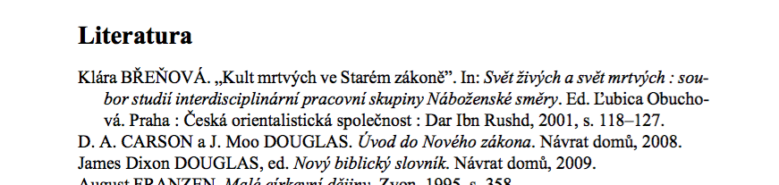

LaTeX a dějepis, tip #3 — citace podle ČČH (pořadí jmen)
=============================================================

:tags: latex, ččh
:category: Latex - tipy a triky

.. class:: intro

Že v LaTeXu sázejí matematici, fyzici, ajťáci a další verbež není zas tak překvapivé. A kdyby to s ním nebylo tak složité, možná by leccos nabídl i pro nás humanitně zaměřené. Tak si pojďme ukázat, že to zas tak složité není a že se spousta problémů, kvůli kterým si trháme vlasy, dá řešit elegantně.

Jak tomu bývá, ani historici se nemohou dohodnout na jedné závazné formě citací a tak každý používá takový formát, jaký se mu zrovna líbí. Existující normy se berou spíše jako doporučení a tak často záleží na zlovůli vedoucího vaší práce, jakou podobu bibliografie po vás bude chtít.

Asi nejčastěji po vás budou požadovat citace podle `Českého časopisu historického <http://www.hiu.cas.cz/cs/nakladatelstvi/periodika/cesky-casopis-historicky/citacni-uzus.ep/>`_. Ten má od výchozího nastavení LaTeXu tak, jak jsme si ho `ukázali minule <http://zapisnik.glor.cz/latex-tip-2.html>`_, řadu odlišností. Tou nejvýraznější je pořadí ``Jméno, PŘÍJMENÍ``. Jak ho prohodit i v našich dokumentech?

Jde to jednoduše pomocí dvou příkazů, které se vloží ještě před začátek dokumentu:

.. code::

    \DeclareNameAlias{sortname}{first-last}
    \DeclareNameAlias{default}{first-last}

Výsledek pak vypadá nějak takto:

Pokud stále nevíte, jak na to, tady máte `živou ukázku <https://www.overleaf.com/read/tgshbyshqftd>`_.