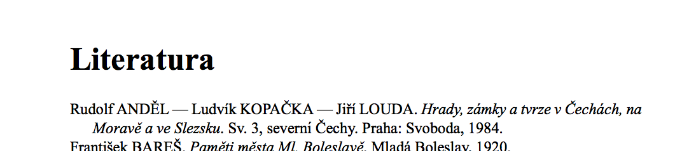

LaTeX a dějepis, tip #4 — citace podle ČČH (oddělovač jmen)
=============================================================

:tags: latex, ččh
:category: Latex - tipy a triky

.. class:: intro

Že v LaTeXu sázejí matematici, fyzici, ajťáci a další verbež není zas tak překvapivé. A kdyby to s ním nebylo tak složité, možná by leccos nabídl i pro nás humanitně zaměřené. Tak si pojďme ukázat, že to zas tak složité není a že se spousta problémů, kvůli kterým si trháme vlasy, dá řešit elegantně.

Že to s vizuální úpravou bibliografie není jednoduché, jsme si řekli už v `minulém tipu <http://zapisnik.glor.cz/latex-tip-3.html>`_. Tam jsme si také ukázali, jak se přiblížit citačnímu úzu Českého časopisu historického pořadím jmen. 

Dnešní tip nás posune zas o kousek dál. Podle pravidel ČČH by se více autorů mělo oddělovat pomocí pomlčky (``—``). Tato úprava zas není nikterak složitá, opět bude stačit přidat dva řádky někam nad začátek dokumentu:

.. code::

    \renewcommand{\multinamedelim}{\space—\space}
    \renewcommand{\finalnamedelim}{\multinamedelim}
  
Výsledek pak vypadá takto:

   
Jako obvykle vás v případě nejasností odkáži na `živou ukázku <https://www.overleaf.com/read/pcjmngjdsjyx>`_.